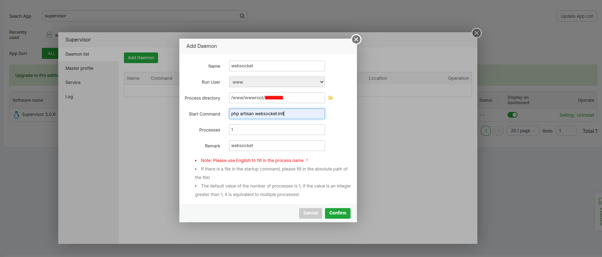

# 🔌 How to Get Socket URL

## 📋 Overview
Learn how to set up WebSocket server and get your Socket URL for real-time communication in e-School SaaS.

## 🎯 Option 1: aapanel Control Panel (Recommended)

If you are using **aapanel control panel**, you can directly install supervisor from the app store and configure Laravel WebSocket from there. This is our **recommended option** for aapanel users.

#### 📱 Install Supervisor from App Store
1. Open your aapanel control panel
2. Navigate to the **App Store** section
3. Search for **Supervisor**
4. Click **Install** to add it to your system


#### ⚙️ Configure WebSocket Service
After installing supervisor, configure your WebSocket service:



#### ✅ Benefits of aapanel Method
- 🚀 **Easy Installation**: One-click installation from app store
- 🎛️ **User-Friendly Interface**: Graphical configuration options
- 🔧 **Integrated Management**: Centralized control panel access
- 📊 **Real-time Monitoring**: Built-in status monitoring
- 🛠️ **Simplified Configuration**: No manual command line setup required

---

## 🖥️ Option 2: Manual Installation (Traditional Method)

If you prefer manual installation or are not using aapanel, follow the traditional setup method below.

### 1️⃣ Install Required Packages
Open the Terminal from an SSH Connection:

```bash
sudo apt-get update
```

```bash
sudo apt-get install supervisor
```

### 2️⃣ Create Configuration File
```bash
sudo nano /etc/supervisor/conf.d/your-laravel-websockets.conf
```

### 3️⃣ Add Configuration
Add the following content to the configuration file:

```ini
[program:laravel-websockets]
process_name=%(program_name)s_%(process_num)02d
command=php /path/to/your/laravel/artisan websocket:init
autostart=true
autorestart=true
user=username
numprocs=1
redirect_stderr=true
stdout_logfile=/path/to/your/laravel/storage/logs/laravel-websockets.log
```

### 4️⃣ Update Supervisor
```bash
sudo supervisorctl reread
```

```bash
sudo supervisorctl update
```

### 5️⃣ Start WebSocket Service
```bash
sudo supervisorctl start laravel-websockets
```

### 6️⃣ Check Status
```bash
sudo supervisorctl status
```

**✅ Expected Output:**
```
laravel-websockets   RUNNING   pid 12345, uptime 0:03:21
```

## 🎉 Final Result

**🔗 Your Socket URL:** `ws://YOUR-SERVER-IP:8090`

## 📝 Important Notes
- Replace `/path/to/your/laravel/` with your actual Laravel project path
- Replace `username` with your server username
- Ensure port 8090 is open in your firewall
- Test the WebSocket connection after setup
