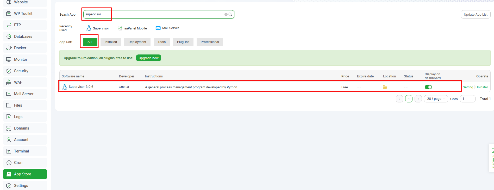
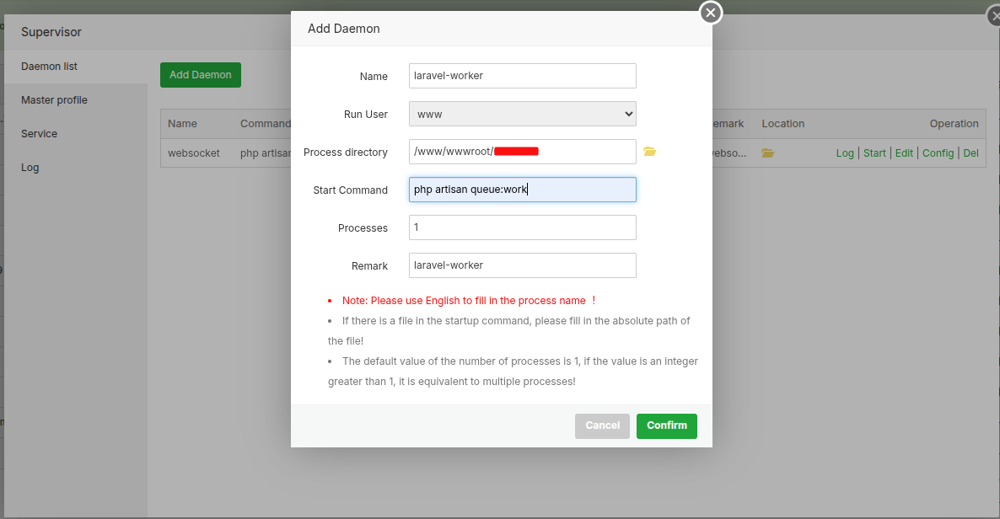

# 🔄 Laravel Queue Implementation

## 📋 Overview
The school creation process in e-School SaaS involves several time-consuming operations that are now handled efficiently through Laravel's queue system, improving both user experience and system performance.

### ⚙️ Key Operations
- 🗄️ Creating a new database for each school
- 🔄 Running database migrations
- 👥 Setting up default roles and permissions
- 📝 Inserting initial data and settings
- 📧 Sending welcome emails

### ⭐ Benefits
- ⚡ Immediate user interface response
- 🚫 No blocking operations
- ⏱️ Background processing (2-3 minutes)

## 🏗️ Architecture

### 📦 Job Classes

**SetupSchoolDatabase** (`app/Jobs/SetupSchoolDatabase.php`)
- 🎯 Manages database creation and migrations
- 📊 Updates school status automatically
- 📨 Handles welcome email dispatch

## 🔧 Setup Instructions

### 🎯 Option 1: aapanel Control Panel (Recommended)

If you are using **aapanel control panel**, you can directly install supervisor from the app store and configure Laravel queue from there. This is our **recommended option** for aapanel users.

#### 📱 Install Supervisor from App Store
1. Open your aapanel control panel
2. Navigate to the **App Store** section
3. Search for **Supervisor**
4. Click **Install** to add it to your system



#### ⚙️ Configure Laravel Queue Worker
After installing supervisor, configure your Laravel queue worker:



#### ✅ Benefits of aapanel Method
- 🚀 **Easy Installation**: One-click installation from app store
- 🎛️ **User-Friendly Interface**: Graphical configuration options
- 🔧 **Integrated Management**: Centralized control panel access
- 📊 **Real-time Monitoring**: Built-in status monitoring
- 🛠️ **Simplified Configuration**: No manual command line setup required

---

### 🖥️ Option 2: Manual Installation (Traditional Method)

If you prefer manual installation or are not using aapanel, follow the traditional setup method below.

### 1️⃣ Queue Configuration

Update `.env` file with queue driver:
```env
QUEUE_CONNECTION=database
```

### 2️⃣ Queue Worker Setup

Start processing jobs:
```bash
# Process all queues
php artisan queue:work

# For production (with supervisor)
# See configuration below
```

## 📊 School Status Codes

- 0️⃣ Pending/Setup in progress
- 1️⃣ Setup completed successfully

## 🚀 Production Deployment

### 🔧 Supervisor Configuration


> **Note:** If Supervisor is already installed on your server, you can skip steps 1️⃣ below and proceed directly to creating the configuration file.

### 1️⃣ Install Required Packages
Open the Terminal from an SSH Connection:

```bash
sudo apt-get update
```

```bash
sudo apt-get install supervisor
```

### 2️⃣ Create Configuration File
```bash
sudo nano /etc/supervisor/conf.d/laravel-worker.conf
```

### 3️⃣ Add Configuration
Add the following content to the configuration file:


```ini
[program:laravel-worker]
process_name=%(program_name)s_%(process_num)02d
command=php /path/to/your/project/artisan queue:work
autostart=true
autorestart=true
stopasgroup=true
killasgroup=true
user=www-data
numprocs=2
redirect_stderr=true
stdout_logfile=/path/to/your/project/storage/logs/worker.log
stopwaitsecs=3600
```

### 4️⃣ Update Supervisor
```bash
sudo supervisorctl reread
```

```bash
sudo supervisorctl update
```

### 5️⃣ Start WebSocket Service
```bash
sudo supervisorctl start laravel-worker
```

### 6️⃣ Check Status
```bash
sudo supervisorctl status
```

## ⚡ Performance Benefits

1. 🎯 **Enhanced User Experience**
   - Instant response to requests
   - No waiting time for users

2. 💪 **System Efficiency**
   - Non-blocking operations
   - Better resource utilization

3. 📈 **Scalability**
   - Multiple concurrent processes
   - Efficient resource management

4. 🔄 **Reliability**
   - Automatic retry mechanism
   - Failed job handling

## 🔍 Troubleshooting Guide

### ❌ Common Issues

1. 🚫 **Jobs Not Processing**
   - ✅ Verify queue workers are running
   - ✅ Check queue driver configuration
   - ✅ Inspect failed_jobs table

2. ⚠️ **School Setup Failures**
   - 📝 Review error logs
   - 🔑 Check database permissions
   - 🔄 Use retry commands for failed jobs

3. 📧 **Email Issues**
   - ⚙️ Verify email configuration
   - 🔒 Check SMTP settings
   - 📋 Review email logs

## 🔒 Security Guidelines

1. 🗄️ **Database Security**
   - ✅ Proper queue worker permissions
   - ✅ Restricted database access

2. 📁 **File System**
   - ✅ Correct storage permissions
   - ✅ Secure log directories

3. 🔐 **Environment Security**
   - ✅ Protected configuration values
   - ✅ Secure production settings
