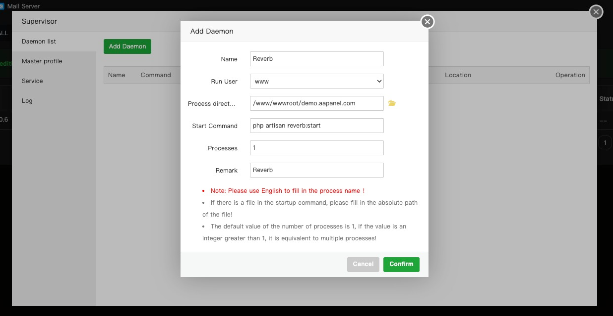

# 🔌 How to setup Laravel reverb

## 📋 Overview
Learn how to set up laravel reverb server for real-time communication in e-School SaaS.

## 🎯 Option 1: aapanel Control Panel (Recommended)

If you are using **aapanel control panel**, you can directly install supervisor from the app store and configure Laravel reverb from there. This is our **recommended option** for aapanel users.

#### 📱 Install Supervisor from App Store
1. Open your aapanel control panel
2. Navigate to the **App Store** section
3. Search for **Supervisor**
4. Click **Install** to add it to your system


#### ⚙️ Configure Laravel Reverb Service {#configure-laravel-reverb-service}
After installing supervisor, configure your Laravel Reverb service:



#### ✅ Benefits of aapanel Method
- 🚀 **Easy Installation**: One-click installation from app store
- 🎛️ **User-Friendly Interface**: Graphical configuration options
- 🔧 **Integrated Management**: Centralized control panel access
- 📊 **Real-time Monitoring**: Built-in status monitoring
- 🛠️ **Simplified Configuration**: No manual command line setup required

---

## 🖥️ Option 2: Manual Installation (Traditional Method)

If you prefer manual installation or are not using aapanel, follow the traditional setup method below.

### 1️⃣ Install Required Packages
Open the Terminal from an SSH Connection:

```bash
sudo apt-get update
```

```bash
sudo apt-get install supervisor
```

### 2️⃣ Create Configuration File {#create-configuration-file}
```bash
sudo nano /etc/supervisor/conf.d/laravel-reverb.conf
```

### 3️⃣ Add Configuration
Add the following content to the configuration file:

```ini
[program:laravel-reverb]
command=php artisan reverb:start
directory=/path/to/your/project
autorestart=true
startsecs=3
startretries=3
stdout_logfile=/path/to/your/project/storage/logs/reverb-out.log
stderr_logfile=/path/to/your/project/storage/logs/reverb.err.log
stdout_logfile_maxbytes=2MB
stderr_logfile_maxbytes=2MB
user=www
priority=999
numprocs=1
stopsignal=QUIT
process_name=%(program_name)s_%(process_num)02d
```

### 4️⃣ Update Supervisor
```bash
sudo supervisorctl reread
```

```bash
sudo supervisorctl update
```

### 5️⃣ Check Status
```bash
sudo supervisorctl status
```

**✅ Expected Output:**
```
laravel-reverb   RUNNING   pid 12345, uptime 0:03:21
```

### 6️⃣ .env file configuration
```ini
BROADCAST_DRIVER=reverb
REVERB_APP_ID=your-app-id
REVERB_APP_KEY=your-app-key
REVERB_APP_SECRET=your-app-secret
REVERB_HOST=127.0.0.1
REVERB_PORT=9090
REVERB_SCHEME=http
VITE_REVERB_APP_KEY="${REVERB_APP_KEY}"
VITE_REVERB_HOST="${REVERB_HOST}"
VITE_REVERB_PORT="${REVERB_PORT}"
VITE_REVERB_SCHEME="${REVERB_SCHEME}"
```

<!-- apache configuration -->
### 7️⃣ Apache Configuration
```ini
ProxyPreserveHost On

ProxyPass "/app/" "ws://127.0.0.1:9090/app/"
ProxyPassReverse "/app/" "ws://127.0.0.1:9090/app/"

RequestHeader set X-Forwarded-Proto "https"
RequestHeader set X-Forwarded-Port "443"
```


<!-- nginx configuaration -->
### 8️⃣ Nginx Configuration
```ini
location /app/ {
    proxy_pass http://127.0.0.1:9090/app/;

    # WebSocket Support
    proxy_http_version 1.1;
    proxy_set_header Upgrade $http_upgrade;
    proxy_set_header Connection "upgrade";

    # Preserve Host
    proxy_set_header Host $host;

    # Forwarding Headers (X-Forwarded-Proto and Port)
    proxy_set_header X-Real-IP $remote_addr;
    proxy_set_header X-Forwarded-For $proxy_add_x_forwarded_for;
    proxy_set_header X-Forwarded-Proto https;
    proxy_set_header X-Forwarded-Port 443;

    # Buffering must be off for WebSockets to work reliably
    proxy_buffering off;
}
```


## 🎉 Final Result

**🔗 Your Socket URL:** `ws://YOUR-DOMAIN:9090/app/{REVERB_APP_KEY}`

**🔗 Your Secure Socket URL:** `wss://YOUR-DOMAIN/app/{REVERB_APP_KEY}`

## 📝 Important Notes
- Replace `/path/to/your/laravel/` with your actual Laravel project path
- Replace `username` with your server username

> ⚠️ **Important:** Ensure port `9090` is open in your firewall.
