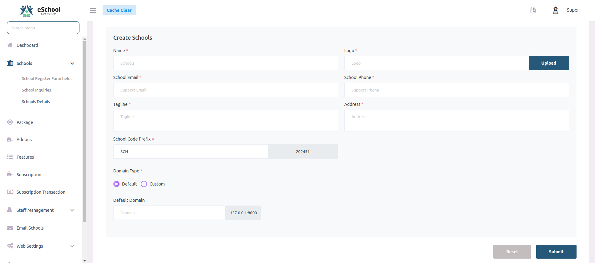
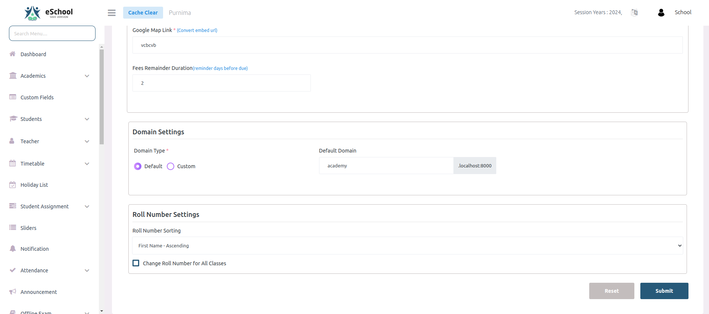
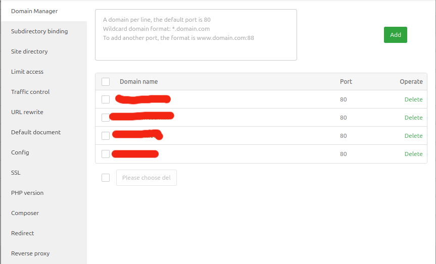

# 🌐 How to Setup Custom Domain

## 📋 Overview
Learn how to configure custom domains for schools in your e-School SaaS system.

## 🏷️ Domain Types

When creating a school, the admin has the option to specify the domain type for the school's website. Schools can also choose the domain type from General Settings. They can choose between two domain types:

### 🔗 Default Domain
This is a predefined domain provided by the system (e.g., `schoolname.yoursystemdomain.com`). 
- ✅ Automatically set up
- ✅ No additional configuration required
- ✅ Ready to use immediately

### 🎯 Custom Domain
If the school has its own domain, the admin can enter it during setup or from general settings.
- ⚠️ Requires proper DNS configuration
- 🔧 Must point to server's IP address
- ✅ Professional branding opportunity

## 🖥️ Server Configuration

## 👨‍💻 Steps for Super Admin

### 1️⃣ Add Custom Domain to VPS
- 🔐 Log into the VPS server
- ⚙️ Configure the custom domain to work with the VPS server
- 🏗️ Create a virtual host configuration

### 2️⃣ Enable SSL Certificate
- 🔒 Install SSL for the custom domain
- 🆓 Use Let's Encrypt for free SSL
- 💳 Or install a paid SSL certificate

## 🏫 Steps for School Admin

### 1️⃣ Get Server Information
- 📍 Find the VPS server's IP address
- 🔍 Check "General Settings" section
- 📋 Note the IP when selecting "Custom Domain" option

### 2️⃣ Update DNS Settings
- 🌐 Log into your domain provider's dashboard
- ➕ Add a DNS A record
- 🎯 Point the custom domain to the VPS server's IP address

### 3️⃣ Wait for DNS Propagation
- ⏰ DNS changes may take a few minutes to hours
- 🔄 Propagation time varies by provider
- 🧪 Test the domain after propagation

## ✅ Verification Steps

1. 🌐 **Check Domain Resolution**
   - Use online DNS checker tools
   - Verify A record points to correct IP

2. 🔒 **Test SSL Certificate**
   - Ensure HTTPS works properly
   - Check for security warnings

3. 📱 **Test School Access**
   - Verify school website loads correctly
   - Check all features work properly

## 📝 Important Notes

- 🕐 DNS propagation can take up to 48 hours
- 🔄 Clear browser cache if domain doesn't load
- 📞 Contact support if issues persist
- 🔐 Always use HTTPS for security 
