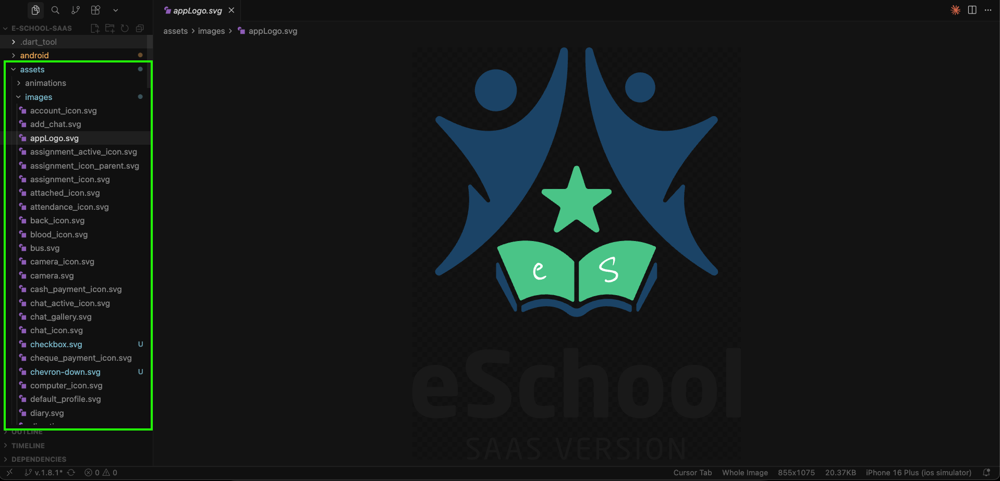
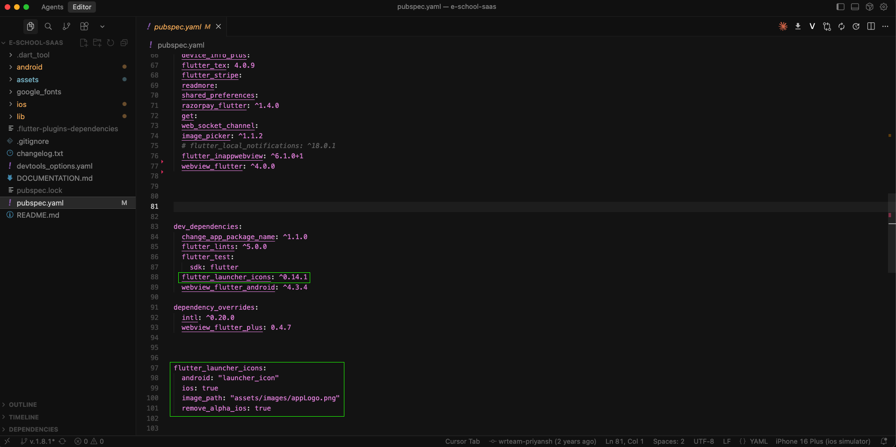
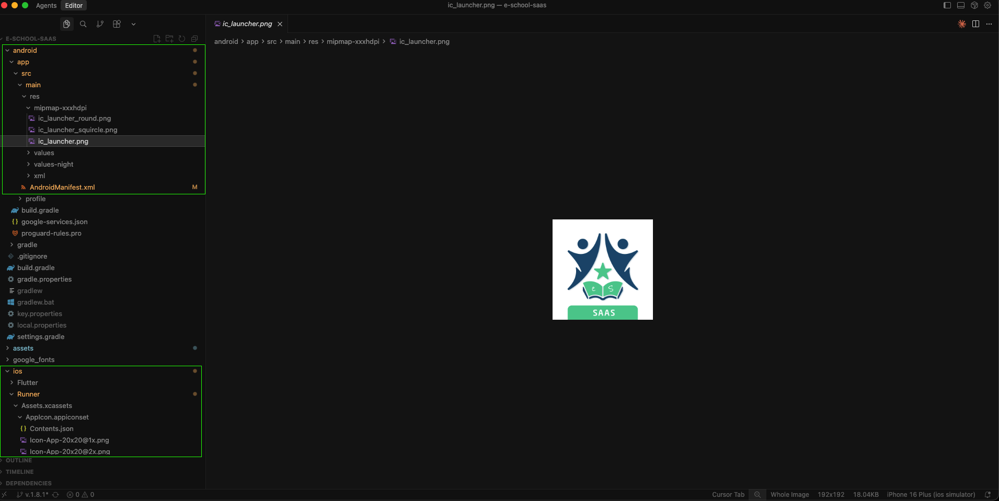

# 🖼️ Change App Logo & Assets

Both eSchool and eSchool Teacher share the same asset structure, so updating branding is the same for both.

## 🔄 Steps to Change Logo

The splash screens in both apps display the logo. To customize them, navigate to the specified locations and replace the existing images. Once you replace the images at these locations, your custom logo will automatically appear in the app's splash screen.

<div style={{display: 'flex', gap: '10px', justifyContent: 'center', alignItems: 'center'}}>
  
  
</div>

<br /> 


### Location of Assets
General images location: `assets/images/`

In this folder, you will find two logo files: appLogo.svg and appLogo.png. Create your branded logo and replace both of these files with your own versions, keeping the same filenames and formats (SVG and PNG). Do not change the filenames or paths—simply replace the images. By doing this, the splash screen logo will be updated in both apps (Staff App and Student/Parent App).

Optional illustrations like `noInternet.svg`, `fileNotFound.svg`, etc., can also be customized for full visual branding.



## 🔄 Steps to Change App icon

## ⚡ Quick Method: Auto‑Generate Launcher Icons

Once you've replaced the two logo files with your own (keeping the same names and formats), run:

```bash
dart run flutter_launcher_icons
```

This command auto‑generates the required icon assets for both Android and iOS using the configuration already present in `pubspec.yaml`. No need to edit `pubspec.yaml` it's ready to go.




## 🛠️ Manually Add Launcher Icon (Optional)

### Android

If you prefer to skip the automatic command, you can generate launcher icons using any online generator and manually add them to your Android and iOS resource folders.




### iOS
- Replace icons in:
  - `ios/Runner/Assets.xcassets/AppIcon.appiconset/`
- Ensure all required sizes are present or regenerate using Xcode's asset tools

After placing all files manually, rebuild the project:

```bash
flutter clean
flutter pub get
flutter run
```

---

## 📱 Customize Onboarding Screen

When users launch either app for the first time, they are greeted with an onboarding screen. This screen displays images and labels that can be fully customized directly from the **Admin Panel**. If no data or images are configured in the Admin Panel, the onboarding screen will display the app icon as a fallback.

<div style={{display: 'flex', gap: '10px', justifyContent: 'center', alignItems: 'center', flexWrap: 'wrap'}}>
  
</div>


<div style={{display: 'flex', gap: '10px', justifyContent: 'center', alignItems: 'center', flexWrap: 'wrap'}}>

</div>

<div style={{display: 'flex', gap: '10px', justifyContent: 'center', alignItems: 'center', flexWrap: 'wrap'}}>
  
  </div>
<br />

### Elements You Can Customize

All onboarding screen elements are managed from the **Admin Panel**, making it easy to update branding without modifying any code:

#### 1. **School Logo**
   - Navigate to: **Admin Panel → General Settings → Vertical Logo**
   - Upload or replace the vertical logo to update the school logo displayed on the onboarding screen.

#### 2. **School Name**
   - Navigate to: **Admin Panel → General Settings → School Name**
   - Update the school name field to reflect your institution's name on the onboarding screen.

#### 3. **Gallery Images**
   - Navigate to: **Admin Panel → Gallery**
   - Add images to the gallery section.
   - **Note**: The first four images uploaded in the gallery will automatically appear on the onboarding screen.
   - This allows you to showcase your school's facilities, events, or achievements.

#### 4. **School Tagline**
   - Navigate to: **Admin Panel → General Settings → School Tagline**
   - Set or update the tagline that will be displayed on the onboarding screen.
   - This is typically a short, inspirational message or motto representing your school's values.

### Key Points
- All changes are made through the Admin Panel—no code modifications required.
- Changes apply to both the Student/Parent App and the Staff/Teacher App.
- If gallery images are not configured, the onboarding screen will gracefully fall back to displaying the app icon.
- Ensure images are properly sized and optimized for mobile viewing for the best user experience.
