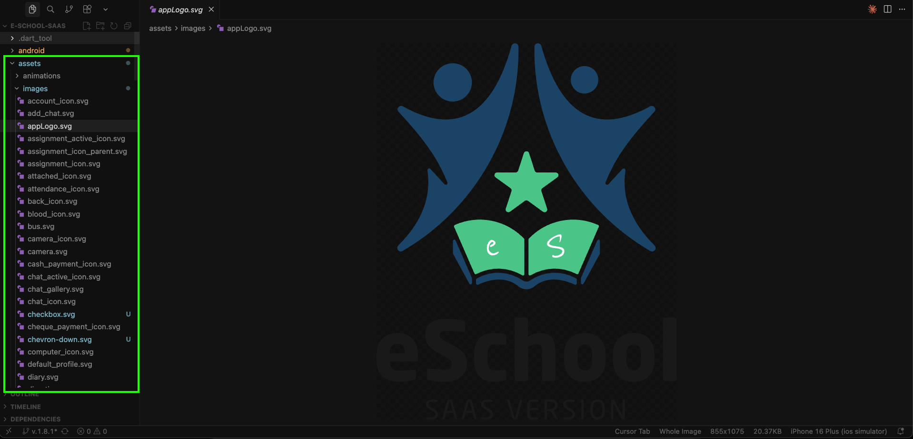

# 🖼️ Change App Logo & Assets

Both eSchool and eSchool Teacher share the same asset structure, so updating branding is the same for both.

## 🔄 Steps to Change Logo

The splash screens in both apps display the logo. To customize them, navigate to the specified locations and replace the existing images. Once you replace the images at these locations, your custom logo will automatically appear in the app's splash screen.

  
  

  

### Location of Assets
General images location: `assets/images/`

Replace these files with your own logo, keeping the same file name and format. Do not rename or move them.

| App | File | Where it is shown |
|-----|------|-------------------|
| **Student/Parent** | `assets/images/appLogo.svg` | Splash screen and onboarding screens |
| **Staff/Teacher** | `assets/images/appLogo.svg` | Onboarding screen |
| **Staff/Teacher** | `assets/images/splash_logo.png` | Splash screen |

#### Illustrations

The pictures on the empty, error and maintenance screens are in `assets/illustrations/` in both apps:

| File | Screen |
|------|--------|
| `no_data.svg` | A list with nothing to show |
| `no_internet.svg` | No internet connection |
| `something_went_wrong.svg` | Any other error |
| `maintenance.svg` | The app is under maintenance |

You do not need to recolour them: they are painted in your primary colour when the app runs. See [Change App Theme](change-app-theme.md). If you replace one with your own artwork, draw the parts that should follow the theme in `#22577A` and keep the file name.

## 🔄 Steps to Change App Icon

The app icon is the first visual element users see on their device's home screen, app drawer, and the Play Store / App Store listing. It must be correctly configured for both **Android** and **iOS** to ensure a professional and consistent brand appearance.

We have a dedicated guide that covers the complete app icon setup process — including automated generation, `pubspec.yaml` configuration, adaptive icon setup for Android, and manual replacement steps for both platforms.

👉 **[App Icon Setup Guide](https://www.marketplace.wrteam.in/docs/flutter-common-doc/GeneralSettings/appicon)**

### What's Covered in the Guide

| Method / Platform | Details |
|-------------------|---------|
| **Automated (Recommended)** | Use `flutter_launcher_icons` package — configure once in `pubspec.yaml` and run a single command |
| **Android Adaptive Icons** | Set foreground, background, monochrome, and inset options for modern Android devices |
| **iOS Icons** | Auto-generate or manually replace icons in `AppIcon.appiconset/` with alpha layer removed for App Store compliance |
| **Manual Method** | Directly replace icon files in platform-specific `res/mipmap-*` and `xcassets` directories |

:::tip Use a 512×512 Source Image
Always start with a **512×512 px** high-resolution PNG as your source icon. The `flutter_launcher_icons` package will automatically generate all required sizes for both platforms from this single file.
:::

---

## 📱 Customize Onboarding Screen

When users launch either app for the first time, they are greeted with an onboarding screen. This screen displays images and labels that can be fully customized directly from the **Admin Panel**. If no data or images are configured in the Admin Panel, the onboarding screen will display the app icon as a fallback.

  

  
  

 

### Elements You Can Customize

All onboarding screen elements are managed from the **Admin Panel**, making it easy to update branding without modifying any code:

#### 1. **School Logo**
   - Navigate to: **Admin Panel → General Settings → Vertical Logo**
   - Upload or replace the vertical logo to update the school logo displayed on the onboarding screen.

#### 2. **School Name**
   - Navigate to: **Admin Panel → General Settings → School Name**
   - Update the school name field to reflect your institution's name on the onboarding screen.

#### 3. **Gallery Images**
   - Navigate to: **Admin Panel → Gallery**
   - Add images to the gallery section.
   - **Note**: The first four images uploaded in the gallery will automatically appear on the onboarding screen.
   - This allows you to showcase your school's facilities, events, or achievements.

#### 4. **School Tagline**
   - Navigate to: **Admin Panel → General Settings → School Tagline**
   - Set or update the tagline that will be displayed on the onboarding screen.
   - This is typically a short, inspirational message or motto representing your school's values.

### Key Points
- All changes are made through the Admin Panel—no code modifications required.
- Changes apply to both the Student/Parent App and the Staff/Teacher App.
- If gallery images are not configured, the onboarding screen will gracefully fall back to displaying the app icon.
- Ensure images are properly sized and optimized for mobile viewing for the best user experience.
