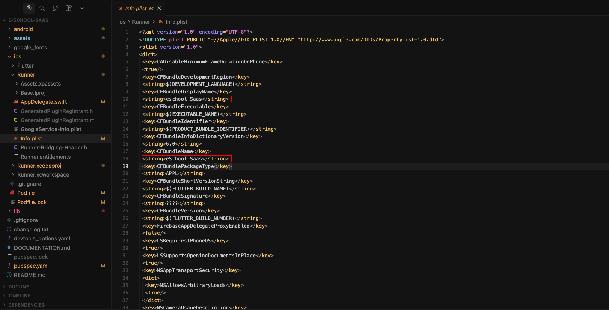

# 📱 Change App Name

## 🔄 Steps to Change Name

### 1️⃣ Android App Name
1. For Android, go to android/app/src/main/AndroidManifest.xml and change the app name as shown in image. Replace the selected eSchool text with your school name
2. Locate the `android:label` attribute
3. Update the value with your desired app name

  
  

 

### 2️⃣ iOS App Name
1. Open `ios/Runner/Info.plist`
2. Find the `CFBundleName` and `CFBundleDisplayName` key
3. Update the value with your desired app name

  
  

 

## 📝 Notes
- Keep the name concise and memorable
- Test the app after changing the name
- Ensure the name follows platform guidelines 
