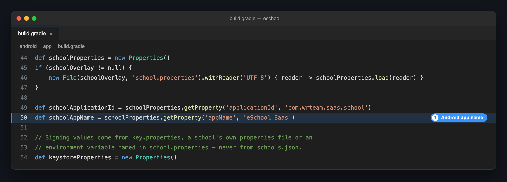
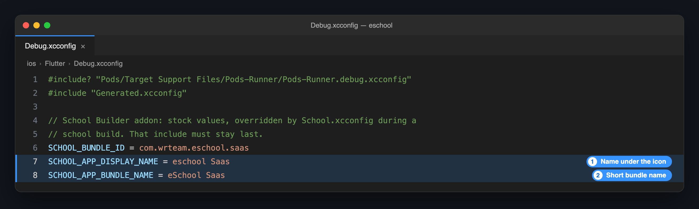

import Tabs from '@theme/Tabs';
import TabItem from '@theme/TabItem';

# 📱 Change App Name

The app name is the text shown under the app icon on the phone. Android and iOS each keep their own, so you set it in two places.

:::info Changed in v1.12.0
The name is no longer typed into `AndroidManifest.xml` or `Info.plist`. Those files now read it from the two files below, so **do not edit `android:label` or `CFBundleDisplayName` directly**.
:::

The names each app ships with:

| App | Android | iOS (under the icon) | iOS (bundle name) |
|-----|---------|----------------------|-------------------|
| **Student/Parent** | `eSchool Saas` | `eschool Saas` | `eSchool Saas` |
| **Staff/Teacher** | `Staff Teacher` | `Saas Staff Teacher` | `Staff Teacher` |

---

## 🔄 Steps to Change Name

### 1️⃣ Android App Name

1. Open `android/app/build.gradle`.
2. Find the line that starts with `def schoolAppName`.
3. Replace the **second** value with your app name:

<Tabs groupId="app">
<TabItem value="student" label="Student/Parent app" default>

```groovy title="android/app/build.gradle"
// highlight-next-line
def schoolAppName = schoolProperties.getProperty('appName', 'Your School')
```

</TabItem>
<TabItem value="staff" label="Staff/Teacher app">

```groovy title="android/app/build.gradle"
// highlight-next-line
def schoolAppName = schoolProperties.getProperty('appName', 'Your School Staff')
```

</TabItem>
</Tabs>



:::caution
Change only the second value. The first one, `'appName'`, is a key the build looks up and must stay as it is.
:::

### 2️⃣ iOS App Name

1. Open `ios/Flutter/Debug.xcconfig`.
2. Set `SCHOOL_APP_DISPLAY_NAME` and `SCHOOL_APP_BUNDLE_NAME`:

   ```properties title="ios/Flutter/Debug.xcconfig"
   SCHOOL_APP_DISPLAY_NAME = Your School
   SCHOOL_APP_BUNDLE_NAME = Your School
   ```

3. Open `ios/Flutter/Release.xcconfig` and make the **same** change. Debug builds read the first file and release builds read the second, so a name set in only one of them shows up in only one kind of build.



| Setting | Where it appears |
|---------|------------------|
| `SCHOOL_APP_DISPLAY_NAME` | Under the app icon on the home screen. |
| `SCHOOL_APP_BUNDLE_NAME` | The app's short name inside iOS. Keep it to 15 characters or fewer. |

:::tip
Write the name without quotes, and leave the `#include? "School.xcconfig"` line as the last line of the file.
:::

### 3️⃣ Run the App Again

```bash
flutter clean
flutter pub get
flutter run
```

If the phone still shows the old name, uninstall the app from the device and run it again.

---

## 🏫 Changing It From the School Builder

If you use the [Multi-School APK add-on](multi-school-apk/overview.md), you can skip the steps above. Open the builder, edit the **Default School**, type the name in **App name** and click **Save to project**. The builder writes the Android and iOS files for you and backs them up first. See [Add a School](multi-school-apk/add-a-school.md).

---

## 📝 Notes

- **Keep it short.** Phones cut long names off under the icon; about 12 characters fits on most.
- **Change both apps.** The Student/Parent app and the Staff/Teacher app are separate projects with separate names.
- **The store listing is separate.** The name on Google Play and the App Store is set in each store's console, not in the code.
