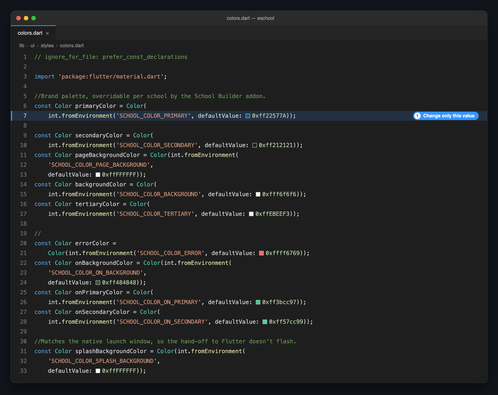
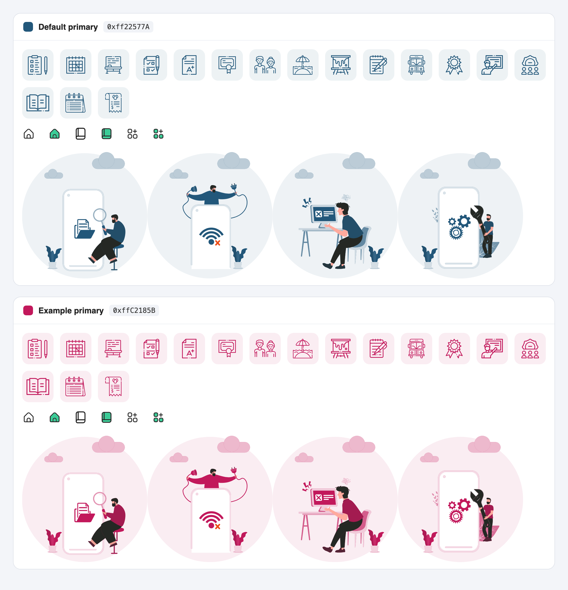

import Tabs from '@theme/Tabs';
import TabItem from '@theme/TabItem';

# 🎨 Change App Theme

Each app keeps its theme colours in one file, `lib/ui/styles/colors.dart`. Change a colour there and every screen that uses it follows, including the menu icons and the illustrations.

---

## 🔄 Steps to Change the Colours

### 1️⃣ Open the Colours File

Go to `lib/ui/styles/colors.dart` in the app you want to change.



### 2️⃣ Replace the Colour Values

Each colour has a `defaultValue`. Replace only that value:

<Tabs groupId="app">
<TabItem value="student" label="Student/Parent app" default>

```dart title="lib/ui/styles/colors.dart"
const Color primaryColor = Color(
    // highlight-next-line
    int.fromEnvironment('SCHOOL_COLOR_PRIMARY', defaultValue: 0xff22577A));
```

</TabItem>
<TabItem value="staff" label="Staff/Teacher app">

```dart title="lib/ui/styles/colors.dart"
Color primaryColor = const Color(
  // highlight-next-line
  int.fromEnvironment('SCHOOL_COLOR_PRIMARY', defaultValue: 0xff29638A),
);
```

</TabItem>
</Tabs>

A colour is written as `0xff` followed by its six-digit hex code:

| Your colour | Write it as |
|-------------|-------------|
| `#22577A` | `0xff22577A` |
| `#C2185B` | `0xffC2185B` |

:::caution Change only the `defaultValue`
Keep the names in quotes, such as `'SCHOOL_COLOR_PRIMARY'`, exactly as they are. The [Multi-School APK add-on](multi-school-apk/overview.md) uses them to give each school its own colours.
:::

### 3️⃣ Run the App Again

Stop the app and run it again. The colours are built into the app, so a hot reload does not show them.

```bash
flutter run
```

---

## 🎨 What Each Colour Controls

<Tabs groupId="app">
<TabItem value="student" label="Student/Parent app" default>

| Colour | Default | Where you see it |
|--------|---------|------------------|
| `primaryColor` | `#22577A` | The main brand colour: top bars, buttons, menu icons and illustrations. |
| `secondaryColor` | `#212121` | Main text, titles and the bottom navigation icons. |
| `pageBackgroundColor` | `#FFFFFF` | The background of every screen. |
| `backgroundColor` | `#F6F6F6` | Cards, panels and input fields. |
| `tertiaryColor` | `#EBEEF3` | Borders and light fills. |
| `errorColor` | `#FF6769` | Error messages and failed states. |
| `onBackgroundColor` | `#484848` | Secondary text and divider lines. |
| `onPrimaryColor` | `#3BCC97` | The accent: the selected bottom navigation icon and the shapes on the login screens. |
| `onSecondaryColor` | `#57CC99` | Light accent tints. |
| `splashBackgroundColor` | `#FFFFFF` | The background of the splash screen. |

</TabItem>
<TabItem value="staff" label="Staff/Teacher app">

| Colour | Default | Where you see it |
|--------|---------|------------------|
| `primaryColor` | `#29638A` | The main brand colour: top bars, buttons, menu icons and illustrations. |
| `secondaryColor` | `#1A1C1D` | Main text, titles and the bottom navigation icons. |
| `pageBackgroundColor` | `#F7F9FF` | The background of every screen. |
| `backgroundColor` | `#FFFFFF` | Cards, panels and input fields. |
| `errorColor` | `#BA1A1A` | Error messages and failed states. |
| `tertiaryColor` | `#EBEEF3` | Borders. |

</TabItem>
</Tabs>

### Icons and Illustrations Follow the Primary Colour

You do not need to recolour any image. The menu icons, their tinted tiles and the illustrations on the empty, error and maintenance screens are painted in your primary colour when the app runs:



---

## 📌 Colours Set Outside This File

| What | Where to change it |
|------|--------------------|
| **Notification colour** (Android) | `notification_color` in `android/app/src/main/res/values/colors.xml`. Set it to your primary colour. |
| **App icon** | See [Change App Logo & Assets](change-app-logo.md). |
| **Launch screen** | The first screen, shown before the app's own splash: `launch_background.xml` on Android and `LaunchScreen.storyboard` on iOS. In the Student/Parent app, keep its background the same as `splashBackgroundColor`, or the screen flashes between the two. |

---

## 🏫 Building Apps for Several Schools?

With the [Multi-School APK add-on](multi-school-apk/overview.md), each school sets its own colours in the builder and no file is edited. The values in `colors.dart` are the defaults that a school inherits for any colour it leaves empty. See [Add a School](multi-school-apk/add-a-school.md).

---

## 📝 Notes

- **Pick a primary colour dark enough for white text.** Buttons and top bars put white text on it.
- **Keep the accent different from the primary.** In the Student/Parent app, `onPrimaryColor` marks the selected tab, so it has to stand out.
- **Change both apps.** The Student/Parent app and the Staff/Teacher app each have their own `colors.dart`.
- **Check the real screens.** After changing colours, open the login screen, the home screen, a list and an error screen before you publish.
