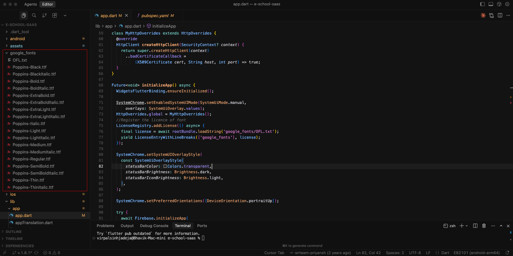
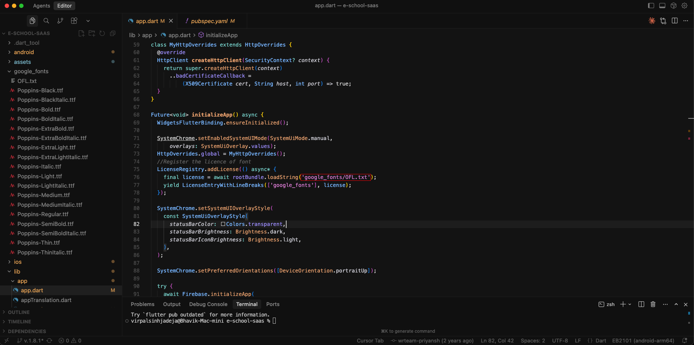

# 🔤 Change App Font

Customize your app's typography by integrating Google Fonts to match your brand's visual identity.

---

## 📋 Overview

The eSchool app uses Google Fonts for flexible and beautiful typography. You can easily change the app's font family by selecting any font from Google Fonts and updating a single configuration file.

---

## 🔄 Steps to Change Font

### Step 1: Choose Your Google Font

1. Visit [Google Fonts](https://fonts.google.com/)
2. Browse and select your desired font family
3. Note the exact font family name (e.g., "Roboto", "Poppins", "Open Sans")

### Step 2: Update Font Configuration

Navigate to the font configuration file and update the font family:

**File Location:** `assets/google_fonts/`




### Step 3: Update license file

#### In the app.dart file, update the license file name in the google_fonts section with the name of the new file you have added.




### Step 4: Verify Font in pubspec.yaml

The app is pre-configured to use Google Fonts. Ensure the `google_fonts` package is listed in your `pubspec.yaml`:

```yaml
dependencies:
  google_fonts: ^latest_version
```

If not present, add it and run:

```bash
flutter pub get
```


### Step 6: Rebuild the App

After updating the font family name, rebuild your app to see the changes:

```bash
flutter clean
flutter pub get
flutter run
```

The new font will be automatically downloaded and applied throughout the app.

---

## ✨ How It Works

The app uses the **`google_fonts`** package, which:
- Automatically downloads fonts from Google Fonts on-demand
- Caches fonts locally for offline use
- Applies the font across all text widgets in the app
- Requires no manual font file downloads or asset management

You simply specify the font family name, and the package handles everything else!

---

## 💡 Popular Google Fonts

Here are some recommended fonts for educational apps:

- **Poppins** - Modern, clean, and highly readable
- **Roboto** - Professional and versatile (Android default)
- **Open Sans** - Friendly and clear for all screen sizes
- **Lato** - Elegant and easy to read
- **Montserrat** - Bold and contemporary
- **Nunito** - Rounded and approachable

---

## 📝 Important Notes

- **Font Name Accuracy**: Ensure the font family name matches exactly as shown on Google Fonts (case-sensitive)
- **Internet Required**: The first time the app runs with a new font, it needs internet to download it
- **Caching**: Once downloaded, fonts are cached and work offline
- **Compatibility**: All Google Fonts are optimized for mobile devices
- **Testing**: Always test your chosen font on different screen sizes and devices

---

## ⚠️ Troubleshooting

### Font Not Changing?

1. **Check Font Name**: Verify the exact spelling and capitalization on Google Fonts
2. **Clean Build**: Run `flutter clean && flutter pub get`
3. **Rebuild App**: Ensure you completely rebuild the app, not just hot reload
4. **Internet Connection**: Make sure the device has internet on first run with new font

### Font Looks Incorrect?

- Some fonts may not support all language characters
- Test with your app's content to ensure proper rendering
- Consider font weights and styles for better readability

---

## 🎨 Custom Fonts (Alternative Method)

If you prefer to use custom fonts not available on Google Fonts:

### Step 1: Add Font Files

Place your custom font files (`.ttf` or `.otf`) in:
```
assets/fonts/YourFontName-Regular.ttf
assets/fonts/YourFontName-Bold.ttf
```

### Step 2: Update pubspec.yaml

```yaml
flutter:
  fonts:
    - family: YourFontName
      fonts:
        - asset: assets/fonts/YourFontName-Regular.ttf
        - asset: assets/fonts/YourFontName-Bold.ttf
          weight: 700
```


### Step 3: Rebuild

```bash
flutter clean
flutter pub get
flutter run
```

---

## 🔗 Resources

- [Google Fonts](https://fonts.google.com/) - Browse available fonts
- [google_fonts Package](https://pub.dev/packages/google_fonts) - Package documentation
- [Flutter Typography](https://docs.flutter.dev/cookbook/design/fonts) - Official Flutter font guide
