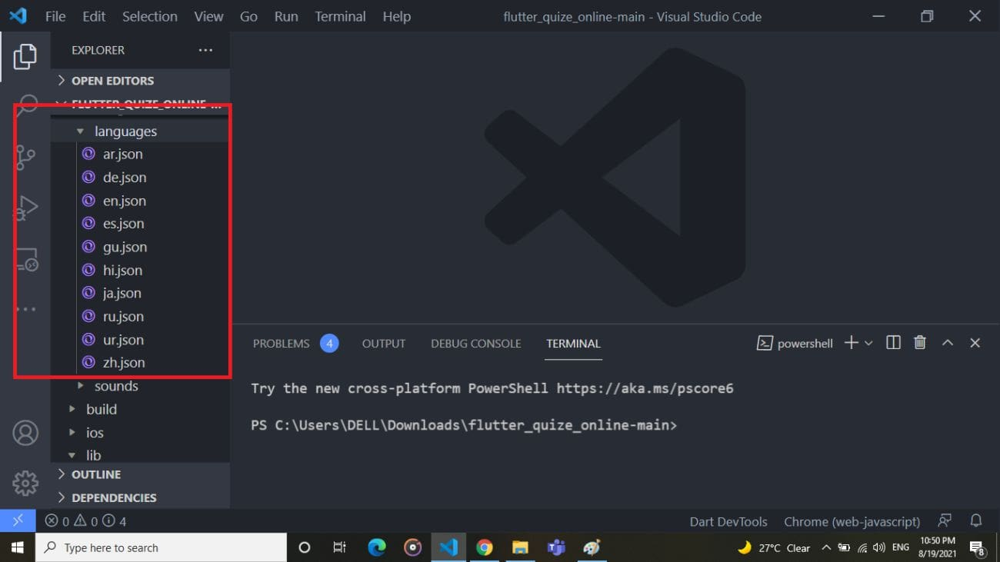
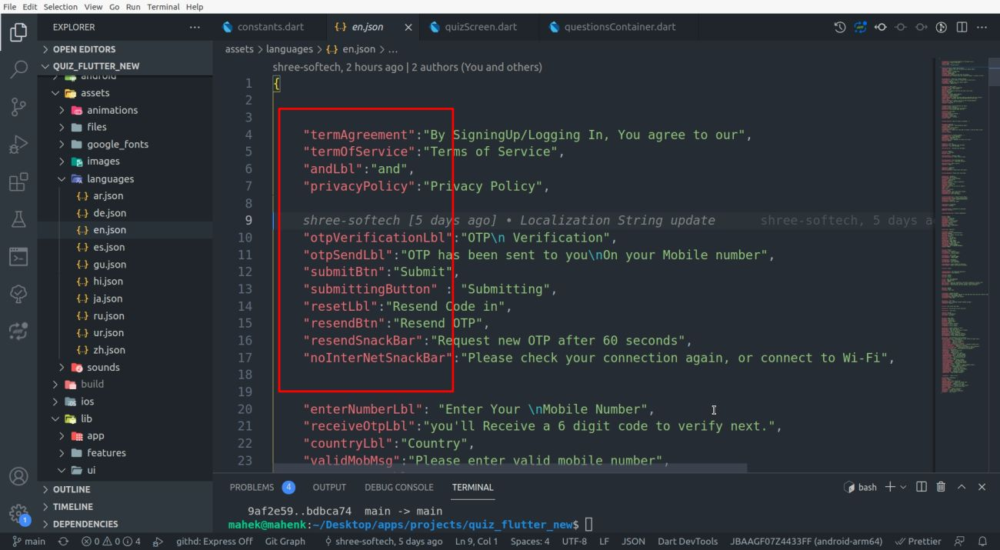
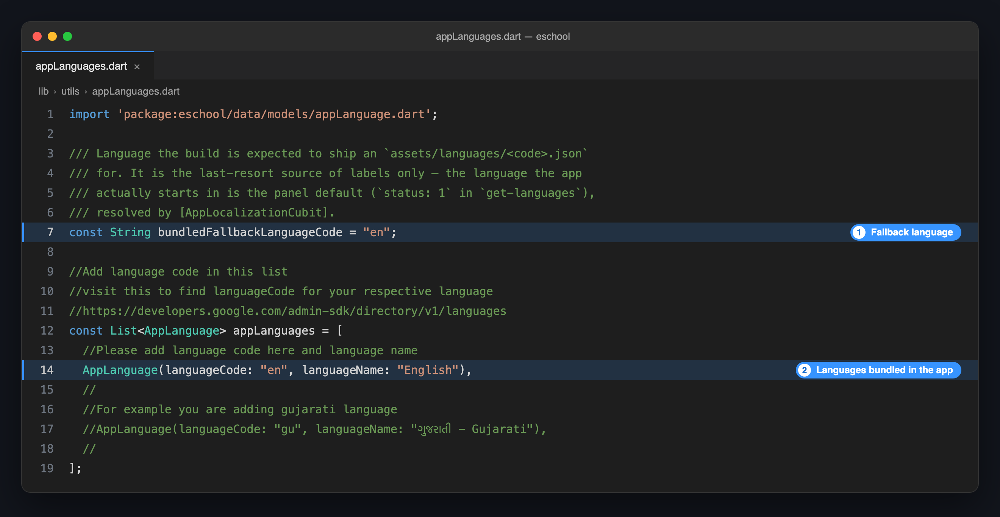

# 🌍 Change App Language

The apps take their languages from your admin panel. You add a language, upload its translations and choose the default there, and both apps pick it up. No code change and no new build is needed.

The app decides which language to open in, in this order:

1. The language the user chose in the app.
2. The **default language** set in the admin panel.
3. The **fallback language** bundled in the app, used only until the app has reached the admin panel once (for example, a first launch without internet).

---

## 🔄 Add a Language or Change the Default

1. In the **Super Admin Panel**, open **Language Settings**.
2. Add the language and upload its translation files for the **Student/Parent App** and the **Staff/Teacher App**. The panel offers a sample JSON file for each to translate.
3. To make it the language new users start in, set it as the **default language**.
4. Open the app again. The language appears in the app's language list.

See [Language Settings](/superadmin/settings/system-settings/language-settings) for each field, including right-to-left languages.

:::tip
Changing the default in the panel does not override a user who already chose a language in the app.
:::

---

## 📦 Optional: Bundle a Language in the App

Do this only if the app must open in your language on a first launch **without internet**. Otherwise the panel is enough.

### 1️⃣ Add the Translation File

1. In `assets/languages/`, copy `en.json` and name the copy after your language code, for example `hi.json`. Find your code in [Google's language code list](https://developers.google.com/admin-sdk/directory/v1/languages).

   

2. Translate the **values** and leave the keys as they are:

   

### 2️⃣ List the Language

Open `lib/utils/appLanguages.dart` and add the language to `appLanguages`:

```dart title="lib/utils/appLanguages.dart"
const List<AppLanguage> appLanguages = [
  AppLanguage(languageCode: "en", languageName: "English"),
  // highlight-next-line
  AppLanguage(languageCode: "hi", languageName: "हिन्दी - Hindi"),
];
```

### 3️⃣ Make It the Fallback Language

In the same file, set `bundledFallbackLanguageCode` to your language code:

```dart title="lib/utils/appLanguages.dart"
// highlight-next-line
const String bundledFallbackLanguageCode = "hi";
```



:::caution
The fallback code must have a matching file in `assets/languages/`. Without `hi.json`, a fallback of `"hi"` shows label names in place of text.
:::

### 4️⃣ Run the App Again

```bash
flutter run
```

Repeat these steps in the other app if both should start in your language.
