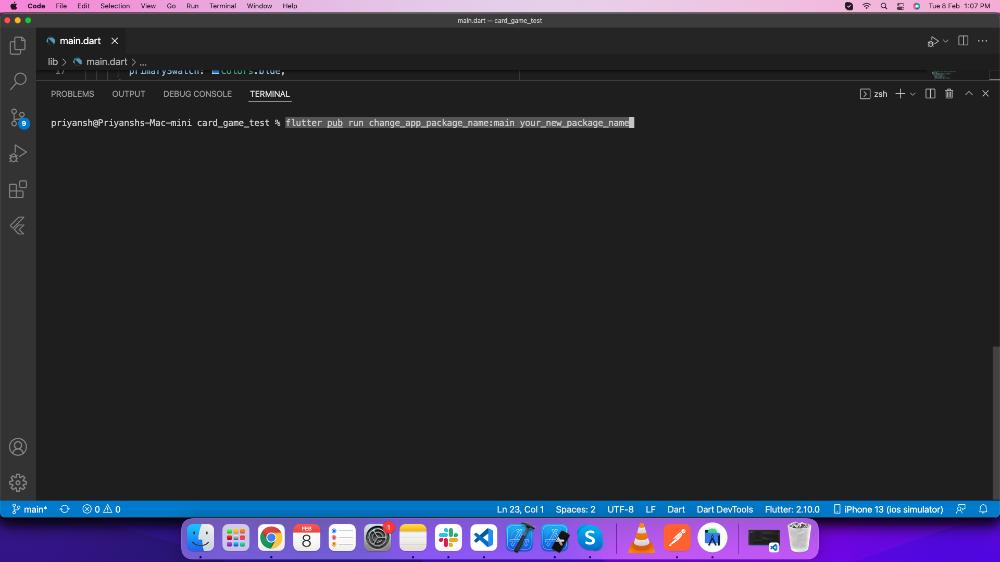
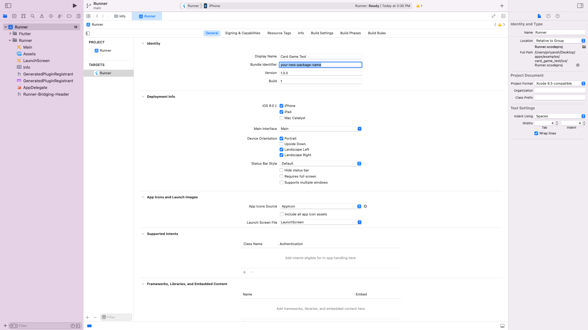

# 📦 Change Package Name

## 📋 Overview

Learn how to change the package name (bundle identifier) for both Android and iOS platforms in the eSchool SaaS mobile application.

## 🔄 Steps to Change Package Name

### 1️⃣ Prepare the Project

1. **Unzip the downloaded code**. After unzipping you will have **E-School - Flutter Code** zip folder. Unzip that folder and open it in Android Studio or Visual Studio Code.

2. **Open IDE terminal**, go to your project path and execute command:
   ```bash
   flutter pub get
   ```

3. **If you are running this app for iOS**, then run these following commands in terminal:
   ```bash
   cd ios
   pod install
   cd ..
   ```

### 2️⃣ Change Package Name of Android App

Execute this command in your terminal:

```bash
flutter pub run change_app_package_name:main your_new_package_name
```

Replace `your_new_package_name` with your desired package name (e.g., `com.yourcompany.eschool`).



### 3️⃣ Change Package Name of iOS App

1. Open **iOS folder** of this project in Xcode
2. Go to **Runner** → **Targets** → **General** → **Identity**
3. Enter new package name in **Bundle Identifier**



## ⚠️ Important Notes

- Package name must be **unique** and follow platform naming conventions
- Android package names should use reverse domain notation (e.g., `com.yourcompany.eschool`)
- iOS bundle identifiers should match the same format
- After changing the package name, make sure to:
  - Clean and rebuild the project
  - Update any Firebase configuration files if applicable
  - Test the app thoroughly on both platforms

## 🔧 Example Package Names

- **Android**: `com.yourcompany.eschool`
- **iOS**: `com.yourcompany.eschool`
