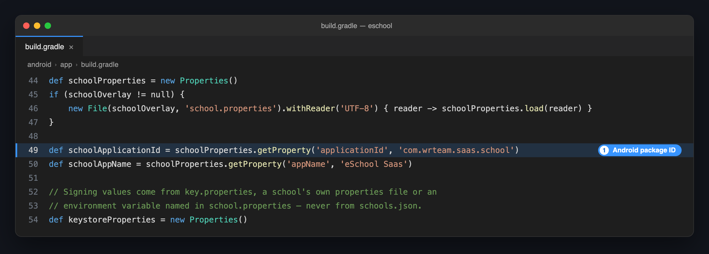
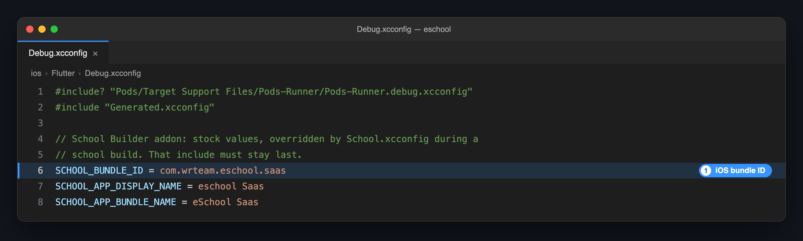

# 📦 Change Package Name

## 📋 Overview

The **package name** (also called the *bundle identifier* on iOS) is the unique identifier for your application on the Play Store and App Store. It must be set correctly before you release your app, as it cannot be changed after publishing without creating a new app listing.

This guide walks you through changing the package name for both **Android** and **iOS** in the eSchool SaaS mobile application.

---

## 🏷️ Package Name Naming Rules

Before choosing your package name, follow these conventions to avoid build errors or store rejections:

| Rule | Details |
|------|---------|
| ✅ **Lowercase only** | Use only lowercase letters (`a–z`) |
| ✅ **Dot-separated** | Use dots (`.`) as segment separators |
| ✅ **Reverse domain format** | e.g., `com.yourcompany.appname` |
| ❌ **No spaces** | Spaces are not allowed anywhere |
| ❌ **No special characters** | Avoid `@`, `-`, `_`, `#`, etc. |
| ❌ **No uppercase letters** | All characters must be lowercase |

:::tip Consistency is Key
Ensure your package name **matches exactly** across Android, iOS, and Firebase. A mismatch between platforms is one of the most common causes of Firebase integration failures.
:::

---

## 🔄 Steps to Change Package Name

### 1️⃣ Prepare the Project

1. **Unzip the downloaded code.** After unzipping you will have the **E-School - Flutter Code** folder. Open it in Android Studio or Visual Studio Code.

2. **Install Flutter dependencies** — open the IDE terminal, navigate to your project root, and run:
   ```bash
   flutter pub get
   ```

3. **iOS only** — if you are targeting iOS, also run:
   ```bash
   cd ios
   pod install
   cd ..
   ```

---

### 2️⃣ Run the Rename Command (Recommended)

From v1.12.0, both apps include a rename command that sets the Android package name and the iOS bundle identifier in one step. `flutter pub get` in the previous step downloads it.

1. Run this command from the project root, with your own package name:

   ```bash
   dart run change_app_package_name:main com.yourcompany.eschool
   ```

2. Check the output. It lists each file it changed, with the old and the new value:

   ```text
   📦 Changing package name to com.yourcompany.eschool
      Android + iOS

   🤖 Android · School Builder layout
      📝 android/app/build.gradle
         applicationId: com.wrteam.saas.school → com.yourcompany.eschool
         namespace: com.wrteam.saas.school → com.yourcompany.eschool
      📝 android/app/src/main/AndroidManifest.xml
         package: com.wrteam.saas.school → com.yourcompany.eschool
      📝 android/app/src/main/kotlin/com/wrteam/saas/school/MainActivity.kt
         package: com.wrteam.saas.school → com.yourcompany.eschool
         moved to: android/app/src/main/kotlin/com/wrteam/saas/school → android/app/src/main/kotlin/com/yourcompany/eschool

   🍎 iOS · School Builder layout
      📝 ios/Flutter/Debug.xcconfig
         SCHOOL_BUNDLE_ID: com.wrteam.eschool.saas → com.yourcompany.eschool
      📝 ios/Flutter/Release.xcconfig
         SCHOOL_BUNDLE_ID: com.wrteam.eschool.saas → com.yourcompany.eschool

   ✅ Package name updated.
   ```

   On Android the command renames the code too: `namespace`, the `package` of each manifest, and the package and folder of `MainActivity`. No file keeps the old name except the Firebase files, which you regenerate below.

3. Repeat in the other app. The **Student/Parent** app and the **Staff** app are separate projects, and each needs its own package name.

The command also accepts these options:

| Option | What it does |
|--------|--------------|
| `--dry-run` | Shows what would change without writing anything. Use it to check before you rename. |
| `--android` | Changes only the Android package name. |
| `--ios` | Changes only the iOS bundle identifier. |
| `--plain` | Prints plain text, without emoji or colour. |

Both platforms are checked before either is written. If one of them cannot be renamed, the command says why, changes nothing and stops.

:::info Names with reserved words
Avoid a name with a word Java reserves, such as `new`, `package`, `default`, `class` or `int`. Android does not accept such a name for the code. For a name like `com.new.package.name`, the command renames only the application ID, which is the name the stores and Firebase use, keeps the code's package as it was, and says so. The app still builds.
:::

:::warning Keep the command that comes with the code
In `pubspec.yaml`, `change_app_package_name` points to a version made for this project (v1.7.0). Do not replace it with `change_app_package_name` from pub.dev. On this project, the pub.dev version (1.5.0):

- **Android:** stops with `applicationId not found` and changes nothing.
- **iOS:** overwrites the bundle ID setting in `ios/Runner.xcodeproj/project.pbxproj`, which cuts the link to `SCHOOL_BUNDLE_ID`.

If you already ran the pub.dev version, run the command above. It puts the link in `project.pbxproj` back.
:::

If the command changed both platforms, skip to [After Changing the Package Name](#-after-changing-the-package-name). The next two steps make the same changes by hand.

---

### 3️⃣ Or Change the Android Package Name by Hand

1. Open `android/app/build.gradle`.
2. Find the line that starts with `def schoolApplicationId`.
3. Replace the **second** value with your package name:

```groovy title="android/app/build.gradle"
// highlight-next-line
def schoolApplicationId = schoolProperties.getProperty('applicationId', 'com.yourcompany.eschool')
```



:::note The other names are optional by hand
`namespace` in the same file, `package=` in `AndroidManifest.xml` and the Kotlin folder under `android/app/src/main/kotlin/` are names used inside the code. The Play Store and Firebase only read the package ID you set above, so the app works with them left as they are. The rename command changes them as well, so that nothing shows the old name; by hand, it is safest to leave them.
:::

---

### 4️⃣ Or Change the iOS Bundle Identifier by Hand

1. Open `ios/Flutter/Debug.xcconfig` and set `SCHOOL_BUNDLE_ID`:

   ```properties title="ios/Flutter/Debug.xcconfig"
   SCHOOL_BUNDLE_ID = com.yourcompany.eschool
   ```

2. Open `ios/Flutter/Release.xcconfig` and make the **same** change. Debug builds read the first file and release builds read the second.



:::caution Do not type it into Xcode
In Xcode, **Targets → Runner → General → Bundle Identifier** now reads its value from `SCHOOL_BUNDLE_ID`. Typing a bundle ID into that field cuts the link, and the [Multi-School APK add-on](multi-school-apk/overview.md) can no longer give each school its own ID.
:::

:::tip Using the School Builder?
With the [Multi-School APK add-on](multi-school-apk/overview.md), edit the **Default School** in the builder, enter the Android package ID and the iOS bundle ID, and click **Save to project**. The builder writes these files for you.
:::

---

## ✅ After Changing the Package Name

Once both platforms are updated, complete the following checklist before running the app:

- [ ] **Clean the build** — run `flutter clean` followed by `flutter pub get`
- [ ] **Update Firebase** — regenerate and replace `google-services.json` (Android) and `GoogleService-Info.plist` (iOS) with files tied to the new package name. When these files are still for the old name, the rename command prints the `flutterfire configure` command to run. See 👉 [Integrate with Firebase](./integrate-with-firebase.md)
- [ ] **Verify iOS** — confirm `SCHOOL_BUNDLE_ID` is the same in `Debug.xcconfig` and `Release.xcconfig`
- [ ] **Test on both platforms** — run the app on an Android emulator and an iOS simulator to confirm everything works

:::warning Firebase Mismatch
If you change the package name but do not update Firebase configuration files, Firebase services (authentication, push notifications, Firestore) will **fail silently**. Always regenerate and replace the Firebase config files after renaming.
:::

---

## 💡 Example

| Platform | Example Package Name |
|----------|----------------------|
| Android | `com.yourcompany.eschool` |
| iOS (Bundle ID) | `com.yourcompany.eschool` |
| Firebase Project | `com.yourcompany.eschool` |
