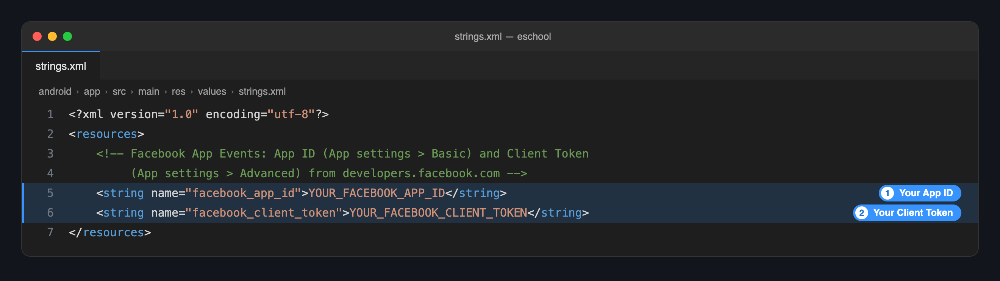
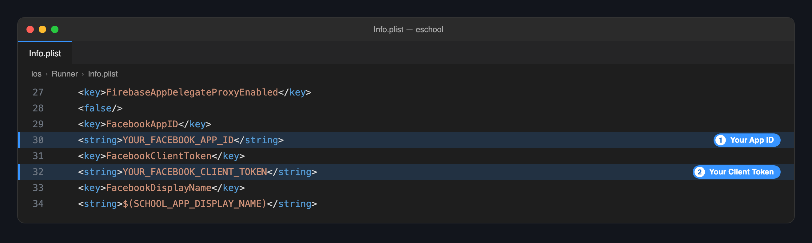

import Tabs from '@theme/Tabs';
import TabItem from '@theme/TabItem';

# 📊 Facebook App Events

Facebook App Events lets you see installs and app activity in **Meta Events Manager**, and use them to measure and target your Facebook and Instagram ads.

From **v1.12.0**, the Facebook SDK is already set up in both apps. You do **not** add a package, edit `AndroidManifest.xml` or write any code. You only add two values from your own Facebook app: the **App ID** and the **Client Token**.

:::info Optional
If you do not use Facebook ads or analytics, skip this page. The apps work as they are with the placeholder values.
:::

---

## 📋 Before You Start

You need a Facebook app with the **Android** and **iOS** platforms added, using the same package name and bundle ID as your app. See [Change Package Name](./change-package-name.md) for those two IDs.

:::tip New to this? Start with the full guide
If you have not created a Facebook app yet, or do not know where to get the App ID and Client Token, follow this guide first. It explains how to create the app and the keys, step by step:

👉 **[Facebook App Events Setup Guide](https://marketplace.wrteam.in/docs/flutter-common-doc/GeneralSettings/facebook-app-events)**

Then come back here to add the two values to the app code.
:::

Once you have the Facebook app, copy these two values from [developers.facebook.com](https://developers.facebook.com/apps):

| Value | Where to find it |
|-------|------------------|
| **App ID** | **App settings → Basic** |
| **Client Token** | **App settings → Advanced → Security** |

:::danger Never put the App Secret in the app
The **App Secret** on the Basic settings page is for servers only. Do not add it to the app code or share it. The mobile apps need only the App ID and the Client Token. If your App Secret has been shared, reset it on the same page.
:::

---

## 🔄 Steps in the App Code

Only two files change in each app.

### 1️⃣ Android

1. Open `android/app/src/main/res/values/strings.xml`.
2. Replace the two placeholder values with your own:

```xml title="android/app/src/main/res/values/strings.xml"
<resources>
    <!-- highlight-start -->
    <string name="facebook_app_id">1234567890123456</string>
    <string name="facebook_client_token">abcdef0123456789abcdef0123456789</string>
    <!-- highlight-end -->
</resources>
```



:::note
Change only the two values. `AndroidManifest.xml` already reads them from this file, so leave it as it is.
:::

### 2️⃣ iOS

1. Open `ios/Runner/Info.plist`.
2. Find `FacebookAppID` and `FacebookClientToken`, and replace the value under each:

```xml title="ios/Runner/Info.plist"
<key>FacebookAppID</key>
<!-- highlight-next-line -->
<string>1234567890123456</string>
<key>FacebookClientToken</key>
<!-- highlight-next-line -->
<string>abcdef0123456789abcdef0123456789</string>
<key>FacebookDisplayName</key>
<string>$(SCHOOL_APP_DISPLAY_NAME)</string>
```



:::note
Leave `FacebookDisplayName` as it is. It takes your app name automatically. See [Change App Name](./change-app-name.md).
:::

### 3️⃣ Repeat in the Other App

The **Student/Parent** app and the **Staff/Teacher** app are separate projects. Make the same two changes in each.

| | Same Facebook app for both | A Facebook app for each |
|---|---|---|
| **When to choose it** | You want all activity in one place. | You want to report on students and staff separately. |
| **What to do** | Add both apps' package names and bundle IDs to the one Facebook app, and use the same App ID and Client Token in both projects. | Use each Facebook app's own App ID and Client Token in its project. |

### 4️⃣ Run the App Again

These values are built into the app, so stop it and run it again:

```bash
flutter clean
flutter pub get
flutter run
```

---

## ✅ Check It Works

1. Open the app on a device and use it for a minute.
2. In [Meta Events Manager](https://www.facebook.com/events_manager2), select your app.
3. Open **Test events** or the **Overview**. An **App Install** or **Activate App** event should appear. It can take up to 20 minutes the first time.

---

## 🛠️ Troubleshooting

| Problem | Likely cause | What to do |
|---------|--------------|------------|
| No events appear | The placeholder values are still in one of the two files | Check both `strings.xml` and `Info.plist`, in the app you are running. |
| Events appear for Android only, or iOS only | Only one platform's file was changed | Make the change in the other file too. |
| The app closes at launch after the change | The App ID has letters or spaces, or the Client Token was put in the App ID field | The App ID is digits only. Copy both values again. |
| Events from the wrong app | The other project has a different App ID | Compare the values in both projects. |

---

## 🔗 Full Guide

The steps above cover only what you change in the eSchool SaaS app code. For everything on the Facebook side, follow the complete guide:

👉 **[Facebook App Events Setup Guide](https://marketplace.wrteam.in/docs/flutter-common-doc/GeneralSettings/facebook-app-events)**

Use it for creating the Facebook app, adding the Android and iOS platforms to it, and finding your App ID and Client Token.

:::tip Skip the code steps in that guide
The guide is written for any Flutter app, so it also explains adding the package and editing the manifest. In eSchool SaaS v1.12.0 and later that part is already done. Use the guide for the Facebook side, and this page for the app code.
:::
