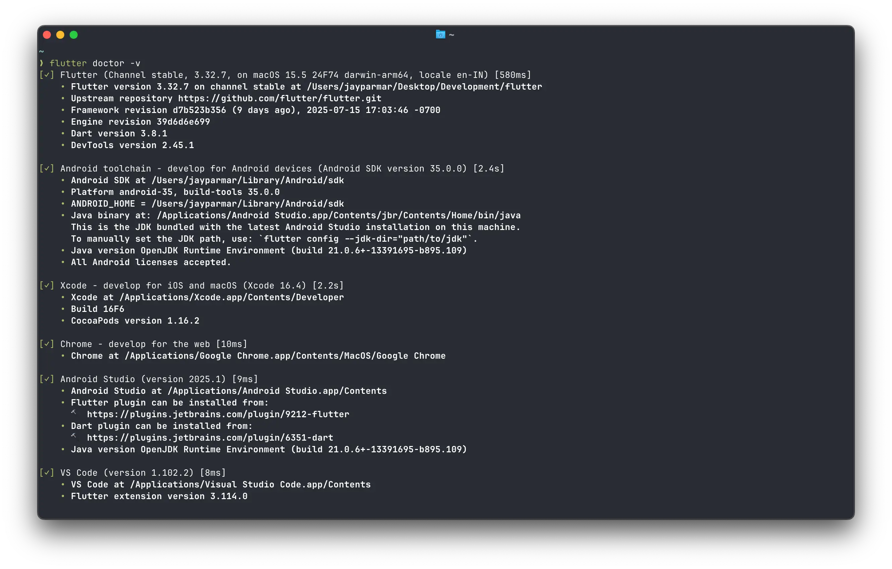

# 🛠️ Environment Setup

## 📋 Introduction

This guide will walk you through setting up Flutter for the **eSchool SaaS** mobile application development.

## 🔧 Setup

### 1️⃣ Download Flutter SDK

1. Download Flutter SDK from [flutter.dev](https://docs.flutter.dev/get-started)
2. Extract the downloaded zip file in a location of your choice (avoid paths with special characters or spaces)
3. Add Flutter to your PATH environment variable

> 💡 **Video Tutorial**: If you prefer video tutorials, we recommend this playlist for the full installation process: [https://www.youtube.com/playlist?list=PLSzsOkUDsvdtl3Pw48-R8lcK2oYkk40cm](https://www.youtube.com/playlist?list=PLSzsOkUDsvdtl3Pw48-R8lcK2oYkk40cm)

### 2️⃣ Verify Installation

Open a terminal/command prompt and run the following command to verify the installation:

```bash
flutter doctor -v
```

This command checks your environment and displays a report of the status of your Flutter installation.



**Flutter Doctor** will show you:
- Flutter installation status
- Android toolchain status
- iOS toolchain status (macOS only)
- IDE setup status
- Connected devices

## 💻 Setting Up an IDE

You can use any of the following IDEs for Flutter development:

### Android Studio / IntelliJ IDEA (Recommended)

1. Install Android Studio from [developer.android.com](https://developer.android.com/studio)
2. Install the **Flutter** and **Dart** plugins from the marketplace:
   - Go to `File > Settings > Plugins` (or `IntelliJ IDEA > Preferences > Plugins` on macOS)
   - Search for "Flutter" and install it (this will also install the Dart plugin)
   - Restart the IDE

### Visual Studio Code

1. Install VS Code from [code.visualstudio.com](https://code.visualstudio.com)
2. Install the **Flutter** and **Dart** extensions from the marketplace:
   - Open VS Code
   - Go to Extensions view (`Ctrl+Shift+X` or `Cmd+Shift+X`)
   - Search for "Flutter" and install it (this will also install the Dart extension)
   - Restart VS Code

## 🤖 Setting Up Android SDK

1. Open **Android Studio**
2. Go to **SDK Manager** (`Tools > SDK Manager` or `Android Studio > Settings > Appearance & Behavior > System Settings > Android SDK`)
3. Install the latest **Android SDK**
4. Install **Android Emulator** or connect a physical device:
   - Go to `Tools > Device Manager`
   - Create a new virtual device or connect your physical device via USB

## 🍎 Setting Up iOS Development (Mac Only)

1. Install **Xcode** from the App Store
2. Install the **Xcode Command Line Tools**:
   ```bash
   xcode-select --install
   ```
3. Set up an iOS simulator or connect a physical iOS device:
   - Open Xcode
   - Go to `Xcode > Settings > Platforms` to download iOS simulators
   - Or connect your physical iOS device via USB

## 🚀 Running the App

After setting up your development environment, **without making any changes to the code**, simply try to run the app.

This ensures your setup is correct and the app runs as expected. Later on, if you encounter issues, you can be confident the problem is not with the app code, but with your environment or configuration.

### Steps to Run

1. **Open a terminal/command prompt** and navigate to the project directory
2. **Get all dependencies**:
   ```bash
   flutter pub get
   ```
3. **Connect a device** or start an emulator/simulator:
   - For Android: Start an emulator from Android Studio or connect a physical device
   - For iOS: Start a simulator from Xcode or connect a physical device
4. **Run the project**:
   ```bash
   flutter run
   ```

The app should now be running on your device or emulator/simulator.

## 🔍 Troubleshooting Flutter Setup

If you encounter any issues during the Flutter setup, try the following:

1. **Run `flutter doctor -v`** for more detailed information
2. **Follow the recommendations** provided by the Flutter doctor
3. **Make sure your Android SDK and iOS development tools** are properly set up
4. **Check your PATH environment variable** to ensure Flutter is accessible
5. **Restart your computer** after installation

If you still face issues, please refer to the [Flutter documentation](https://docs.flutter.dev/get-started/install).

### Additional Resources

- **Official Flutter Installation Guide**: [https://docs.flutter.dev/get-started/install](https://docs.flutter.dev/get-started/install)
- **Video Tutorial Playlist**: [https://www.youtube.com/playlist?list=PLSzsOkUDsvdtl3Pw48-R8lcK2oYkk40cm](https://www.youtube.com/playlist?list=PLSzsOkUDsvdtl3Pw48-R8lcK2oYkk40cm)
