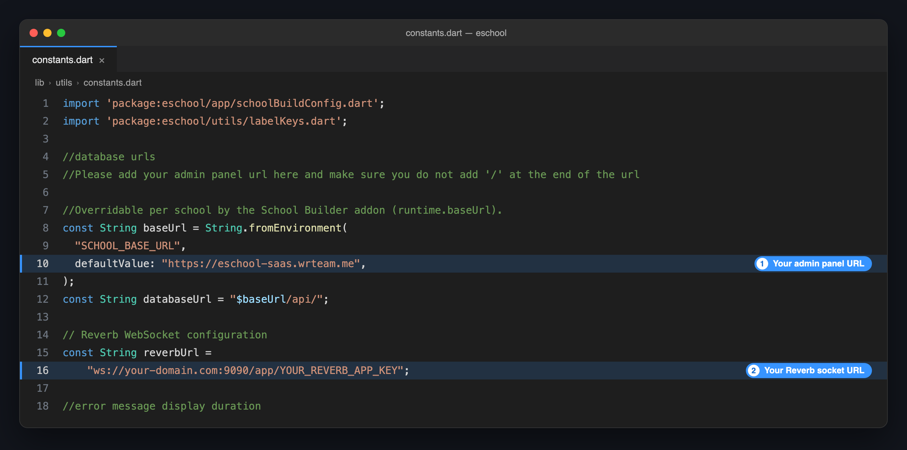

# 🔄 Integrate with Admin Panel

The apps reach your admin panel through two addresses, and both are set in one file: `lib/utils/constants.dart`.

| Address | What the app uses it for |
|---------|--------------------------|
| **Admin panel URL** (`baseUrl`) | Every API request: login, attendance, fees, results and the rest. |
| **Reverb socket URL** (`reverbUrl`) | Live updates, such as chat messages arriving without a refresh. |

The file and the steps are the same in the **Student/Parent app** and the **Staff/Teacher app**. Do them in both.

---

## 📋 Before You Start

| Item | Details |
|------|---------|
| **Admin panel URL** | The address you open your admin panel at, for example `https://school.yourdomain.com`. |
| **Reverb app key** | `REVERB_APP_KEY` from the admin panel's `.env` file. See the [Reverb Setup Guide](../admin-panel-installation/reverb-setup.md). |

---

## Step 1: Set the Admin Panel URL

1. Open `lib/utils/constants.dart`.
2. Find `baseUrl` and replace the `defaultValue` with your admin panel URL:

```dart title="lib/utils/constants.dart"
const String baseUrl = String.fromEnvironment(
  "SCHOOL_BASE_URL",
  // highlight-next-line
  defaultValue: "https://school.yourdomain.com",
);
```



:::caution Change only the `defaultValue`
- **No `/` at the end.** `https://school.yourdomain.com` is right; `https://school.yourdomain.com/` breaks every request.
- **Keep `"SCHOOL_BASE_URL"` and `String.fromEnvironment` as they are.** The [Multi-School APK add-on](multi-school-apk/overview.md) uses them to give each school its own URL.
- **Leave `databaseUrl` alone.** It is built from `baseUrl`.
:::

---

## Step 2: Set the Reverb Socket URL

In the same file, replace `reverbUrl` with your own socket URL:

```dart title="lib/utils/constants.dart"
const String reverbUrl =
    // highlight-next-line
    "wss://school.yourdomain.com/app/YOUR_REVERB_APP_KEY";
```

Use the form that matches your server:

| Your admin panel runs on | Socket URL |
|--------------------------|------------|
| **HTTPS**, with the `/app/` proxy from the Reverb guide | `wss://YOUR-DOMAIN/app/YOUR_REVERB_APP_KEY` |
| **HTTP**, or Reverb reached directly on its port | `ws://YOUR-DOMAIN:9090/app/YOUR_REVERB_APP_KEY` |

:::tip
Use `wss://` on a live server. A `ws://` address needs port `9090` open in your firewall.
:::

---

## Step 3: Repeat in the Other App

Open the second app's project and make the same two changes in its `lib/utils/constants.dart`. Both apps must point at the same admin panel.

---

## Step 4: Check It Works

1. **Stop the app and run it again.** These values are built into the app, so a hot reload does not pick them up.

   ```bash
   flutter run
   ```

2. Log in with an account from your admin panel.
3. If your school uses chat, send a message to that account from another one. It should arrive without reopening the screen.

---

## 🏫 Building Apps for Several Schools?

With the [Multi-School APK add-on](multi-school-apk/overview.md), each school can have its own admin panel URL, set as **API base URL** in the builder. A school that leaves it empty uses the `defaultValue` you set here.

---

## 🛠️ Troubleshooting

| Problem | Likely cause | What to do |
|---------|--------------|------------|
| Login fails, or every screen shows an error | A `/` at the end of `baseUrl`, or `http://` where your panel uses `https://` | Copy the address from your browser's address bar and remove the last `/`. |
| The app still talks to the old address | The app was hot reloaded, not restarted | Stop the app and run it again. |
| Chat messages only appear after reopening the screen | Reverb is not running, or `reverbUrl` is wrong | Check the [Reverb Setup Guide](../admin-panel-installation/reverb-setup.md), then compare the key in `reverbUrl` with `REVERB_APP_KEY`. |
| Chat never connects | A `ws://` address with port `9090` closed, or a `wss://` address without the `/app/` proxy | Open the port, or add the proxy from the Reverb guide. |
