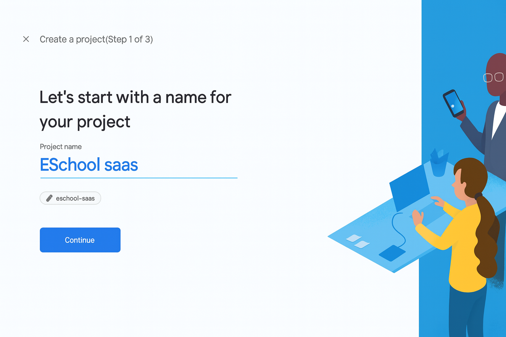
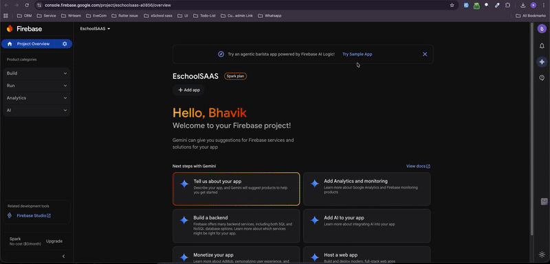

# 🔥 Integrate with Firebase 

For eSchool SaaS, you should set up Firebase using the Firebase CLI. Manual setup can easily miss required files or configurations, which leads to issues later. Using the CLI ensures all platforms are configured correctly and all files are generated reliably.

---


**Select or Create Firebase Project:**



**Choose Platforms (Android & iOS):**


**Configuration Files Generated:**


**Setup Complete:**


---

## Step 1: Install Firebase CLI

Open your terminal and run these commands:

```bash
# Install Firebase CLI
npm install -g firebase-tools

# Login to Firebase
firebase login

# Verify installation
firebase --version
```

---

## Firebase CLI in action

The short demo below shows the two essential commands you need to get started with Firebase CLI on your machine:




## Step 1: Install FlutterFire CLI

```bash
dart pub global activate flutterfire_cli
```

---

## Step 2: Configure your Flutter project

Run the configuration command from your Flutter project directory. Replace the project ID if yours is different. The GIF above shows how the prompts look and what gets generated.


```bash
flutterfire configure --project=eschoolsaas-a0856
```


---

## ✅ Verification

Run your app to verify Firebase is working:

```bash
flutter run
```

Check Firebase Console to see your app listed in the project.

---

## 🎥 Video Tutorial

📹 **[Watch Video Tutorial](https://drive.google.com/file/d/1Rriv3MzkixJKQETU9BuwEI9l8p4CgQlH/view?usp=sharing)**

Watch the complete step-by-step Firebase setup process for eSchool SaaS.

---

## 💡 Benefits of Firebase CLI

- ✅ Automated configuration
- ✅ Reduces manual errors
- ✅ Faster setup process
- ✅ Handles both Android and iOS simultaneously
- ✅ Automatically updates configuration files

---

## 🔗 Additional Resources

- [Firebase Documentation](https://firebase.google.com/docs)
- [FlutterFire Documentation](https://firebase.flutter.dev/)
- [Firebase CLI Reference](https://firebase.google.com/docs/cli)

---

## 🔧 Troubleshooting

**Command not found error?**
- Ensure Node.js is installed
- Restart your terminal after installing Firebase CLI

**FlutterFire command not working?**
- Add to PATH: `export PATH="$PATH":"$HOME/.pub-cache/bin"`

**Configuration failed?**
- Check your internet connection
- Verify you're logged in: `firebase login`
- Make sure you're in the correct project directory
