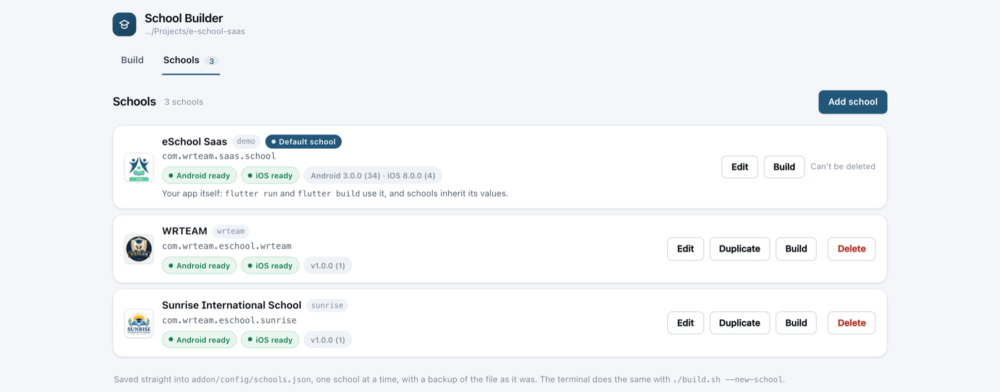
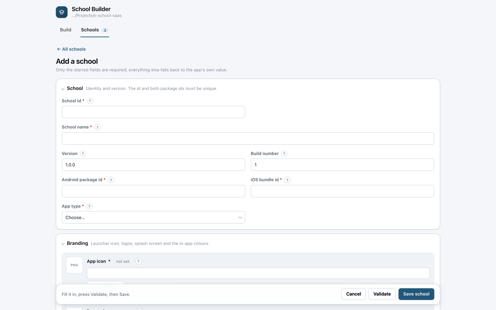
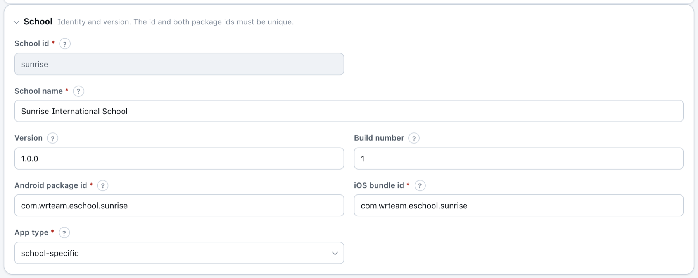
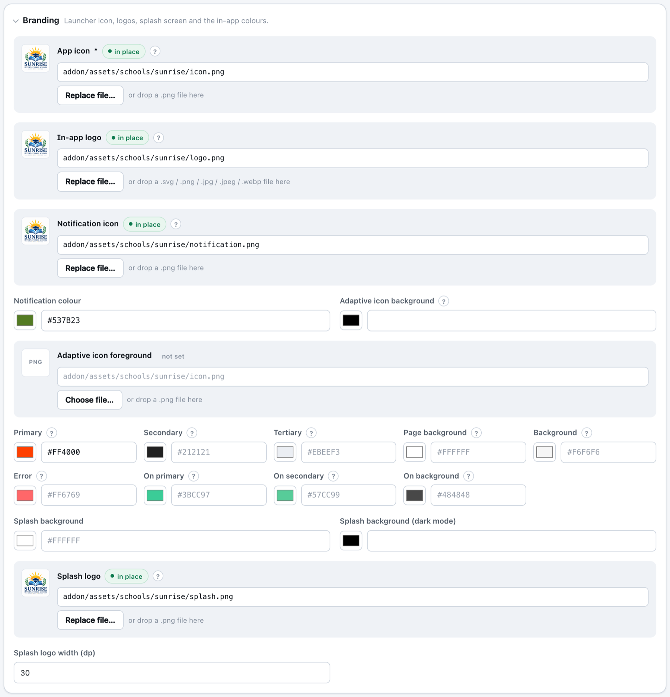
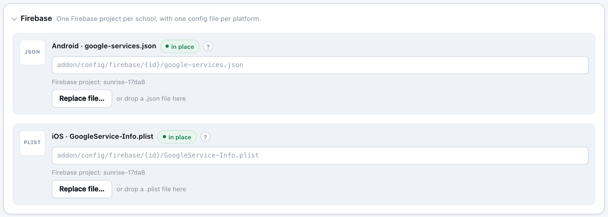
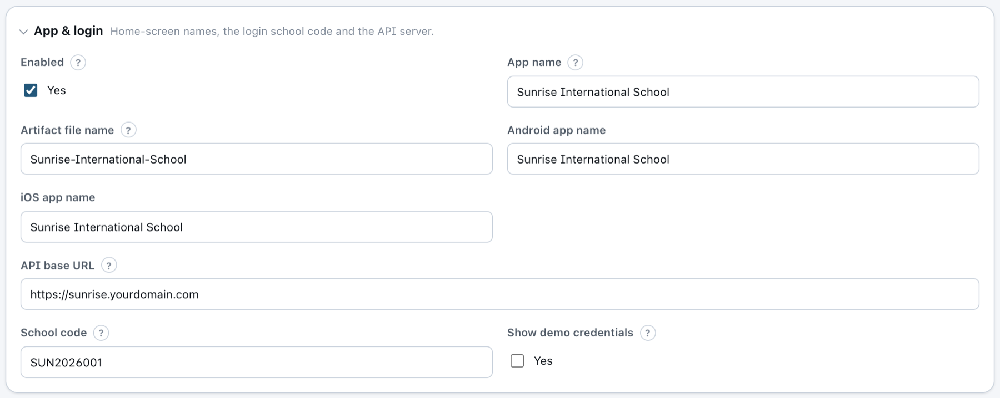
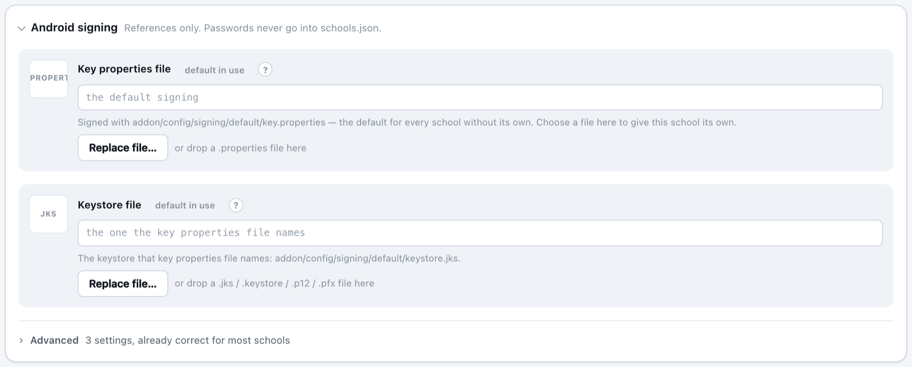
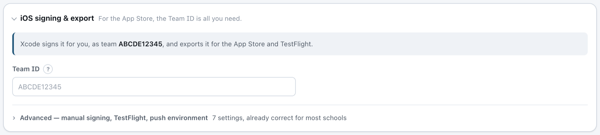
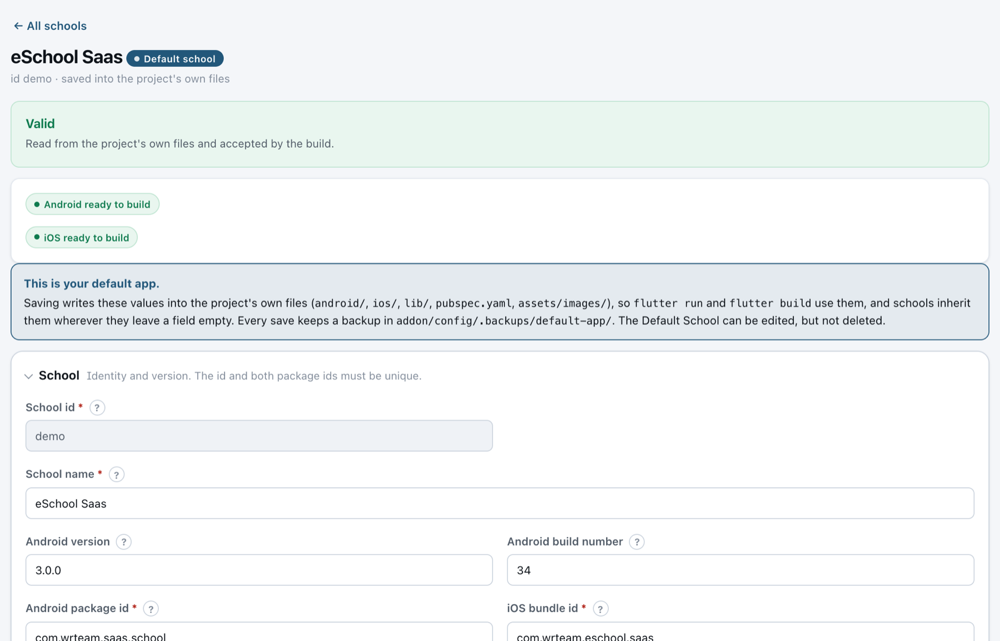

import Tabs from '@theme/Tabs';
import TabItem from '@theme/TabItem';

# 🏫 Add a School

Each school you add becomes its own app. This page shows how to add a school in the builder's browser page, which works the same on Windows and macOS. It takes a few minutes per school once you have the details ready.

---

## 📋 Before You Start

Have these details ready for the school:

| Item | Details |
|------|---------|
| **School name and ID** | The ID is short, lowercase and unique, for example `sunrise`. It names the school's folders and **cannot be changed later**. |
| **Android package ID and iOS bundle ID** | Unique for each school, for example `com.yourcompany.sunrise`. Follow the rules in [Change Package Name](../change-package-name.md). |
| **App icon** | A square PNG, 1024 × 1024 px, with no transparency (iOS requires this). |
| **In-app logo** | SVG or PNG. It appears on the splash and login screens. |
| **Splash logo** *(optional)* | A PNG shown on the launch screen while the app opens. |
| **Firebase files** | `google-services.json` (Android) and `GoogleService-Info.plist` (iOS) from the school's own Firebase project. See the tip below. |
| **Admin panel URL** | Your eSchool SaaS admin panel address, for example `https://school.yourdomain.com`, with no `/` at the end. |
| **School code** | In the Super Admin panel, go to **Schools → Manage Schools** and turn on the **Code** column. |
| **App type** | **General** for the standard app that many schools share, or **school-specific** for an app made for this school only. The app sends it to your backend in the `App-Type` header. The build does not start without it. |
| **Signing key** | A keystore file and its `key.properties` file. See [Generate Release Version](../generate-release-version.md). One key shared by all schools is fine. |

:::tip Firebase: one project per school
In the [Firebase console](https://console.firebase.google.com/), create a project for the school, then:

1. **Add app → Android** using the school's **Android package ID**, and download `google-services.json`.
2. **Add app → iOS** using the school's **iOS bundle ID**, and download `GoogleService-Info.plist`.

Both files must come from the **same** Firebase project. For general Firebase setup, see [Integrate with Firebase](../integrate-with-firebase.md).
:::

---

## Step 1: Open the Schools Tab

1. In a terminal, from your project root, start the builder. It opens in your browser:

<Tabs groupId="os">
<TabItem value="windows" label="Windows" default>

```powershell
.\build.cmd
```

</TabItem>
<TabItem value="mac" label="macOS">

```bash
./build.sh
```

</TabItem>
</Tabs>

2. Click the **Schools** tab, then click **Add school**.



---

## Step 2: Fill in the Form

The form is split into sections. **Only fields marked with `*` are required.** Anything you leave empty uses the app's default value. Click the **?** next to any field to see what it is for.



### School



| Field | What to enter |
|-------|---------------|
| **School id** `*` | Short lowercase ID, for example `sunrise`. It can't be changed later. |
| **School name** `*` | The school's full name. |
| **Version** / **Build number** | The app version shown in the stores, for example `1.0.0` and `1`. Increase the build number for every store update. |
| **Android package id** `*` / **iOS bundle id** `*` | This school's unique IDs. They must match the apps in its Firebase project. |
| **App type** `*` | **general** or **school-specific**. The app sends it as the `App-Type` header when it logs in and when its splash screen loads the settings. No other request carries it. The build does not start until you choose one. |

### Branding

Click **Choose file…** to pick a file in your computer's own Open dialog (Windows or macOS), or drag a file onto the box. Each file is **copied into the school's own folder** (`addon/assets/schools/<school-id>/`), so you can move or delete the original afterwards. A thumbnail appears once a file is in place.



| Field | What to enter |
|-------|---------------|
| **App icon** `*` | 1024 × 1024 PNG launcher icon. |
| **In-app logo** | Logo for the splash and login screens (SVG or PNG). |
| **Notification icon** / **Notification colour** | *Optional.* A white, transparent PNG and a colour for Android notifications. |
| **Adaptive icon** | *Optional.* Background colour and foreground PNG for Android adaptive icons. |
| **Primary, Secondary, …, On background** | *Optional.* The app's theme colours. Leave empty to keep the default eSchool colours. |
| **Splash background**, **Splash logo**, **Splash logo width** | *Optional.* The screen shown while the app starts. |

### Firebase

Choose the school's two Firebase files. The builder shows the Firebase project each file belongs to and checks that they match the school's package IDs.



:::info
You only need `GoogleService-Info.plist` if you build for iOS. For Android-only schools, `google-services.json` is enough.
:::

### App & Login



| Field | What to enter |
|-------|---------------|
| **Enabled** | Untick to hide the school from the Build tab without deleting it. |
| **App name** | The name shown under the app icon on the phone. |
| **Artifact file name** | The file name of the built app, for example `Sunrise-International-School` produces `Sunrise-International-School.apk`. |
| **Android app name** / **iOS app name** | *Optional.* A different name for one platform. |
| **API base URL** | Your admin panel URL. If empty, the app uses the URL set in `lib/utils/constants.dart`. |
| **School code** | The school's code. **This locks the app to the school:** the school code field is removed from the login and password-reset screens. |
| **Show demo credentials** | Keep this **off** for production apps. When on, the login screen is pre-filled with demo login details. |

### Android Signing



- **To give the school its own key**, choose its `key.properties` file and keystore (`.jks`). They are copied into `addon/config/signing/<school-id>/`, which stays private on your computer and is never committed to Git.
- **To use one key for all schools**, leave both fields empty and put a shared key in `addon/config/signing/default/`. The section shows **default in use**.

To set up the shared key once, from the project root:

<Tabs groupId="os">
<TabItem value="windows" label="Windows" default>

```powershell
New-Item -ItemType Directory -Force addon\config\signing\default
Copy-Item addon\config\signing\key.properties.sample addon\config\signing\default\key.properties
Copy-Item C:\path\to\your-keystore.jks addon\config\signing\default\keystore.jks
notepad addon\config\signing\default\key.properties
```

</TabItem>
<TabItem value="mac" label="macOS">

```bash
mkdir -p addon/config/signing/default
cp addon/config/signing/key.properties.sample addon/config/signing/default/key.properties
cp /path/to/your-keystore.jks addon/config/signing/default/keystore.jks
open -e addon/config/signing/default/key.properties
```

</TabItem>
</Tabs>

Then fill in `key.properties`:

```properties
storeFile=keystore.jks
keyAlias=your-key-alias
storePassword=your-store-password
keyPassword=your-key-password
```

:::tip Keystore paths on Windows
Keep the keystore next to `key.properties` and name it `keystore.jks`, as above, and no path is needed. If `storeFile` points somewhere else, use forward slashes, for example `C:/keys/app.jks`.
:::

If there is no default key either, the builder falls back to the project's existing `android/key.properties`.

:::warning Always sign updates with the same key
Google Play rejects an update that is signed with a different keystore. Keep a safe backup of every keystore and its passwords, because a lost key cannot be recovered.
:::

### iOS Signing & Export

*Only needed if you build for iOS, which requires a Mac. On Windows, leave this section as it is.* Enter your Apple **Team ID**. Xcode then signs and exports the app automatically. Sign in to Xcode once first, under **Xcode → Settings → Accounts**. For manual signing and other options, open **Advanced**.



---

## Step 3: Validate and Save

1. Click **Validate** at the bottom of the form. The builder lists anything that is still missing or incorrect.
2. Click **Save school**.

The school now appears in the **Schools** list with a status for each platform:

| Status | Meaning |
|--------|---------|
| 🟢 **Android ready** / **iOS ready** | The school has everything it needs to build. |
| 🟡 **Android: 1 to add** | Something is still missing. Click **Edit**, and the section that needs attention opens automatically. |

Next: [Generate the APK](./generate-apk.md).

---

## 🏠 The Default School

The first row on the **Schools** tab, with the **Default school** badge, is your **default app itself**: the app that `flutter run` and `flutter build` build without the add-on. You can change it from the builder like any school.



- **The form shows what your project has.** App name, package ID, Android and iOS versions, colours, launcher icon, logo, splash screen, notification icon, admin panel URL and Firebase files are read from the project's own files each time you open it.
- **Save to project writes into those files**, so the next `flutter run` or `flutter build` uses your changes, and schools that leave a field empty inherit them. A file you pick is only applied when you click **Save to project**.
- **Every save is backed up.** The files a save changes are copied to `addon/config/.backups/default-app/<date-time>/` first. If any step fails, all of them are put back.
- **It can be edited, but not deleted or duplicated.** Its app type is always **general**.
- **Android and iOS keep separate versions**, because your default app may already be in both stores with different version numbers.

| | Default School | Other schools |
|---|---|---|
| Where its settings live | Your project's own files | `addon/config/schools.json` |
| How it builds | The project as it is, exactly like `flutter build` | With its own folder under `build/.school-builder/overlays/` |
| App type | Always **general** | **general** or **school-specific** |
| School code | None: users type their school's code | Optional, locks the app to one school |
| Android signing | `android/key.properties` | Its own key, or the shared default key |
| Version | Separate Android and iOS versions | One version for both stores |
| Actions | **Edit**, **Build** | **Edit**, **Duplicate**, **Build**, **Delete** |

:::tip Set up for you
The first time you open the builder, the school that already uses your project's own package ID becomes the Default School. If there isn't one, a new Default School is added for you.
:::

---

## 🗂️ Managing Schools

Each row in the **Schools** list has these actions:

| Action | What it does |
|--------|--------------|
| **Edit** | Change any detail except the school ID. |
| **Duplicate** | Start a new school from a copy. Branding, colours, version, app type and signing are copied. The school code and Firebase files are not. You give the copy its own ID and package IDs. Not available on the Default School. |
| **Build** | Opens the school on the **Build** tab. |
| **Delete** | Removes the school after you type its ID to confirm. Its settings, images and Firebase files are moved to `addon/config/.backups/deleted/`, so nothing is lost. To pause a school instead, untick **Enabled**. The Default School can't be deleted. |

:::note
You never need to edit `addon/config/schools.json` by hand. Every save is checked first, and the previous version of the file is kept in `addon/config/.backups/`.
:::
