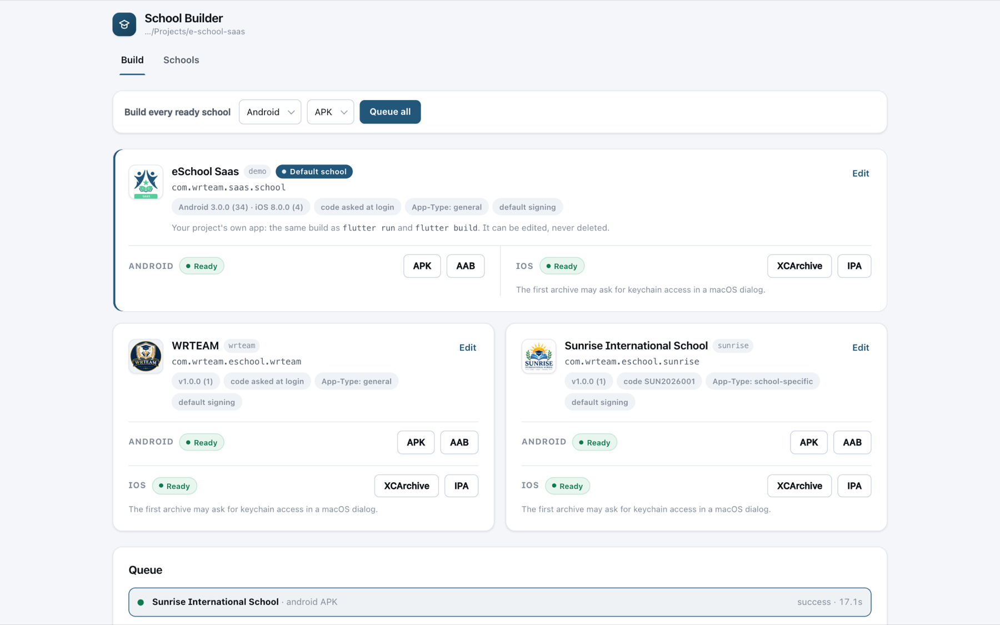
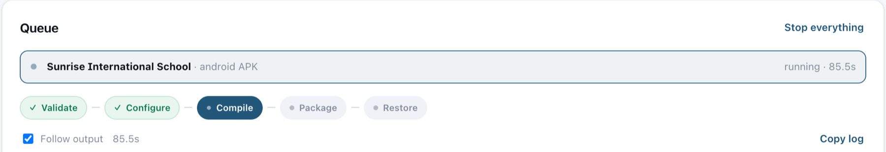
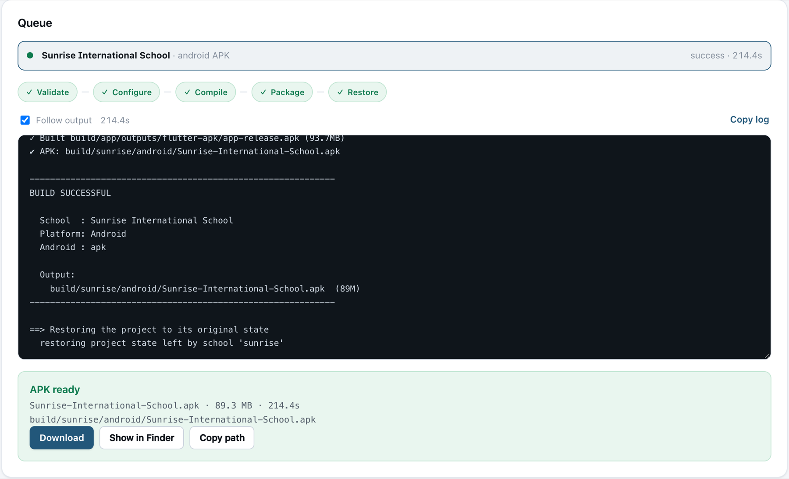

import Tabs from '@theme/Tabs';
import TabItem from '@theme/TabItem';

# 🚀 Generate the APK

Once a school shows **Android ready**, you can build its app, on **Windows or macOS**. This page covers building from the builder page, building every school at once, and testing a school on a phone.

---

## Step 1: Open the Build Tab

In a terminal, from your project root, start the builder. It opens in your browser:

<Tabs groupId="os">
<TabItem value="windows" label="Windows" default>

```powershell
.\build.cmd
```

</TabItem>
<TabItem value="mac" label="macOS">

```bash
./build.sh
```

</TabItem>
</Tabs>

The **Build** tab shows every school as a card, with its package ID, version, school code, App-Type and a status for Android and iOS.



The **Default school** card comes first and spans the full width, with its Android and iOS buttons side by side. It builds your default app exactly as `flutter build` does, and shows its separate Android and iOS versions.

If a platform shows **"1 to add"** instead of **Ready**, the card lists exactly what is missing. Anything both platforms need, such as a missing app type, is listed once above them. Click **Edit** on the card to fix it. On Windows, the **iOS** buttons are unavailable, because iOS builds need a Mac.

---

## Step 2: Start the Build

On the school's card, under **ANDROID**, click the file type you need:

| Button | Use it for |
|--------|------------|
| **APK** | Installing directly on phones, sharing with the school, or testing. |
| **AAB** | Uploading to the **Google Play Store**. |

The build starts right away and appears in the **Queue** below the cards.

---

## Step 3: Follow the Progress

The builder shows each stage as it runs, with the full build log underneath.



| Stage | What happens |
|-------|--------------|
| **Validate** | Checks the icon, Firebase files, signing key and app type. |
| **Configure** | Generates the school's package ID, name, icons, splash screen, colours and Firebase file in its own folder (for iOS, in a separate copy of the project). Your project's files are not changed. |
| **Compile** | Runs the standard Flutter release build. |
| **Package** | Names the file and saves it in the school's output folder. |
| **Restore** | Removes the school's staged in-app logo, so the project is exactly as it was. |

:::info How long does it take?
The first build usually takes a few minutes. Later builds are much faster because Flutter reuses its cache.

You can close the browser tab while a build runs. It keeps going, and opening the builder again shows its progress. **Stop everything** cancels the build and restores the project.
:::

---

## Step 4: Get Your APK

When the build finishes, the **APK ready** panel appears:



- **Download**: saves the APK through your browser.
- **Show in Explorer** (Windows) / **Show in Finder** (macOS): opens the folder that contains the file.
- **Copy path**: copies the file's location.

Every school's files are saved in their own folder inside your project, so one school can never overwrite another:

```text
build/
├── sunrise/
│   └── android/
│       ├── Sunrise-International-School.apk
│       └── Sunrise-International-School.aab
└── greenfield/
    └── android/
        └── Greenfield-Public-School.apk
```

:::note
`flutter clean` deletes the whole `build/` folder, including these files. Copy finished apps somewhere safe before you run it.
:::

---

## ⚡ Build Every School at Once

Use the bar at the top of the **Build** tab:

1. Choose the platform (**Android**) and the file type (**APK** or **AAB**).
2. Click **Queue all**.

Every ready school is added to the queue and built one after another. Only one build runs at a time, because each build applies its school's settings to the whole project.

---

## 📱 Test on a Device

To try a school's app on a connected Android phone or emulator before release, run it from the terminal. This is the one task the builder page doesn't do, because `flutter run` needs the terminal for hot reload:

<Tabs groupId="os">
<TabItem value="windows" label="Windows" default>

```powershell
.\build.cmd sunrise run            # debug, with hot reload, for testing
.\build.cmd sunrise run release    # the real release build
```

</TabItem>
<TabItem value="mac" label="macOS">

```bash
./build.sh sunrise run            # debug, with hot reload, for testing
./build.sh sunrise run release    # the real release build
```

On a Mac, iPhones and the iOS Simulator work too.

</TabItem>
</Tabs>

The builder generates the school's settings, starts the app with `flutter run` using them, and cleans up when you quit with `q` or `Ctrl + C`. A plain `flutter run` afterwards runs your default app again.

:::note Running on an iPhone
On iOS, the app runs from the builder's copy of your project, so hot reload doesn't see code you change in your project while it runs. Quit and start it again to include the change.
:::

---

## 🍎 iOS Builds (Mac Only)

On a Mac with Xcode, each card also has **XCArchive** and **IPA** buttons under **iOS**. The school needs its `GoogleService-Info.plist` and your Apple **Team ID** (see [Add a School](./add-a-school.md#ios-signing--export)). Archives also appear in Xcode's **Organizer**, ready to upload to App Store Connect.

The iOS build runs in a copy of your project, `build/.school-builder/ios-workspace/`, so your project's `ios/` folder is never changed. The first iOS build takes longer while CocoaPods sets up the copy.

If you build Android apps on Windows, you can build the iOS apps of the same schools on a Mac later. The school settings are the same `addon/config` folder: copy the project, or share it through Git.

---

## ✅ Next Steps

- **Test** the APK on a real device and log in with an account from that school.
- **Publish** each school's app as its own store listing. See [Deployment](../deployment.md).
- **Release an update:** edit the school, increase its **Version** and **Build number**, build again, and sign with the **same** keystore.
