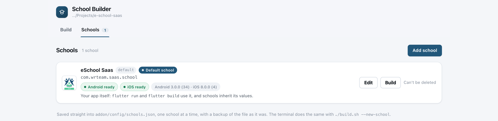

import Tabs from '@theme/Tabs';
import TabItem from '@theme/TabItem';

# 📦 Install the Add-on

This page explains what you receive after purchasing the Multi-School APK add-on and how to add it to your eSchool SaaS app project on **Windows** or **macOS**. Installation takes about five minutes.

:::warning Finish the Super Admin setup first
Before you install the add-on in the app project, purchase it, add its files to the **Super Admin** panel and complete its setup there. The [School Mobile App Add-on guide](/superadmin/available-addons/school-mobile-app) explains each step. Start the steps on this page only after that setup has finished successfully. See [the setup order](overview.md#setup-order).
:::

:::tip Choose your system once
Where the steps differ, pick **Windows** or **macOS** in the tabs. Every page in this section follows your choice.
:::

---

## 📥 What You Receive

After purchase, you download a zip file named like **`school-builder-1.0.0.zip`**. It contains a single folder, `school-builder`:

```text
school-builder/
├── addon/                              ← the add-on folder
│   ├── build.sh                        ← the builder (macOS)
│   ├── build.cmd                       ← the builder (Windows)
│   ├── addon.json                      ← add-on name and version
│   ├── README.md
│   ├── docs/MULTI_SCHOOL_BUILD.md      ← full technical reference
│   ├── templates/schools.example.json  ← example school list
│   ├── tools/                          ← builder scripts and browser page
│   └── config/
│       ├── firebase/README.md
│       └── signing/                    ← README and a sample key.properties
├── build.sh                            ← shortcut to the builder (macOS)
└── build.cmd                           ← shortcut to the builder (Windows)
```

| Item | Purpose |
|------|---------|
| `addon/` | The builder itself. This is the **add-on folder**. |
| `build.cmd` / `build.sh` | Start the builder from the project root: `.\build.cmd` on Windows, `./build.sh` on macOS. |

:::info One add-on for both apps
The same zip works for the **Student/Parent app** and the **Staff/Teacher app**. Install it into each project you want to build schools for. The add-on reads each app's own colours and notification icon from that project, so nothing has to be changed for either app.

The add-on needs **app code v1.12.0 or later**, which already contains everything else it uses. On older code it stops and asks you to update first.
:::

:::note Your data is never in the zip
The zip contains no schools, Firebase files or signing keys. These are created on your computer inside `addon/config/` and `addon/assets/schools/`, so installing a future update never overwrites them.
:::

---

## 🛠️ Installation Steps

### Step 1: Prepare your computer

<Tabs groupId="os">
<TabItem value="windows" label="Windows" default>

1. Make sure the app already builds: `flutter doctor` shows no Android errors, and `flutter build apk` works in the project.
2. Install **Python 3.8 or later** from [python.org](https://www.python.org/downloads/). In the installer, tick **Add python.exe to PATH**.
3. Close and reopen your terminal, then check the installation:

```powershell
py -3 --version
```

</TabItem>
<TabItem value="mac" label="macOS">

1. Make sure the app already builds: `flutter doctor` shows no errors for the platforms you need.
2. Python 3 comes with the Xcode Command Line Tools. If `python3 --version` doesn't work, run:

```bash
xcode-select --install
```

</TabItem>
</Tabs>

Then back up your project: commit your work to Git, or make a copy of the project folder.

### Step 2: Copy the add-on into your project

1. Extract `school-builder-1.0.0.zip`.
2. Open the extracted **`school-builder`** folder.
3. Copy **everything inside it** into your app's **project root**, the folder that contains `pubspec.yaml`. If you're asked, choose **Replace** (Windows) or **Merge** (macOS).

:::warning Copy the contents, not the folder
The `addon` folder must sit directly in the project root, next to `lib` and `pubspec.yaml`. The path should be `e-school-saas\addon\`, not `e-school-saas\school-builder\addon\`.
:::

If you prefer the terminal, run these commands from your project root. Replace the version number with the one you downloaded.

<Tabs groupId="os">
<TabItem value="windows" label="Windows" default>

```powershell
cd C:\path\to\e-school-saas                    # the folder that contains pubspec.yaml
Expand-Archive "$HOME\Downloads\school-builder-1.0.0.zip" -DestinationPath "$HOME\Downloads" -Force
Copy-Item -Recurse -Force "$HOME\Downloads\school-builder\*" .
```

</TabItem>
<TabItem value="mac" label="macOS">

```bash
cd /path/to/e-school-saas                      # the folder that contains pubspec.yaml
unzip ~/Downloads/school-builder-1.0.0.zip -d ~/Downloads/
cp -R ~/Downloads/school-builder/. .
chmod +x build.sh addon/build.sh
```

</TabItem>
</Tabs>

Your project root now looks like this:

```text
e-school-saas/
├── addon/          ← new
├── android/
├── assets/
├── ios/
├── lib/
├── build.cmd       ← new
├── build.sh        ← new or updated
└── pubspec.yaml
```

### Step 3: Open the builder

In a terminal, from the project root, run:

<Tabs groupId="os">
<TabItem value="windows" label="Windows" default>

```powershell
.\build.cmd
```

This works in both **PowerShell** and **Command Prompt**. In Command Prompt you can also type just `build.cmd`.

</TabItem>
<TabItem value="mac" label="macOS">

```bash
./build.sh
```

</TabItem>
</Tabs>

The builder opens in your default browser. There is nothing to choose first. The terminal also shows the page's link, in case the browser doesn't open by itself:

```text
  School Builder
  http://127.0.0.1:8787/?t=AvqWlDbuqjMQ8hN6qcVELwf_oPQ9k-a2

  The link carries a one-time token; it changes every start.
  Press Ctrl-C to stop the server.
```

Everything else happens in that page. On a new installation, the **Schools** tab already lists your default app as the **Default School**, which you can edit straight away. Click **Add school** for your first school:



:::tip Keep the terminal open
The browser page is served from the terminal window. Keep that window open while you use the builder, and press `Ctrl + C` to close the builder when you're done. The page only runs on your own computer (`127.0.0.1`) and uses a private link that changes each time you start it.
:::

### Step 4 (optional): Turn on the Git safety check

If your project uses Git, run this once from the project root:

<Tabs groupId="os">
<TabItem value="windows" label="Windows" default>

```powershell
Copy-Item addon\tools\pre-commit .git\hooks\pre-commit
```

</TabItem>
<TabItem value="mac" label="macOS">

```bash
ln -sf ../../addon/tools/pre-commit .git/hooks/pre-commit
```

</TabItem>
</Tabs>

This blocks a commit while a school's settings are applied to the project, so one school's icon or Firebase files can never be committed by mistake.

---

## ✅ Verify the Installation

<Tabs groupId="os">
<TabItem value="windows" label="Windows" default>

```powershell
.\build.cmd --help
```

</TabItem>
<TabItem value="mac" label="macOS">

```bash
./build.sh --help
```

</TabItem>
</Tabs>

If you see a list of commands, the add-on is installed. If you see **"The School Builder addon is not installed"**, the `addon` folder is not in the project root. Repeat [Step 2](#step-2-copy-the-add-on-into-your-project).

Next: [Add a School](./add-a-school.md).

---

## 🔄 Updating the Add-on

When a new version is released, replace only the builder. Your schools, Firebase files and signing keys stay untouched.

<Tabs groupId="os">
<TabItem value="windows" label="Windows" default>

```powershell
# 1. Remove the old builder files (your data folders are not touched)
Remove-Item -Recurse -Force addon\tools, addon\docs, addon\templates
Remove-Item -Force addon\build.sh, addon\build.cmd, addon\addon.json

# 2. Copy the contents of the new school-builder folder into the project root, as in Step 2

# To check which version you have installed:
Get-Content addon\addon.json
```

</TabItem>
<TabItem value="mac" label="macOS">

```bash
# 1. Remove the old builder files (your data folders are not touched)
rm -rf addon/tools addon/docs addon/templates
rm -f  addon/build.sh addon/build.cmd addon/addon.json

# 2. Copy the contents of the new school-builder folder into the project root, as in Step 2

# To check which version you have installed:
cat addon/addon.json
```

</TabItem>
</Tabs>
