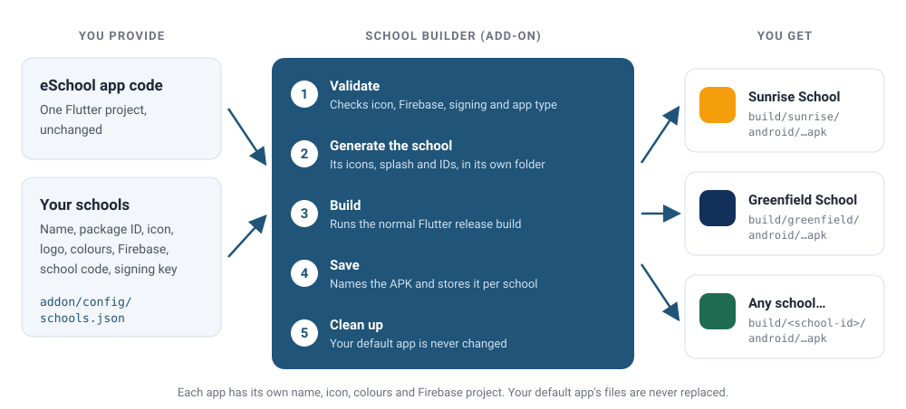

# 🏫 Multi-School APK — Overview

The **Multi-School APK** add-on builds a **separate, fully branded app for each of your schools** from the same eSchool SaaS app code. Inside the code, the add-on is called **School Builder**.

Each school gets its own app name, package ID, launcher icon, logo, colours, Firebase project and school code. You manage schools from a page in your browser and build each app with one click. There are no duplicate projects and no files to edit by hand.

The add-on works with both mobile apps: the **Student/Parent app** and the **Staff/Teacher app**. It runs on **Windows and macOS**. Android APK and AAB builds work on both, while iOS builds need a Mac.

:::info Paid add-on
Multi-School APK is sold separately. The standard app code does **not** include the `addon` folder. You receive it when you purchase the add-on.
:::

---

## ⚠️ Set Up the Add-on in the Super Admin Panel First {#setup-order}

The add-on has two parts, and they must be set up in this order:

| Order | Where | What you do |
|-------|-------|-------------|
| **1** | **Super Admin panel** | Purchase the add-on, add its files to the Super Admin panel and finish its setup there. |
| **2** | **Mobile app project** | Install the add-on in the app code and build each school's app, as this section explains. |

1. **Purchase the add-on** and add the add-on files to the **Super Admin** panel.
2. **Complete the add-on setup in the Super Admin panel.** Every step is explained in the [School Mobile App Add-on guide](/superadmin/available-addons/school-mobile-app). Follow that guide for the detailed steps.
3. **Check that the setup finished successfully**: the add-on is **Active** and **School Mobile App** appears in the Super Admin sidebar.
4. **Only then start the mobile app setup**, beginning with [Install the Add-on](install-addon.md).

:::warning Follow this order
Do not start the mobile app setup before the Super Admin setup is complete. A school's own app can only log in once the add-on is installed and active in the Super Admin panel, so building the app first leads to setup and login errors that are hard to trace.
:::

---

## 🎬 Walkthrough Video

A 35-second tour: open the builder, choose a school's App type, build its APK and download it. The builder looks and works the same on Windows.

<video controls width="100%" poster="/eSchool-SaaS-Doc/images/installation/app/multi-school-apk/video-poster.jpg" style={{borderRadius: '12px', boxShadow: '0 10px 15px -3px rgba(0,0,0,0.1)'}}>
  <source src="/eSchool-SaaS-Doc/video/multi-school-apk-walkthrough.mp4" type="video/mp4" />
  Your browser does not support the video tag.
</video>

---

## ✨ Key Benefits

| Benefit | What it means for you |
|---------|-----------------------|
| **One codebase** | You maintain a single project, and every school's app is built from it. |
| **Branded per school** | Each app has its own name, icon, logo, splash screen, colours and Firebase project. |
| **School code built in** | The app is locked to its school, so users never type a school code at login. |
| **Point and click** | One command opens the builder in your browser. Add schools and build APK, AAB or IPA files from there. |
| **Windows or Mac** | Build Android apps on Windows or macOS. Only iOS builds need a Mac. |
| **Build all at once** | Queue every ready school and they build one after another. |
| **Default app in the builder** | Your default app appears as the **Default School**. Change its name, icon, splash screen, colours or Firebase files from the same page, and saving updates the project itself. |
| **Default app stays default** | A school build never changes your project's Android or iOS files. Each school's icons, splash screen and settings are generated in its own folder (Android) or in a separate copy of the project (iOS), so a normal `flutter run`, `flutter build` or Xcode build always builds your default app. |

---

## ⚙️ How It Works



1. **Add each school once** in the builder's **Schools** tab. Its details are saved in `addon/config/schools.json`.
2. **Click Build.** The builder first checks that the school has everything it needs.
3. It **generates that school's Android files in their own folder**, `build/.school-builder/overlays/<school-id>/android/`: launcher and adaptive icon, splash screen, colours, notification icon, package ID, app name, signing and Firebase file. Your project's `android/` folder is not changed. For an **iOS** build, it first updates a copy of your project in `build/.school-builder/ios-workspace/` to match it, then writes the school's icon, splash screen, Firebase file, bundle ID and app name into that copy. Your project's `ios/` folder is not changed.
4. It runs the **standard Flutter release build**. For Android, Gradle uses the school's folder on top of your default resources, for this build only. For iOS, Flutter and Xcode build from the copy.
5. It saves the finished file as `build/<school-id>/android/<School-Name>.apk`.
6. It **cleans up**: it removes the school's in-app logo from `assets/branding/`. The project is exactly as it was before the build.

### How the add-on works with the existing code

The eSchool SaaS app code (**v1.12.0 and later**) already includes small hooks for the add-on. Each hook has a default value, so **without the add-on, the app builds exactly as before**. `flutter run` and `flutter build apk` work as usual.

| Part of the app | During a school build | Without the add-on |
|-----------------|-----------------------|--------------------|
| Colours, logo, school code, admin panel URL, app type | Passed to Flutter as build values | Default values in the code |
| Android package ID, app name, signing | Read from the school's own folder under `build/` | Defaults in `build.gradle` |
| Android icon, adaptive icon, splash screen, notification icon, Firebase file | Read from the school's own folder, on top of your default resources | Your project's own files, never replaced |
| iOS bundle ID, app name, version | `ios/Flutter/School.xcconfig` in the iOS build copy | Defaults in the Xcode configuration |
| iOS icon, splash screen, Firebase file | Written into the iOS build copy, `build/.school-builder/ios-workspace/` | Your project's own files, never replaced |

### Built into the app vs. managed from the admin panel

| Built into each app (rebuild to change) | Managed from the admin panel (no rebuild) |
|-----------------------------------------|-------------------------------------------|
| App name and package ID / bundle ID | School settings and details |
| Launcher icon, splash screen, in-app logo | Enabled features and modules |
| Theme colours | Languages and labels |
| Firebase project (push notifications) | Payment gateways |
| Admin panel URL, school code, app type | Everything else configured in the panel |
| Version name and build number | |

### General or school-specific app

Each school's app is built as one of two types. The app tells your eSchool SaaS backend which type it is in an `App-Type` header:

| App type | Header the app sends | Use it for |
|----------|----------------------|------------|
| **General** | `App-Type: general` | The standard app that many schools share |
| **School-specific** | `App-Type: school-specific` | An app made for one school only |

Only two requests send this header: **login**, and the **settings request the splash screen makes** when the app opens. No other request carries it. You choose the type for each school when you [add the school](./add-a-school.md#school). An app built without the add-on sends `App-Type: general`.

---

## 📁 Where the Add-on Lives

The add-on is the `addon` folder in your app's project root, the folder that contains `pubspec.yaml`.

```text
e-school-saas/                 ← your app project root
├── addon/                     ← the Multi-School APK add-on
│   ├── build.sh               ← the builder (macOS)
│   ├── build.cmd              ← the builder (Windows)
│   ├── tools/                 ← builder scripts and the browser page
│   ├── templates/             ← example configuration
│   ├── docs/                  ← technical reference
│   ├── config/                ← YOUR DATA: school list, Firebase files, signing keys
│   └── assets/schools/        ← YOUR DATA: each school's icon, logo and splash image
├── build.sh                   ← shortcut that starts the builder (macOS)
├── build.cmd                  ← shortcut that starts the builder (Windows)
├── android/  ios/  lib/  …    ← the standard app code (school builds never change android/)
└── build/
    ├── <school-id>/           ← finished apps, one folder per school
    └── .school-builder/overlays/<school-id>/android/
                               ← each school's generated Android files, rebuilt on every build
```

---

## 🧰 Requirements

| Requirement | Notes |
|-------------|-------|
| **eSchool SaaS app code v1.12.0 or later** | Already set up and running. See [App Prerequisites](../overview.md) and [Run This App](../run-this-app.md). The builder checks this itself: it reads the version line at the top of `lib/main.dart` (for example `//[V.1.12.0]`) and won't start on older code. |
| **A Windows PC or a Mac** | **Android** (APK, AAB): Windows 10/11 or macOS. **iOS** (IPA): a Mac with Xcode. |
| **Flutter and the Android SDK** | The same Flutter version as the main app (see the [version compatibility table](../overview.md#-version-compatibility)), with `flutter doctor` showing no Android errors. |
| **Python 3.8 or later** | **Windows:** install it from [python.org](https://www.python.org/downloads/) and tick **Add python.exe to PATH** in the installer. **Mac:** included with the Xcode Command Line Tools (`xcode-select --install`). No extra packages are needed. |
| **A Firebase project for each school** | With an Android app (and an iOS app if you build for iOS). |
| **An Android signing key** | One keystore per school, or one shared by all schools. |

---

## 🗺️ From Purchase to APK

| Step | What you do | Guide |
|------|-------------|-------|
| **1** | Purchase the add-on and download the zip file | [Install the Add-on](./install-addon.md) |
| **2** | Copy the add-on into your app project | [Install the Add-on](./install-addon.md) |
| **3** | Open the builder and add your schools | [Add a School](./add-a-school.md) |
| **4** | Build the APK for one school, or for all of them | [Generate the APK](./generate-apk.md) |
| **5** | Publish each school's app to the stores | [Deployment](../deployment.md) |

If something doesn't work as expected, see [Troubleshooting & FAQ](./troubleshooting.md).
