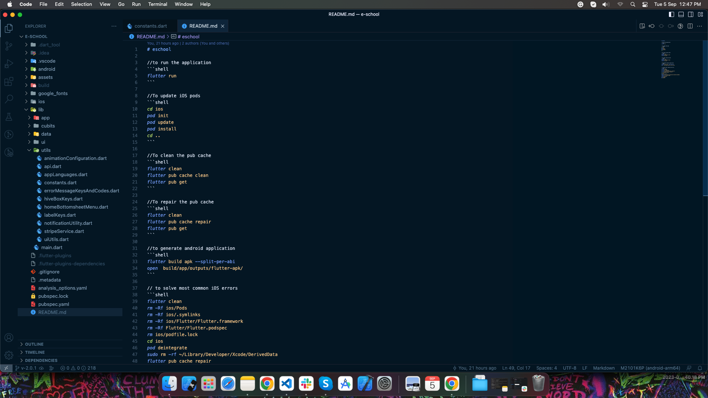

# ▶️ Run This App

This guide will help you run the eSchool mobile application in both debug and release modes.

---

## 📋 Prerequisites

Before running the app, ensure you have:
- Flutter SDK installed and configured
- Android Studio or Xcode installed (depending on your target platform)
- A physical device or emulator/simulator ready

---

## 🐛 Running in Debug Mode

Debug mode is ideal for development, offering hot reload support and detailed logging for faster iteration.

### Step 1: Connect Your Device or Start Emulator

**For Android:**
- Connect a physical device via USB (ensure USB debugging is enabled)
- Or start an Android emulator from Android Studio

**For iOS:**
- Open iOS Simulator from Xcode
- Or connect a physical iPhone/iPad via USB

### Step 2: Verify Device Connection

Run the following command to list all connected devices:

```bash
flutter devices
```

This will display all available devices. Note the device ID if you want to run on a specific device.

### Step 3: Run the App

```bash
# Run on the default device
flutter run

# Run on a specific device
flutter run -d <device-id>
```

### Debug Mode Features

- **Hot Reload**: Press `r` in the terminal to instantly see UI changes
- **Hot Restart**: Press `R` to restart the app while maintaining the device state
- **Debug Console**: View real-time logs and error messages
- **Performance Overlay**: Monitor app performance metrics
- **Fast Compilation**: Quicker build times for faster development

---

## 🚢 Running in Release Mode

Release mode provides optimized performance for production testing. The app runs faster with smaller file sizes.

### Build and Install Release APK (Android)

```bash
# Build release APK
flutter build apk --release

# Install on connected device
flutter install --release
```

### Build for iOS (Release)

```bash
# Build release version for iOS
flutter build ios --release
```

Then open the project in Xcode and deploy to your device.

---

## 🛠️ Common Commands Reference

For a complete list of commonly used Flutter commands and troubleshooting steps, refer to the **README.md** file in the project root directory.

The README includes:
- Shell scripts for quick setup (Android Studio users)
- Common error fixes
- Build and deployment commands
- Configuration tips



---

## 💡 Quick Tips

- **First Run**: The first build may take several minutes. Subsequent builds will be faster.
- **Clean Build**: If you encounter issues, run `flutter clean` followed by `flutter pub get` before rebuilding.
- **Device Selection**: Use `flutter devices` to see all available devices and their IDs.
- **Performance Testing**: Always test in release mode before deploying to production.

---

## ⚠️ Troubleshooting

If you encounter issues while running the app:

1. **Run Flutter Doctor**: `flutter doctor` to check for missing dependencies
2. **Clean Project**: `flutter clean && flutter pub get`
3. **Restart IDE**: Close and reopen Android Studio or VS Code
4. **Check README**: Refer to the project's README.md for specific fixes
5. **Update Flutter**: Ensure you're using a compatible Flutter version

