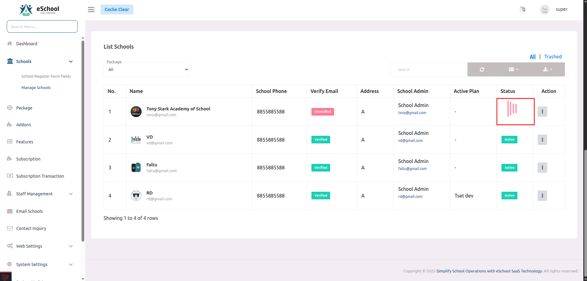
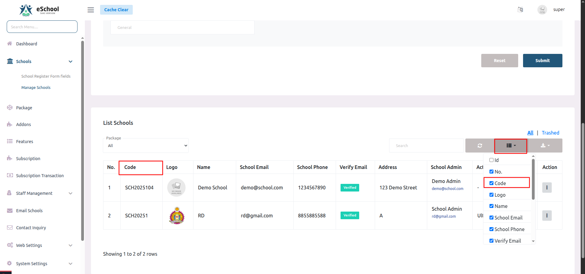
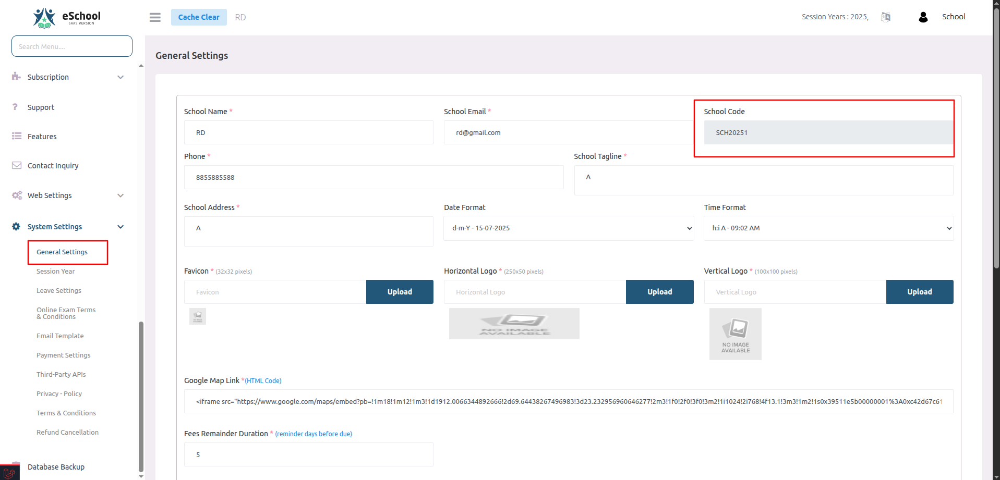
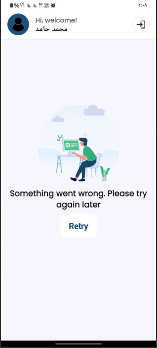
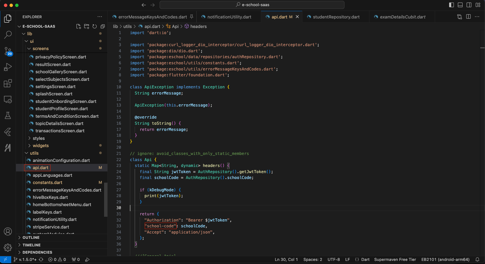
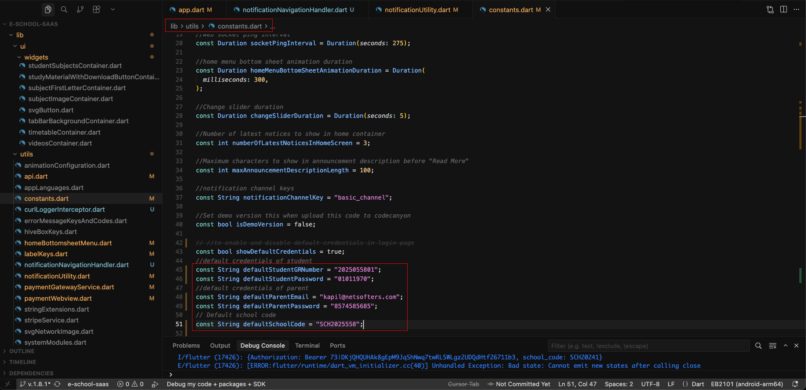
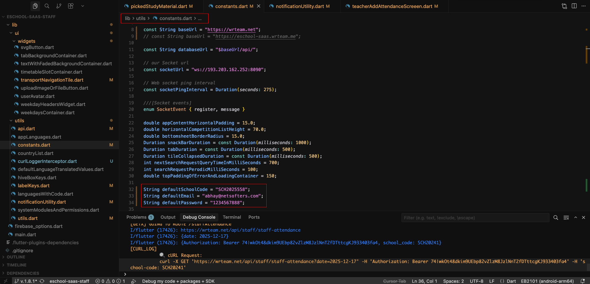

# ❓ Frequently Asked Questions (FAQs)

Welcome to the FAQs section! This comprehensive guide addresses common questions and issues you might encounter during the installation, setup, and operation of eSchool SaaS.

## 📖 Quick Navigation

- [Installation & Setup Issues](#-installation--setup-issues)
- [Domain & SSL Configuration](#-domain--ssl-configuration)
- [Subscription & Package Management](#-subscription--package-management)
- [School Admin Panel](#-school-admin-panel)
- [Mobile Application](#-mobile-application)

---

This section addresses common questions and issues you might encounter during the installation and setup process of eSchool SaaS.

## 🚨 Installation & Setup Issues

<details>
<summary><strong>1. Why is the school not being created and showing an "Error Occurred" message?</strong></summary>

This error typically occurs when the database user does not have permission to create or drop databases, which is required for setting up a new school.

**Root Cause:** By default, hosting providers do not assign these permissions to normal database users for security reasons.

**Solution:**
- You must assign the necessary permissions (such as CREATE, DROP, and ALTER) to your database user or use database root user credential.

**Need Help?** If you are unsure how to proceed, contact your control panel or server support provider and ask them:
> "How can I assign CREATE and DROP database permissions to my database user?"

</details>

<details>
<summary><strong>2. If a school is not being created and it keeps showing the loading screen, how can we set up Laravel Queue to fix this?</strong></summary>

You can find detailed instructions for setting up the queue in our documentation here:


👉 [Queue Setup Guide](admin-panel-installation/queue-setup.md)

</details>

<details>
<summary><strong>3. What are the default login credentials for different Users?</strong></summary>

Different user types have different default login credentials in the system:

🎓 **For Students:**
- Username: GR Number (General Register Number)
- Password: Date of Birth in DDMMYYYY format
- Example:
  ```
  Username: 2025000001
  Password: 01012010 (for DOB: 1st Jan 2010)
  School Code : SCH20251
  ```

👥 **For Parents, Teachers, and Staff:**
- Username: Email Address
- Password: Mobile Number
- Example:
  ```
  Username: teacher@school.com
  Password: 9876543210
  School Code : SCH20251
  ```

**Note:** For security reasons, it's recommended to change these default passwords after first login.

</details>

<details>
<summary><strong>4. How to Update the System (Admin Panel and App Code)?</strong></summary>

#### 🔄 **Admin Panel Update**

**Step-by-Step Guide:**

1. **Login as Super Admin**
   - Use your Super Admin credentials to log in to the system.

2. **Go to System Update**
   - In the left-side menu, scroll to the bottom and click on the "System Update" option.

3. **Enter Purchase Code and Upload File**
   - In the "Purchase Code" field, enter your valid purchase code.
   - In the "Files" section, click on "Choose File" and upload the nearest version update file.

4. **Important Note About Versioning**
   - You must update the system step-by-step.
   - For example, if your current Admin Panel version is v1.5.5, then you should upload the v1.5.6 update file.
   - Do not directly upload a higher version like v1.7.0, or the update may fail.

5. **Submit and Wait**
   - Click the "Submit" button and wait for a few moments.
   - The system will process the update, and your Admin Panel will be upgraded.

<!-- https://drive.google.com/file/d/1wD7iixqXpHM0K3VKLO1EpF8y2CTRzLkk/view?usp=sharing -->
📹 **[Video Tutorial Available:](https://drive.google.com/file/d/1wD7iixqXpHM0K3VKLO1EpF8y2CTRzLkk/view?usp=sharing)**
A detailed video tutorial is available below the update section to guide you visually through the process.

#### 📱 **App Code Update**

There are two methods available for updating your App Code:

#### **Option 1: Manual Update (Recommended for Non-Technical Users)**

1. When an update is released, you will receive the updated app source code via email.
2. Inside the update package, you will find a file called `change_log.txt` or similar.
3. This file contains:
   - A list of files that were modified.
   - A list of new files that were added.
4. Open the latest version code and manually copy the updated and new files into your existing project as per the change log.
5. After copying and replacing the required files, your app will be successfully updated.

#### **Option 2: Full Reskin Method (Recommended for Developers / Technical Persons)**

This method is faster and preferred by technical users who are familiar with Flutter and Firebase.

**Steps:**
1. Download the Latest Full App Code (from the update mail or portal).
2. Perform the following changes in the new code:
   - Change the App Name (for both Android and iOS).
   - Change the Package Name (bundle identifier).
   - Replace the Firebase configuration using firebase_cli or manually add the updated Firebase project.
   - In the `constants.dart` file, update the Base URL to match your backend server.
   - Replace the App Icon and other branding assets you used in the previous version.
3. After completing these steps, build and run the new app code. It will function the same as your previous version but with the latest updates applied.

</details>

<details>
<summary><strong>5. Why are database root user credentials required for this system?</strong></summary>

This system is a SaaS platform, where each school has its own separate database. The root database user has the necessary permissions to create and drop databases. These permissions are required when a new school is added, as the system needs to:

**Required Actions:**
- **Create a new database** for the school
- **Run migrations** to generate all required tables
- **Set up default configurations**

**Alternative Solution:**
If you do not want to use the root account, you can provide a database user with equivalent permissions (CREATE, DROP, and other required privileges) so the system can perform these actions automatically.

</details>

<details>
<summary><strong>6. How many payment gateways are available in the system?</strong></summary>

Currently, we support **four payment gateways** in the system:

**Available Payment Gateways:**
- **Stripe**
- **Razorpay**
- **Paystack**
- **Flutterwave**

**Note:** Each payment gateway can be configured individually in the system settings, allowing super admin and schools to choose the most suitable option for their region and requirements.

</details>


## 🌐 Domain & SSL Configuration

<details>
<summary><strong>7. How do I set up a wildcard domain (e.g., *.yourdomain.com)?</strong></summary>

Setting up a wildcard domain involves creating a DNS record and configuring it properly in your hosting panel.

**Note:** Since the steps can vary depending on the hosting provider or control panel (e.g., cPanel, Plesk), we recommend contacting your hosting support team for detailed guidance on setting up wildcard DNS records.

**Common Steps:**
1. Access your domain's DNS management panel
2. Create a new DNS record with type `A` or `CNAME`
3. Set the hostname to `*` (wildcard)
4. Point it to your server's IP address or domain

</details>

<details>
<summary><strong>8. How do I create a wildcard SSL certificate?</strong></summary>

Wildcard SSL setup depends on your hosting provider and the type of SSL certificate you need.

**Recommended Action:** Please reach out to your control panel or hosting support to request and install a wildcard SSL certificate for your domain (e.g., *.yourdomain.com).

**Common Options:**
- Let's Encrypt (free, with limitations)
- Commercial SSL providers (paid, more features)
- Hosting provider's SSL services

</details>

## 💳 Subscription & Package Management

<details>
<summary><strong>9. What happens if the Super Admin updates an existing subscription package?</strong></summary>

The behavior depends on the "Instant Effect" setting when updating the package:

**✅ Instant Effect Enabled:**
- Only the features are updated immediately
- Existing subscribers get the new features right away

**❌ Instant Effect Disabled:**
- The updates won't apply immediately
- The school will continue with the existing features until the current plan expires
- New features will be available upon plan renewal

**Best Practice:** Always review the "Instant Effect" setting before updating packages to avoid unexpected changes for active subscribers.

</details>

<details>
<summary><strong>10. How is the addon validity calculated?</strong></summary>

Addon validity is always tied to the school's current subscription plan expiry date.

**Key Points:**
- The addon will expire along with the school's main package
- This applies regardless of when the addon was activated
- Addons cannot extend beyond the main subscription period

**Example:**
- Main subscription expires: December 31, 2024
- Addon activated: November 1, 2024
- Addon expires: December 31, 2024 (same as main subscription)

**Recommendation:** Plan your addon purchases to align with your main subscription renewal cycle.

</details>

<details>
<summary><strong>11. Where can I find the School Code?</strong></summary>

The School Code is a unique identifier assigned to each school. You can find it from both the Super Admin Panel and the School Admin Panel:

🔹 <strong>From the Super Admin Panel:</strong>

- Navigate to: <code>Schools → Manage Schools</code>
- Click the column selector icon (top-right of the table)
- Enable the "Code" column by checking it
- You'll now see the School Code in the table listing

<!--  -->

<!--  -->

🔹 <strong>From the School Admin Panel:</strong>

- Go to: <code>System Settings → General Settings</code>
- Look for the School Code field on the right side of the form


<!--  -->

</details>


## 🏫 School admin panel

<details>
<summary><strong>12. How do Classes and Sections work in the system?</strong></summary>

In our system, "Classes" (also known as "Grades" in some countries) represent the academic levels students are enrolled in — for example, Grade 1 through Grade 12.

Each Class can have multiple Sections. A Section is essentially a sub-division of a class, created to manage students efficiently when the number of enrolled students exceeds the capacity of a single classroom.

**Why Sections Are Needed:**

Let's take an example:
- Suppose your classroom capacity is 30 students.
- For Grade 1, if 90 students apply for admission, it's not feasible to place them all in one classroom.
- In such a case, the system allows you to create multiple Sections under the same Class — such as Grade 1 - A, Grade 1 - B, and Grade 1 - C.
- Each section can then accommodate up to 30 students, depending on classroom size or academic management preferences.

**How It Works in the System:**
1. Create a Class (e.g., Grade 1)
2. Create Sections (e.g., A, B, C)
3. Assign Students to Sections — This can be done manually or based on performance, alphabetical order, or admission order.
4. The system ensures students are evenly distributed according to section capacity, and each section can be managed individually.

**Benefits:**
- Better classroom and resource management
- Improved teacher-to-student ratio
- Easier tracking of student progress within smaller groups

</details>


## 📱 Mobile application

<details>
<summary><strong>13. Why does the app show "Something went wrong. Please try again later" after login?</strong></summary>



This issue usually occurs when the API headers are not correctly formatted, specifically the school-code field.

In the api.dart file inside the headers() method, make sure the key is written as:
```dart
"school-code": schoolCode ✅ Correct
```



⚠️ **Do not use an underscore (_) like this:**
```dart
"school_code": schoolCode  ❌ Incorrect
```

Using school_code with an underscore causes the backend to reject the request due to a mismatch in expected header keys, leading to the "Something went wrong" error on the app screen.

</details>

<details>
<summary><strong>14. How do I set up Firebase using the Firebase CLI for eSchool SaaS?</strong></summary>

To set up Firebase using the Firebase CLI for eSchool SaaS:

1. **Prerequisites:**
   - Make sure you have Node.js installed on your system

2. **Install Firebase CLI:**
   ```bash
   npm install -g firebase-tools
   ```

3. **Log in to Firebase:**

   firebase login

   This will open a browser window where you can authenticate with your Google account.

4. **Video Guide:** Watch this quick video guide for a visual walkthrough.

📹 **[Watch Video Tutorial](https://drive.google.com/file/d/1Rriv3MzkixJKQETU9BuwEI9l8p4CgQlH/view?usp=sharing)**

*Click the link above to watch the Firebase CLI setup tutorial video.*

</details>

<details>
<summary><strong>15. How can I control whether default login credentials are displayed on the Student App and Staff App login screens?</strong></summary>

The eSchool SaaS mobile applications provide a convenient feature that allows you to control the visibility of default login credentials on the login screens. This can be helpful for demonstration purposes or to guide users during initial login, but you may want to hide them in production for security reasons.

**Location of Configuration:**

The configuration is located in the `constants.dart` file of your Flutter application code.

**Available Configuration Variables:**

There are two separate boolean variables that control default credential visibility for each app:

### 📱 **For Student App:**

```dart
showDefaultCredentialInStudentApp = true;  // Shows default credentials
showDefaultCredentialInStudentApp = false; // Hides default credentials
```

**When set to `true`:**
- The Student App login screen will display example/default credentials including:
  - **GR Number** (General Register Number) example
  - **Password** (Date of Birth format) example
  - **School Code** example
- This helps students understand what information they need to enter

**When set to `false`:**
- The default credentials will not be shown on the login screen
- Users will see empty input fields without any placeholder examples



### 👥 **For Staff/Teacher App:**

```dart
showDefaultCredentialInTeacherApp = true;  // Shows default credentials
showDefaultCredentialInTeacherApp = false; // Hides default credentials
```

**When set to `true`:**
- The Teacher/Staff App login screen will display example/default credentials including:
  - **Email** address example
  - **Password** (Mobile number) example
  - **School Code** example
- This helps staff members understand the login format

**When set to `false`:**
- The default credentials will not be shown on the login screen
- Users will see empty input fields without any placeholder examples



### 🔧 **How to Configure:**

1. **Open the Flutter Project:**
   - Navigate to your Student App or Staff App source code

2. **Locate the constants.dart file:**
   - The file is typically located in the `lib/utils/` or `lib/constants/` directory

3. **Find the Configuration Variables:**
   - For Student App: Look for `showDefaultCredentialInStudentApp`
   - For Staff App: Look for `showDefaultCredentialInTeacherApp`

4. **Set the Value:**
   - Set to `true` if you want to display default credentials
   - Set to `false` if you want to hide them

5. **Rebuild the Application:**
   - After making changes, rebuild and deploy your application
   - The changes will take effect in the new build

### ⚙️ **Best Practices:**

**✅ When to Show Default Credentials (`true`):**
- During testing and development phase
- For demo or presentation purposes
- When onboarding new users who need guidance
- In training or educational environments

**❌ When to Hide Default Credentials (`false`):**
- In production environments (recommended for security)
- When users are familiar with the login process
- To maintain a professional appearance
- To prevent confusion about actual credentials

### 📝 **Important Notes:**

- These settings are independent for each app (Student and Staff)
- The default credentials shown are examples only and do not provide actual access
- Users must still enter their valid credentials to log in
- This feature only controls the visibility of example text on the login screen
- Changes require rebuilding the application to take effect

### 🔒 **Security Recommendation:**

For production environments, it is strongly recommended to set both variables to `false` to maintain a clean and professional login interface without displaying any example credentials.

</details>

---
