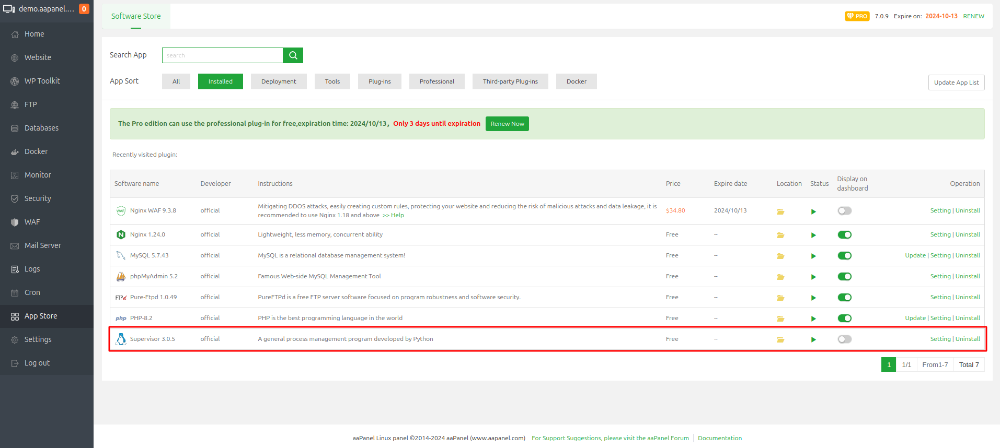
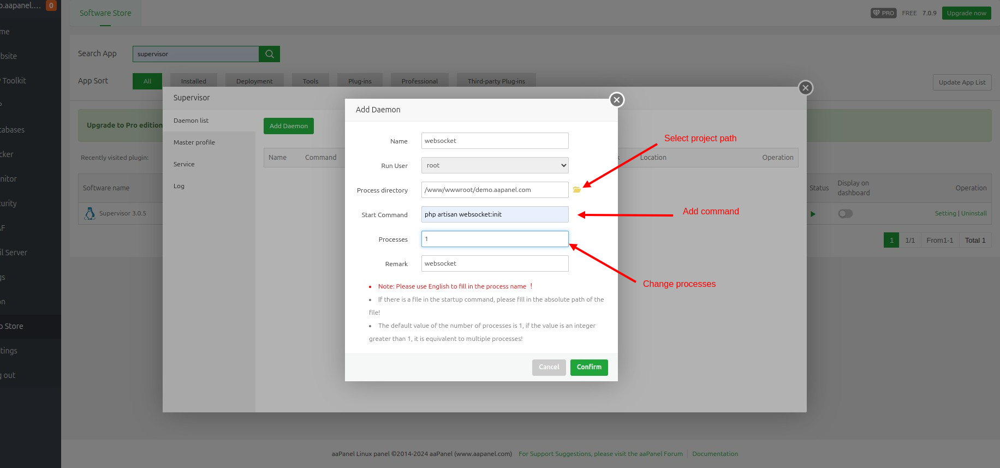
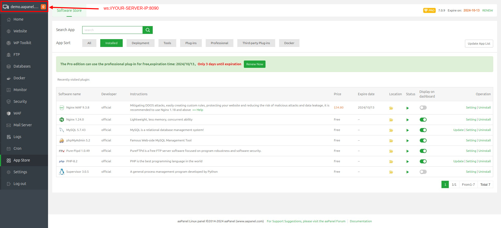

# How to get Socket URL

## Install Supervisor 



## Supervisor settings



## Your Socket URL



**ws://YOUR-SERVER-IP:8090**

---

## Setup websocket using terminal

Open the Terminal from an SSH Connection.

```bash
sudo apt-get update
sudo apt-get install supervisor
sudo nano /etc/supervisor/conf.d/your-laravel-websockets.conf
```

---

```
[program:laravel-websockets]
process_name=%(program_name)s_%(process_num)02d
command=php /path/to/your/laravel/artisan websocket:init
autostart=true
autorestart=true
user=username
numprocs=1
redirect_stderr=true
stdout_logfile=/path/to/your/laravel/storage/logs/laravel-websockets.log
```

---

```bash
sudo supervisorctl reread
sudo supervisorctl update
```

---

```bash
sudo supervisorctl start laravel-websockets
```

---

```bash
sudo supervisorctl status
```

**You should see something like:**

```
laravel-websockets   RUNNING   pid 12345, uptime 0:03:21
```

**Your Socket URL**

**ws://YOUR-SERVER-IP:8090** 