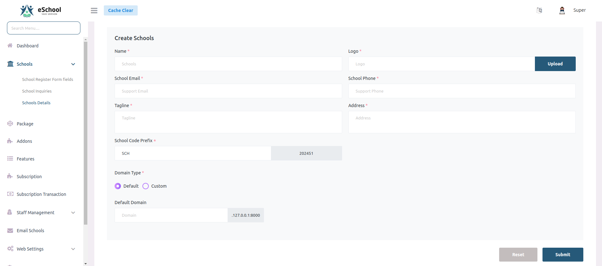
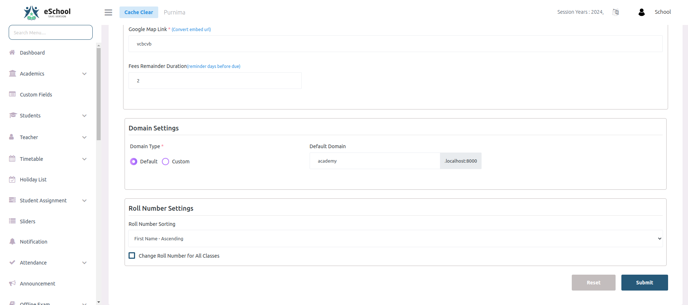
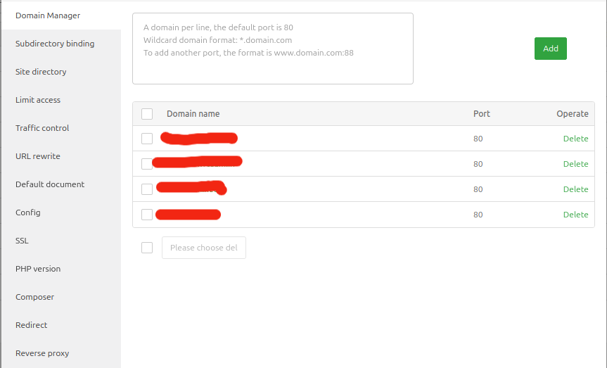

# How to Setup Custom Domain

## Domain Type

When creating a school, the admin has the option to specify the domain type for the school's website and also school can choose the domain type from General Settings Sections. They can choose between two domain types:

**Default Domain:** This is a predefined domain provided by the system (e.g., schoolname.yoursystemdomain.com). It is automatically set up and requires no additional configuration from the admin.

**Custom Domain:** If the school has its own domain, the admin can enter it during the setup process and also school can setup it from general settings. However, before using a custom domain, it must be properly configured to point to the server's IP address where the system is hosted. Once the domain's DNS settings are correctly updated and verified, the custom domain can be used as the school's official website address.

## Set Custom Domain on Server

## Steps for Super Admin

1. **Add Custom Domain to VPS:**
   - Log into the VPS server.
   - Configure the custom domain to work with the VPS server (e.g., by creating a virtual host).

2. **Enable SSL:**
   - Install and enable SSL for the custom domain using tools like Let's Encrypt or a paid SSL certificate.

## Steps for School Admin

1. **Get VPS Server IP Address:**
   - Ensure the VPS server's IP address is visible to the School Admin in the "General Settings" section when they select the "Custom Domain" options.

2. **Update DNS Settings:**
   - Log into your domain provider's dashboard.
   - Add a DNS record (usually an A record) pointing the custom domain to the VPS server's IP address.

3. **Wait for Propagation:**
   - DNS changes may take a few minutes to a few hours to propagate. 