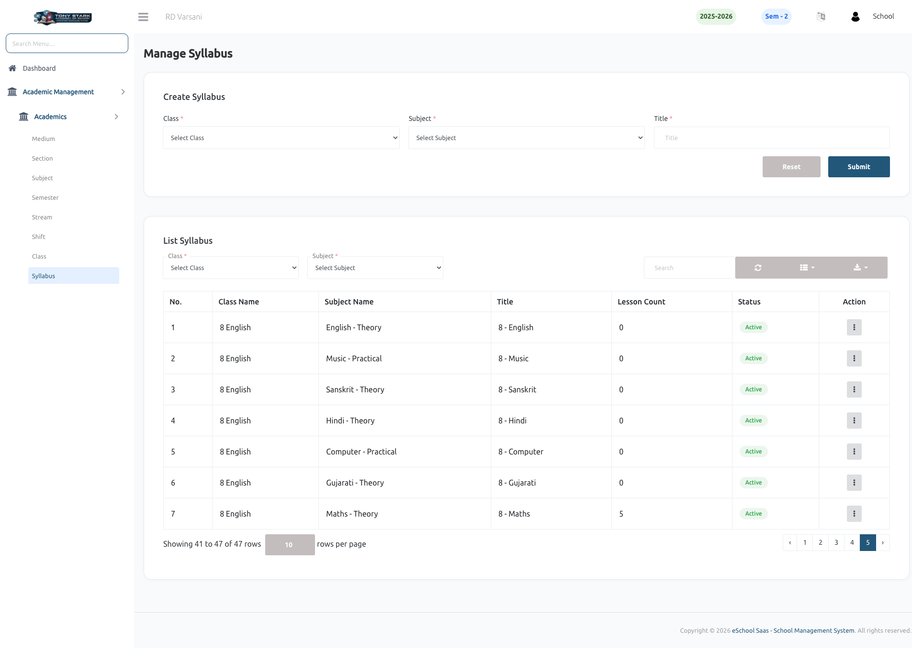

# Syllabus

## Syllabus Module Overview
* The system manages **classes and subjects on a session-year basis**, meaning:
    * For every new session year, subjects must be reassigned to each class.
    * Previously, this required recreating all **lessons and topics** for every session.
* To eliminate redundancy, the **Syllabus Module** has been introduced.

---

## Key Improvements
* **Centralized Syllabus Management**
    * Lessons and topics are now created and maintained within a syllabus.
    * This allows reuse of academic content across multiple session years.
* **Mandatory Syllabus Creation**
    * A syllabus must be created **before** assigning subjects to a class.
    * Subject assignment is now dependent on the syllabus structure.
* **Reuse of Study Materials**
    * Once lessons and topics are defined in a syllabus:
        * They do not need to be recreated for each session year.
        * The same structure can be reused efficiently.
* **Session-Year Flexibility**
    * The system supports **filtering data by session year**.
    * Ensures better organization and retrieval of syllabus-based content.

---

## Workflow Summary
1. Create a **Syllabus**.
2. Define **Subjects, Lessons, and Topics** within the syllabus.
3. **Assign Subjects to Classes** using the created syllabus.
4. **Reuse** the same syllabus structure across different session years.

---

## Benefits
* Reduces repetitive data entry.
* Ensures consistency in academic structure.
* Improves efficiency in managing lessons and topics.
* Enables scalable and reusable content management across sessions.

