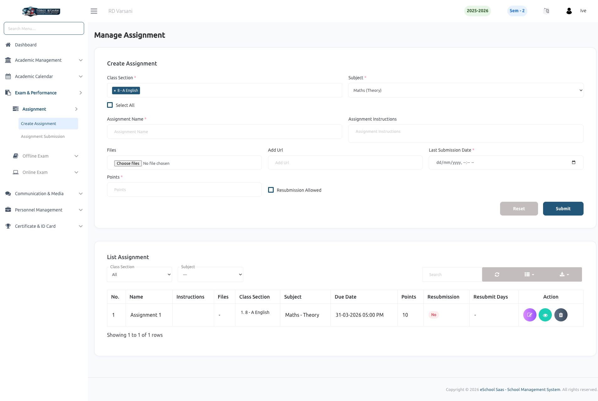
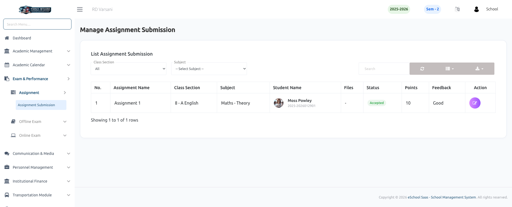

# Manage Assignment Submission

This page allows the School Admin to monitor and review assignment submissions created by subject teachers and submitted by students through the mobile app or web portal.

### Key Features:

- **Assignment Workflow Overview**
    - Subject Teacher creates assignments.
    - Students submit assignments via mobile app or web portal.
    - Subject Teacher reviews and evaluates submissions.
    - Admin can view and monitor the entire process.

- **Class & Subject Filters**
    - Filter submissions by **Class Section**.
    - Select specific **Subject** to view relevant assignment records.

- **Assignment Submission List**
    - Displays detailed information for each submission:
        - Assignment Name
        - Class Section
        - Subject
        - Student Name & ID
        - Uploaded Files (submitted via app/web)

- **Submission Status Tracking**
    - Displays teacher-reviewed status such as **Accepted** (Extendable to Pending / Rejected based on workflow).
    - Reflects real-time evaluation by the subject teacher.

- **Evaluation Details**
    - Shows:
        - Points/Marks assigned by the teacher
        - Feedback/Remarks provided after review

- **Search & Pagination**
    - Search functionality to quickly find specific student submissions.
    - Pagination for efficient handling of large datasets.

- **View Actions**
    - **Action** button to view detailed submission and evaluation.
    - Admin can audit submissions without modifying teacher decisions.

- **Centralized Monitoring**
    - Provides a complete overview of assignment lifecycle: **Creation → Submission → Evaluation**.
    - Ensures transparency and academic performance tracking.

