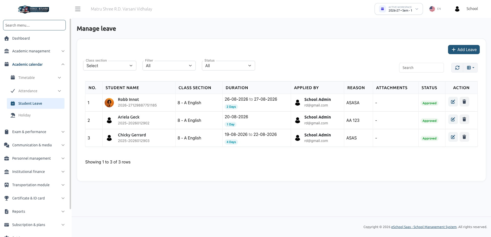

# Student Leave Management

Parents apply for their child's leave from the mobile app; the school admin or the class teacher approves or rejects it; an approved leave writes itself into the student's attendance as **Leave**. School staff can also record a leave directly from the web, which is approved on the spot.

---

## 1. Who does what

| Actor | Can |
|---|---|
| **Parent / Guardian** (app) | Apply for a linked child, view that child's leave history, cancel a request while it is still Pending |
| **School Admin** (web) | See every student's leave, add a leave (auto-approved), edit dates/reason, approve / reject / re-open, delete |
| **Class Teacher** (web / staff app) | Same as admin but limited to the students in their assigned class sections, and only for leaves still Pending — once granted the permission by the admin toggle |
| **Any staff with `student-leave-approve`** (staff app) | List and decide leaves through the staff API |

---

## 2. Leave status

`leaves.status` holds a single integer:

| Value | Meaning | Set by |
|---|---|---|
| `0` | **Pending** | Parent application from the app |
| `1` | **Approved** | Admin/teacher decision, or a web-side leave entry (auto-approved) |
| `2` | **Rejected** | Admin/teacher decision. Requires a note |

The web list badges these as pending (yellow) / approved (green) / rejected (red).

Related columns on `leaves`:

| Column | Purpose |
|---|---|
| `user_id` | The **student's user id** (not `students.id`) |
| `added_by` | Who created the request — the guardian, the teacher or the admin |
| `reason` | Why the leave is being taken (required everywhere) |
| `note` | The rejection reason / decision note. Required when rejecting |
| `from_date`, `to_date` | Inclusive range |
| `leave_master_id` | Ties the leave to the leave settings of the session year |

`leave_details` carries one row per leave day (`type = 'full_day'`), which is what the list uses to count days.

---

## 3. Prerequisites

| # | Requirement | Where |
|---|---|---|
| 1 | **Student Leave Management** feature active in the school's package | Super Admin → Package |
| 2 | A **Leave Master** record for the current session year | Leave settings. Without it, both the app and the web refuse: *"Leave master settings not configured for current session year"* |
| 3 | Permissions granted to the roles that need them | Roles & permissions |
| 4 | For class teachers: the **Teacher Student Leave Permissions** toggle turned on | School Settings → Advanced |
| 5 | The child must be linked to the guardian (`students.guardian_id`) for the app flow | Student master |

### Permissions

| Permission | Guards |
|---|---|
| `student-leave-list` | The web Manage Leave screen, its data endpoint, and `GET /api/staff/student-leave` |
| `student-leave-create` | Adding a leave from the web |
| `student-leave-approve` | Approve / reject / edit, delete, and `POST /api/staff/student-leave/update-status` |
| `reject-student-leave` | Seeded but **not used by any code** — rejection is covered by `student-leave-approve` |

### The teacher toggle

**School Settings → Advanced → Teacher Student Leave Permissions.**

Turning it on loops over the `class_teachers` records and grants `student-leave-approve`, `student-leave-list` and `student-leave-create` **directly to each of those teacher users** (a per-user grant, not a role-level one), and stores `teacher_student_leave_permissions = 1` in the school settings. Turning it off revokes the same three permissions from the same set of users.

Two consequences worth knowing:

- The grant is a **snapshot**. A teacher made a class teacher *after* the toggle was switched on does not get the permissions automatically — toggle it off and on again, or grant the permissions to that user directly.
- The loop reads every `class_teachers` row without filtering by session year, so teachers from earlier session years are included as well.

---

## 4. Flow A — Parent applies from the app

`POST /api/parent/student/leave`

1. Parent picks the child, the date range, types a reason, optionally attaches documents.
2. The server validates and refuses in these cases:

| Check | Message |
|---|---|
| `from_date` earlier than today | "Leave cannot be applied for past dates." |
| `to_date` before `from_date` | "To date must be after or equal to from date." |
| The child is not linked to this guardian | "This child is not linked to your account." |
| No leave master for the session year | "Kindly contact the school admin to update leave settings…" |
| Dates outside the session year | "Selected leave dates must fall within the current academic session year (start to end)." |
| An overlapping non-rejected leave already exists | "A leave request already exists for this child during this period." |
| Every day in the range is a holiday | "Leave cannot be applied as all selected dates in the range are holidays." |

3. **Holidays are skipped.** Each date in the range is checked against the public holidays of the session year and the weekly holidays configured on the leave master (`leave_masters.holiday`, a comma-separated list of day names). Only the remaining dates become `leave_details` rows.
4. The leave is created with `status = 0` (Pending) and `added_by` = the guardian's user id.
5. Attachments (`jpg, jpeg, png, pdf, doc, docx`, size capped by the system `file_upload_size_limit` setting and scanned by the `SafeUpload` rule) are stored as morph `files` rows.
6. Everyone holding `student-leave-approve` gets a push notification titled *"\[Guardian\] has submitted a leave request for \[Student\]."* with the reason as the body.

Nothing touches attendance at this point — a pending leave has no effect on the register.

### Viewing and cancelling

- `GET /api/parent/student/leave` returns that child's leaves for the current session year, newest first, each with its `leave_detail` rows, attachments and a computed `total_days`.
- `POST /api/parent/student/leave/cancel` deletes the request outright (details, files and the leave row) — **only while it is still Pending**. Once approved or rejected, the parent cannot cancel it.

---

## 5. Flow B — Staff adds a leave from the web

**Academy Calendar → Student Leave → Add Leave**, needs `student-leave-create`.

The form asks for class section → student → from/to date (`d-m-Y`) → reason.

Server side (`store` in `app/Http/Controllers/StudentLeaveController.php:167`):

- A teacher may only add a leave for a student in one of their own class sections.
- Dates must sit inside the session year, `to_date` ≥ `from_date`, and must not overlap an existing non-rejected leave for that student.
- The leave is created **already approved** (`status = 1`) — there is no review step for a leave entered by staff.
- One `leave_details` row is created **for every date in the range** — this path does *not* skip weekly or public holidays the way the parent API does.
- Attendance is written straight away: every day in the range is upserted as `type = 2` (Leave) with the remark *"Leave approved by \[name\]"*.
- The student and the guardian get a *"Leave Added and Approved"* notification.

The controller accepts an optional `files[]` upload (jpg/jpeg/png/pdf/doc/docx, 5 MB), but the current Add Leave modal has no file field — attachments in practice come from the parent app.

---

## 6. Flow C — Reviewing a request

### From the web

**Manage Leave** lists every leave for the current session year with filters for class section and status, and a search over reason, note, dates, student name and applicant name. A teacher only ever sees the leaves of students in their own class sections.

The edit action opens a modal carrying from/to date, reason, status (Pending / Approved / Rejected) and a rejection-reason box that appears when Rejected is picked. It posts to `student-leave.update-status` (`updateStatus` in `app/Http/Controllers/StudentLeaveController.php:323`, needs `student-leave-approve`).

What it enforces:

- A teacher can only act on a leave that is **still Pending** ("This leave has already been decided and cannot be changed by a Teacher"), and only for a student in their class sections. A school admin can change a decided leave.
- `note` is required when the status is Rejected.
- The new range must not overlap another non-rejected leave of the same student.

What it does:

1. Saves the new dates, reason, note and status.
2. Deletes and re-creates the `leave_details` rows for the new range (again, every calendar day — holidays are not skipped here).
3. Rewrites attendance (see §7).
4. Notifies the student and the guardian — approval or rejection, with the note appended to a rejection.

### From the staff app

- `GET /api/staff/student-leave` — paginated list for the current session year, with optional `class_section_id` and `status` filters (`per_page` default 15).
- `POST /api/staff/student-leave/update-status` — `leave_id`, `status` (`1` or `2` only — this endpoint cannot re-open a leave to Pending), `note` required when rejecting.

Note that neither staff endpoint restricts the caller to their own class sections: any user holding `student-leave-list` / `student-leave-approve` sees and can decide **every** student's leave through the API, unlike the web screen which scopes teachers to their sections.

### Deleting

The delete action (`destroy` in `app/Http/Controllers/StudentLeaveController.php:502`, needs `student-leave-approve`) removes the attachments, the daily detail rows and the leave itself. **Attendance is only cleaned up when the leave is entirely in the future** (`from_date > today`); deleting a past or in-progress approved leave leaves its `type = 2` attendance rows behind, which then have to be corrected from the attendance screen.

---

## 7. Attendance synchronisation

Attendance rows are unique per `class_section_id + student_id + session_year_id + date`, and `attendances.type` means `0 = Absent, 1 = Present, 2 = Leave`.

| Action | Effect on attendance |
|---|---|
| Parent applies (Pending) | Nothing |
| Staff adds a leave from the web | Every day upserted as `type = 2` with a remark |
| Web decision → **Approved** | Old date range's `type = 2` rows deleted, then the new range upserted as `type = 2` |
| Web decision → **Rejected** or back to **Pending** | Old date range's `type = 2` rows **deleted** (the days go back to having no record) |
| Staff API decision → **Approved** | New range upserted as `type = 2` |
| Staff API decision → **Rejected** | Existing `type = 2` rows in the range **flipped to `type = 0` (Absent)** — not deleted |
| Delete a future leave | `type = 2` rows in the range deleted |
| Delete a past/current leave | Attendance untouched |

The web and the staff API therefore treat a rejection differently: the web removes the record, the API marks the student absent. Pick one path consistently for a given school, or expect the two to leave different traces.

Because deletion and re-creation are keyed on `type = 2`, a day a teacher has since marked Present or Absent by hand is never overwritten by a leave decision.

---

## 8. Notifications

All notifications go through `send_notification(..., 'student_leave')`, so the app can route them by type. The approval / rejection payload also carries `child_id` (the student's user id) as custom data.

| Event | Recipients | Message |
|---|---|---|
| Parent applies | Everyone with `student-leave-approve` | "\[Guardian\] has submitted a leave request for \[Student\]." + the reason |
| Staff adds a leave | Student + guardian | "Leave Added and Approved" |
| Approved | Student + guardian | "Your leave request from \[from\] to \[to\] has been approved." |
| Rejected | Student + guardian | "Your leave request from \[from\] to \[to\] has been rejected." + the note |

---

## 9. API reference

### Parent (guardian token, `checkChild` middleware)

| Method | Endpoint | Body |
|---|---|---|
| POST | `/api/parent/student/leave` | `child_id` (students.id), `reason`, `from_date` (≥ today), `to_date` (≥ from_date), `files[]` optional |
| GET | `/api/parent/student/leave` | `child_id` |
| POST | `/api/parent/student/leave/cancel` | `leave_id`, `child_id` — Pending only |

### Staff / teacher

| Method | Endpoint | Body / query |
|---|---|---|
| GET | `/api/staff/student-leave` | `class_section_id` optional, `status` optional (`0|1|2`), `per_page` optional |
| POST | `/api/staff/student-leave/update-status` | `leave_id`, `status` (`1` = approve, `2` = reject), `note` required when `status = 2` |

Both groups need `Authorization: Bearer {token}` and the `school-code` header, and both sit behind the **Student Leave Management** feature check.

`child_id` in the parent API is `students.id`, while `leaves.user_id` stores the student's `users.id` — the controllers translate between the two.

### Web routes

| Method | Route | Name |
|---|---|---|
| GET | `student-leave/` | `Student-leave.index` |
| GET | `student-leave/show` | `student-leave.show` (bootstrap-table data) |
| POST | `student-leave/store` | `student-leave.store` |
| POST/PUT | `student-leave/update-status` | `student-leave.update-status` |
| DELETE | `student-leave/student-leave/{id}` | `student-leave.destroy` |

---

## 10. Data model

| Table | Role |
|---|---|
| `leaves` | The request: `user_id` (student user), `added_by`, `reason`, `note`, `from_date`, `to_date`, `status`, `leave_master_id`, `school_id` |
| `leave_details` | One row per leave day (`date`, `type = 'full_day'`) |
| `leave_masters` | Per-session-year leave settings — allowed leaves and the weekly `holiday` day list |
| `attendances` | Where an approved leave lands as `type = 2`, unique per class section + student + session year + date |
| `files` (morph) | Supporting documents attached to a leave |
| `holidays` | Public holidays used to skip days in the parent flow |
| `class_teachers` | Drives both the teacher's visibility scope and the permission toggle |

`added_by` and `note` were added to `leaves` in `database/migrations/schools/2026_08_13_160000_version_1_11_0.php:265`, which also de-duplicated `attendances` and added the unique daily-record index the leave sync depends on.

The same `leaves` table also stores **staff** leave. Every student-leave query filters with `whereHas('user', fn($q) => $q->has('student'))` so the two never mix; the staff API additionally refuses a non-student record with "This is not a student leave record."

---

## 11. Troubleshooting

| Symptom | Cause / fix |
|---|---|
| "Leave master settings not configured for current session year" | Create the leave master record for the active session year |
| Menu item missing | The user has none of `student-leave-list` / `student-leave-create` / `student-leave-approve`, or the package lacks the Student Leave Management feature |
| Class teacher cannot approve | The Teacher Student Leave Permissions toggle is off — or the teacher became a class teacher after it was switched on; re-toggle it |
| Teacher gets "This leave has already been decided…" | Teachers can only act on Pending leaves; a decided leave has to be changed by an admin |
| "A leave request already exists for this child during this period" | An overlapping Pending or Approved leave exists. Reject or delete it first — rejected leaves do not block |
| Parent cannot cancel | Cancel only works while the leave is Pending |
| Approved leave not showing in attendance | The student needs a `class_section_id`; also check that no manual Present/Absent record for that day was created *after* the approval on a different type |
| Attendance still shows Leave after deleting | Expected for a past or in-progress leave — attendance cleanup on delete only runs for a leave entirely in the future |
| Leave counted on a Sunday / public holiday | Only the parent app skips holidays. A leave added or edited from the web covers every calendar day in the range |
| Attachment upload rejected | Allowed types are jpg, jpeg, png, pdf, doc, docx; the size ceiling is the system `file_upload_size_limit` setting (web path caps at 5 MB) |

