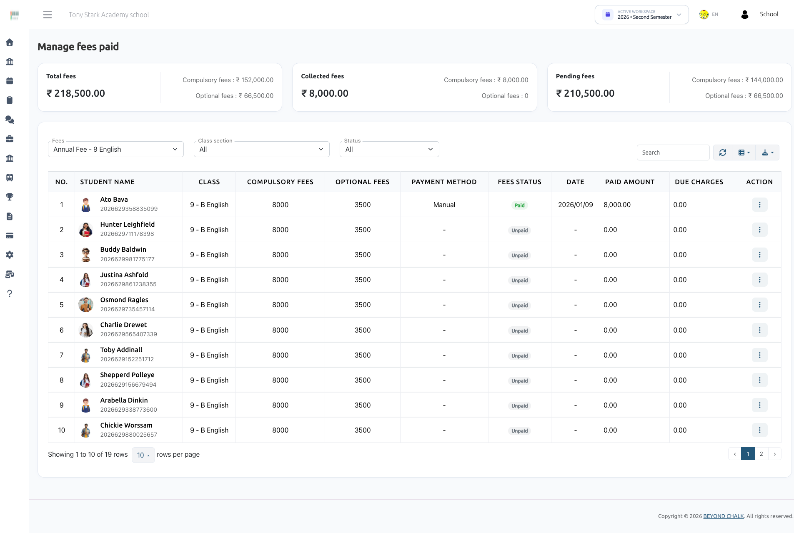
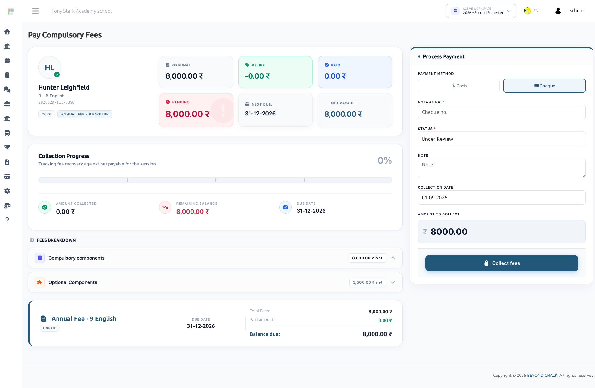
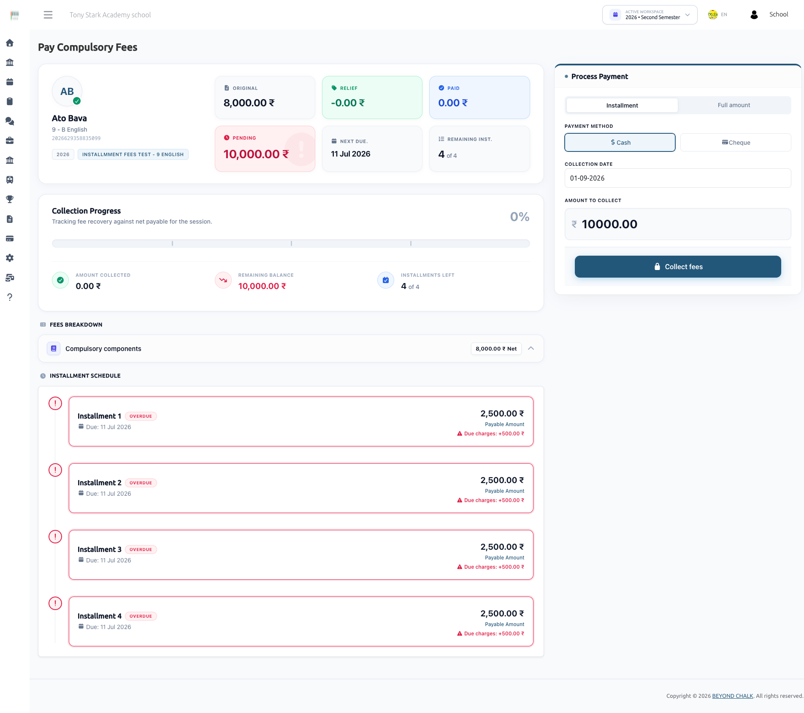
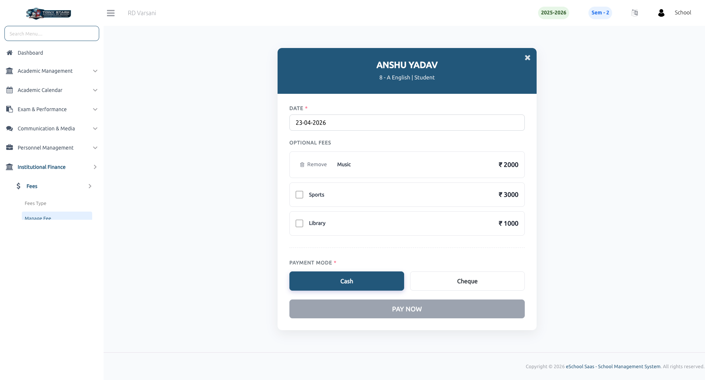
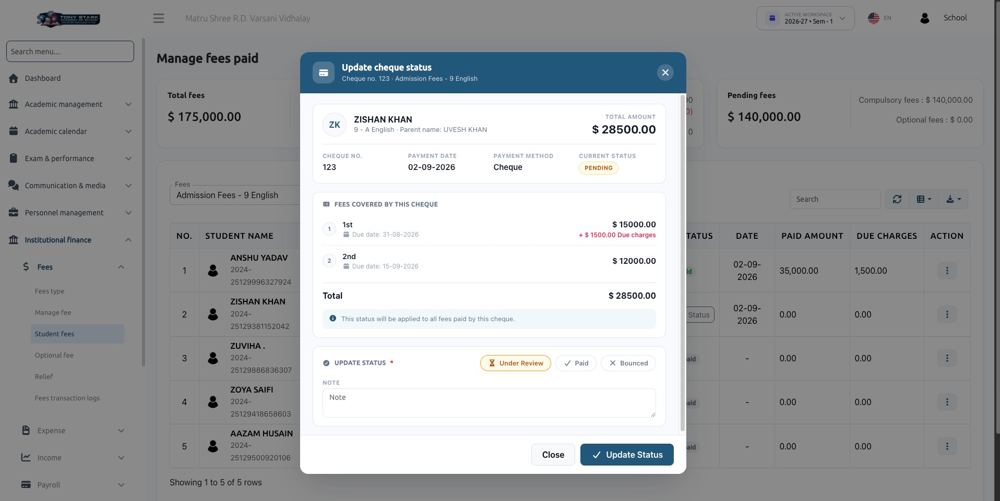
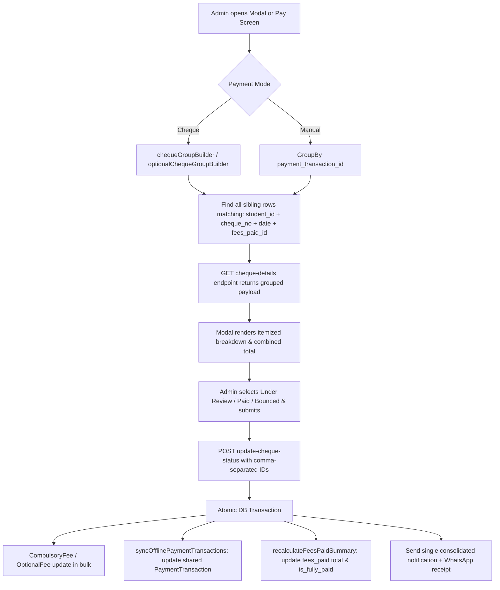

# Fees Module — Payments, Manual Payment & Cheque Status



How fees get collected in eSchool SaaS, with focus on offline payments, manual submissions, and the unified cheque and payment reconciliation workflow:

1. **Manual payment** — the parent pays by bank transfer / UPI / QR outside the system, uploads a receipt from the mobile app, and the school approves or rejects it.
2. **Cheque and manual payment lifecycle** — carries a real status (`Pending` → `Success` or `Failed`) instead of being recorded as paid immediately.
3. **Multi-fee & multi-installment cheque reconciliation** — a single cheque or manual payment can cover multiple installments or multiple optional fee components; they are grouped together and reconciled atomically in one action.
4. **Unified status management modal** — a modern card-based interface used across both Compulsory and Optional fees to review payment details, fees covered, uploaded proofs, and update status.

---

## 1. The two fee types

| Type | Table | Meaning |
|---|---|---|
| **Compulsory fees** | `compulsory_fees` | The mandatory fee for the class. Can be a single full payment or split into installments. |
| **Optional fees** | `optional_fees` | Add-on components (transport, activity, lab, etc.) the guardian picks individually. |

Both write per-transaction rows and roll up into one summary row per student per fee in **`fees_paid`** (`amount`, `is_fully_paid`).

---

## 2. Payment modes & references

| Mode | Stored Value | Recorded by | Initial status | Identifier |
|---|---|---|---|---|
| **Cash** | `Cash` (`1`) | Admin, offline collection screen | `Success` immediately | Cash transaction |
| **Cheque** | `Cheque` (`2`) | Admin, offline collection screen | Admin picks: Under review (`Pending`), Paid (`Success`), or Bounced (`Failed`) | Cheque Number (`cheque_no`) |
| **Online** | `Online` | Parent, via Stripe / Razorpay / Paystack / Flutterwave | `Success` on gateway webhook | Gateway Payment ID |
| **Manual** | `Manual` | Parent, mobile app — pays outside system and uploads proof | Always `Pending` until admin review | Reference Number (`MANUAL-YYYYMMDD-XXXX` on `payment_transactions.order_id`) |

- `mode` on `compulsory_fees` and `optional_fees` is an ENUM `('Cash','Cheque','Online','Manual')`.
- The offline collection forms post the numeric mode (`1` = Cash, `2` = Cheque); the model accessors and controllers handle both numeric and string values.
- Parents never supply a cheque number for manual submissions: `cheque_no` remains `NULL`, and the payment is identified system-wide by the generated `payment_reference` (`MANUAL-YYYYMMDD-XXXX`).

---

## 3. The status model

Both `compulsory_fees.status` and `optional_fees.status` share the same three database values (defined as constants on `CompulsoryFee.php` and `OptionalFee.php`):

| Constant | DB value | Cheque meaning & UI label | Manual meaning & UI label |
|---|---|---|---|
| `CHEQUE_PENDING` / `MANUAL_UNDER_REVIEW` | `Pending` | Cheque deposited, not cleared (**Under Review**) | Receipt uploaded, awaiting verification (**Under Review**) |
| `CHEQUE_SUCCESS` / `MANUAL_APPROVED` | `Success` | Cheque cleared (**Paid**) | Payment verified & approved (**Approved**) |
| `CHEQUE_FAILED` / `MANUAL_REJECTED` | `Failed` | Cheque bounced (**Bounced**) | Payment rejected (**Rejected**) |

### Money calculation rule
**Only `Success` counts as money.**
Every balance, "paid amount", progress bar, `fees_paid.amount` and `is_fully_paid` calculation strictly sums rows where `status = 'Success'` and `deleted_at IS NULL`.
- A `Pending` row is visible in records and review queues but contributes 0.00 to the collected balance.
- A `Failed` row contributes 0.00 and re-opens the fee/component for a fresh collection attempt.

### Money Rules Worth Remembering
- Every "paid" figure = sum of `status = 'Success'`, `deleted_at IS NULL` rows. Nothing else counts.
- Discounts are applied **before** payment: the net payable is `fee − discount`, and the overpayment guard uses the net figure.
- Due charges are computed at payment time (percentage or fixed, only when past the due date) and are allocated **before** the base amount.
- Overpayment is refused: on the final installment a surplus throws an error, and non-installment payment is capped at the outstanding total.
- A fee is fully paid when the `Success` total reaches the net fee — and, for installment fees, every installment has at least one `Success` row.

### UI Form Values & Validation
The web interfaces submit lowercase status tokens mapped by controllers:

| UI Key | Stored DB Status | Rejection Reason Requirement |
|---|---|---|
| `pending` | `Pending` | Not required; cleared if previously set |
| `success` | `Success` | Not required; cleared if previously set |
| `bounced` | `Failed` | **Mandatory** (`reason` on compulsory, `rejection_reason` on optional) |

### Supporting Columns
| Column | Purpose |
|---|---|
| `notes` | Free-form note — parent's remarks on manual submission, or admin's notes |
| `reason` | Rejection / bounce reason. Stored when status is `Failed` (`bounced`), cleared otherwise |
| `payment_transaction_id` | Links to the parent `payment_transactions` audit row |
| morph `files` row | The uploaded payment proof (accessible via `receipt_url`) |

A synchronized `payment_transactions` record is maintained with `payment_gateway` (`cheque` / `manual` / `cash`), `payment_status` (`pending` / `succeed` / `failed`), and total aggregated amount.

---

## 4. Setup — enabling manual payment

**Settings → Payment Settings → Manual tab** (school admin only; hidden for Super Admin).

| Field | Description |
|---|---|
| **Status** | Enable / Disable toggle. Manual payments are rejected if disabled (`0`) |
| **Bank Details & Payment Instructions** | Rich text (bank name, account number, IFSC/SWIFT, UPI ID, instructions). Shown in app |
| **QR code image** | Uploaded image file, stored as a morph `files` record on the payment configuration |

Saved into `payment_configurations` with `payment_method = 'Manual'` (`details` column + attached file). The mobile app retrieves this via `GET /api/parent/fees/manual/config`.

### Permissions

| Permission | Grants |
|---|---|
| `fees-paid` | Collect fees offline, view payment histories, review cheque/manual status, delete transactions |
| `fees-create` / `fees-edit` / `fees-delete` | Manage fee types, installments, and master fee setup |
| `fees-config` | Configure payment methods and payment settings |

The module also requires the **Fees Management** package feature active on the school workspace.

---

## 5. Flow A — Admin collects offline (cash / cheque)

### 1. Compulsory Fees Collection
Screen: **Institutional Finance → Fees → Paid → Compulsory Fees** (`pay-compulsory.blade.php`)





1. Admin selects **Installment** or **Full amount**.
2. Selects **Cash** or **Cheque**:
   - **Cash**: Creates transactions immediately with `status = 'Success'`.
   - **Cheque**: Reveals Cheque Number (required), initial status picker (Under Review / Paid / Bounced), Rejection Reason (mandatory if Bounced), and Note.
3. Enters collection date and amount, then submits.

#### Multi-Installment Cheque Collection & Review:
- When a single cheque pays multiple installments, the system writes one `compulsory_fees` row per installment touched, all sharing the same `cheque_no`, collection date, and `fees_paid_id`.
- If an installment fee has an existing `Pending` cheque, the screen automatically detects all sibling transactions (`chequeGroupTxns`), displays the **Fees covered by this cheque** breakdown, sets the amount input to the grouped total (read-only), and switches the form action to `fees.paid.update-cheque-status`.
- **Payment Lock**: New offline collections and online/manual submissions are locked while any `Pending` cheque or manual transaction exists for that fee.

#### Server-side processing (`payCompulsoryFeesStore`):
- Rejects amounts below the minimum payable or exceeding net outstanding balance.
- Allocates funds installment by installment: **due charges first, then base installment amount**.
- Writes `compulsory_fees` rows with status derived from the mode.
- Recalculates `fees_paid.amount` and `is_fully_paid` from `Success` rows only.
- Sends in-app and WhatsApp receipts only when cleared (`Success`).

- **Note on Installments:** Installments are not allowed for optional fees.
- **Advance Payments:** School admin/user can pay extra amount along with the installment amount. If the installment amount is paid, only advance amount can be paid in the installment duration.

---

### 2. Optional Fees Collection
Screen: **Institutional Finance → Fees → Optional Fee → Pay Optional** (`pay-optional.blade.php`)



The optional fees payment screen features a modern split-panel layout:
- **Left Panel (Fee Selection)**: Lists all available optional components for the student with their base amount, relief discounts, and net payable amount.
  - Badges indicate status: `Paid` (green), `Pending` (amber), `Bounced - Retry Payment` (red), and `Discounted` (blue).
  - Components already `Paid` or `Pending` have disabled checkboxes. Paid rows display a **Remove** button; pending rows display a **Cancel** button.
  - Bounced components are re-enabled with a "Bounced — Retry Payment" badge, allowing immediate re-collection.
- **Right Panel (Process Payment)**: Sticky payment panel providing a live summary of selected fees:
  - Datepicker for collection date.
  - Selected fee itemization with live total amount calculation.
  - Payment Mode toggle: **Cash** vs **Cheque**.
  - **Cheque Fields (when Cheque is selected)**:
    - Informational alert: *"This status will be applied to all fees paid by this cheque."*
    - **Cheque Number** input (required).
    - **Status Segmented Control**: Under Review (`pending`), Paid (`success`), or Bounced (`bounced`).
    - **Rejection Reason**: Dynamically appears and becomes required when Bounced is chosen.
    - **Note** textarea.
  - **Pay Now** CTA button.

#### Server-side processing (`payOptionalFeesStore`):
- **Shared Cheque Transaction**: When multiple optional fees are paid via a single cheque, they share a single `PaymentTransaction` record (`payment_gateway = 'cheque'`, `payment_status = 'pending'|'succeed'|'failed'`) with the combined total amount.
- Validates against duplicate submissions for components already `Pending` or `Success`.
- Enforces net amount ceilings (amount − discounts) to prevent overpayment.
- Inserts `optional_fees` rows in bulk via `createBulk`.
- If bounced, sends an instant notification containing the bounce reason to the parent/guardian.
- On success, dispatches a WhatsApp fee receipt and in-app payment notification.

---

## 6. Flow B — Parent pays manually from the mobile app

1. Parent opens the mobile app, views bank details and QR code via `GET /api/parent/fees/manual/config`.
2. Parent makes an external transfer (bank wire, UPI, or cash deposit).
3. Parent submits `POST /api/parent/fees/manual/compulsory/pay` or `POST /api/parent/fees/manual/optional/pay` with the **receipt image** and an optional note.
4. **Server calculates the payable amount**:
   - Compulsory installment mode: `net installment amount − already-paid amount` + due charges (if past due date).
   - Compulsory full mode: `total compulsory fee − discounts − already paid` + due charges.
   - Optional fees: `sum(component amount − discount − already paid)`.
5. **Reference & Transaction Creation** (`ManualPaymentService.php`):
   - System generates a unique internal reference: `MANUAL-YYYYMMDD-XXXX` (e.g. `MANUAL-20260902-A1B2`).
   - Creates a single `PaymentTransaction` (`payment_gateway = 'manual'`, `order_id = $reference`, `payment_status = 'pending'`).
   - Attaches the receipt file as a morph `files` record to the `PaymentTransaction`.
   - Creates one `compulsory_fees` or `optional_fees` row per installment or component with `mode = 'Manual'`, `status = 'Pending'`, `cheque_no = null`, and `payment_transaction_id = $paymentTransaction->id`.
6. Nothing is added to `fees_paid.amount` until an admin reviews and approves the submission.

### Guards Enforced Before Creation

| Guard | Response |
|---|---|
| Manual payment disabled for the school | "Manual payment is currently disabled for this school." |
| Child not active / not linked to this guardian | "Child's Account is not Active…" |
| Fee already fully paid | "Fees Already Paid" |
| A `Cheque` **or** `Manual` transaction is already `Pending` for this fee | "A cheque/manual payment for this fee is currently under review. New payments are locked until it is cleared or rejected." |
| Optional component already under review or already paid | Locked with the matching message |
| Computed payable amount is zero | "This fee has already been paid." |

Receipt upload: `required|file|max:5120` (5 MB), stored via upload service.

The parent can poll `GET /api/parent/fees/manual/status` for a record's current status, mode, amount, note, and receipt URL.

---

## 7. Flow C — Admin reviews a pending payment (Unified Modal)

Pending cheque and manual payments can be reviewed from two main entry points:
1. **The Compulsory Pay Screen** (`pay-compulsory.blade.php`): Automatically switches into review mode when pending transactions exist for that student and fee.
2. **The Fees List Screens**:
   - **Compulsory Fees List** (`fees_paid.blade.php`): Click the **Update Status** button on any row holding a pending cheque or manual payment.
   - **Optional Fees List** (`optional-fees.blade.php`): Click the **Update Status** button on any row holding a pending optional fee transaction.



Both list screens open the **Unified Cheque & Payment Status Modal**:

```
┌─────────────────────────────────────────────────────────────────────────────┐
│ 💳  UPDATE CHEQUE STATUS                                                  ✕ │
│     Cheque no. 123 · Admission Fees · 9 English                             │
├─────────────────────────────────────────────────────────────────────────────┤
│ ┌─────────────────────────────────────────────────────────────────────────┐ │
│ │ (ZK)  ZISHAN KHAN                                     TOTAL AMOUNT      │ │
│ │       9 - A English · Parent name: UVESH KHAN           $ 28,500.00     │ │
│ │                                                                         │ │
│ │ CHEQUE NO.       PAYMENT DATE      PAYMENT METHOD     CURRENT STATUS    │ │
│ │ 123              02-09-2026        Cheque             [ PENDING ]       │ │
│ └─────────────────────────────────────────────────────────────────────────┘ │
│                                                                             │
│ 📋  FEES COVERED BY THIS CHEQUE                                             │
│ ┌─────────────────────────────────────────────────────────────────────────┐ │
│ │ ①  1st Installment (Due: 31-08-2026)             $ 15,000.00            │ │
│ │                                               + $ 1,500.00 Due charges  │ │
│ │ ②  2nd Installment (Due: 15-09-2026)             $ 12,000.00            │ │
│ │ ─────────────────────────────────────────────────────────────────────── │ │
│ │ Total                                            $ 28,500.00            │ │
│ └─────────────────────────────────────────────────────────────────────────┘ │
│ ℹ This status will be applied to all fees paid by this cheque.             │
│                                                                             │
│ 🔘  UPDATE STATUS *                                                         │
│     [ ⌛ Under Review ]    [ ✓ Paid ]    [ ✕ Bounced ]                     │
│                                                                             │
│ [ Reason for Rejection * (visible only when Bounced/Rejected is selected) ] │
│                                                                             │
│ Note                                                                        │
│ ┌─────────────────────────────────────────────────────────────────────────┐ │
│ │                                                                         │ │
│ └─────────────────────────────────────────────────────────────────────────┘ │
│                                                                             │
│ 📎 Uploaded Payment Receipt (Manual payments only)                          │
│    [ 📄 View Full Receipt ]                                                 │
├─────────────────────────────────────────────────────────────────────────────┤
│                                                [ Close ]  [ Update Status ] │
└─────────────────────────────────────────────────────────────────────────────┘
```

### Dynamic Modal Adaptation (Cheque vs. Manual)
The modal javascript dynamically adapts labels and fields based on `mode`:

| Element | Cheque Payment | Manual Payment |
|---|---|---|
| **Header Icon** | `fa fa-credit-card` | `fa fa-file-text` |
| **Modal Title** | `Update cheque status` | `Update payment status` / `Update Manual Payment Status` |
| **Subtitle Identifier** | `Cheque no. {number} · {fee_name}` | `{reference_no} · {fee_name}` |
| **Identifier Label** | `Cheque No.` | `Reference No.` |
| **Covered Section Title** | `Fees Covered By This Cheque` / `Optional Fees Covered By This Cheque` | `Payment Details` |
| **Success Status Option** | `Paid` | `Approved` |
| **Failure Status Option** | `Bounced` | `Rejected` |
| **Rejection Reason Label** | `Cheque Bounced Reason` | `Reason for Rejection` |
| **Receipt Link** | Hidden (or optional if uploaded) | Visible link to view uploaded proof file |

---

### Multi-Installment & Multi-Component Grouping Engine

Payments covering multiple installments or components are linked behind the scenes so the admin never has to update each item separately:



#### Backend Group Query Builders:
- **`chequeGroupBuilder(CompulsoryFee $fee)`** (`FeesController.php`):
  - For `Manual`: Groups all rows matching `payment_transaction_id`.
  - For `Cheque`: Groups all rows matching `student_id`, `mode = 'Cheque'`, `cheque_no`, `date`, and `fees_paid_id`.
- **`optionalChequeGroupBuilder(OptionalFee $fee)`** (`FeesController.php`):
  - Mirrors compulsory grouping for optional fee components paid under the same cheque or manual transaction.

#### API Endpoints:
- `GET fees-paid/cheque-details/{id}` (`FeesController::chequeGroupDetails`): Returns full grouped payload for compulsory fees.
- `POST fees-paid/update-cheque-status` (`FeesController::updateChequeStatus`): Atomic update for compulsory fees.
- `GET fees/optional/cheque-details/{id}` (`FeesController::optionalChequeGroupDetails`): Returns full grouped payload for optional fees.
- `POST fees/optional/update-cheque-status` (`FeesController::updateOptionalChequeStatus`): Atomic update for optional fees.

---

### What each decision does

When updating status (`updateChequeStatus` or `updateOptionalChequeStatus`), all covered rows are processed together inside a database transaction:

| Decision | Actions taken by the system |
|---|---|
| **Approve / Paid** (`success`) | 1. All covered fee rows updated to `status = 'Success'`.<br/>2. Linked `payment_transactions` record updated to `payment_status = 'succeed'` with the combined total.<br/>3. `fees_paid.amount` and `is_fully_paid` recalculated from `Success` rows.<br/>4. Guardian & student receive **one** notification ("Manual Payment Approved" / "Cheque is cleared").<br/>5. WhatsApp fee receipt with PDF generated and delivered. |
| **Reject / Bounced** (`bounced`) | 1. All covered fee rows updated to `status = 'Failed'` and `reason` recorded.<br/>2. Linked `payment_transactions` record updated to `payment_status = 'failed'`.<br/>3. Balance remains unchanged (amount was never counted).<br/>4. Fee re-opens immediately for a new payment attempt.<br/>5. Guardian & student receive **one** notification with the rejection reason. |
| **Keep Under Review** (`pending`) | 1. Status remains `Pending`.<br/>2. Admin note updated.<br/>3. Linked transaction remains `pending`.<br/>4. No notifications dispatched. |

---

## 8. Locking rules — the short version

- **Compulsory Fee Lock**: A single `Pending` transaction (cheque or manual) locks the **entire compulsory fee** for that student. Neither new admin collections nor new mobile manual submissions can be made until the pending payment is resolved.
- **Optional Fee Lock**: An individual optional component is locked while it is `Pending` or `Success`. Other components remain selectable.
- **Retry on Failure**: When a cheque bounces or a manual payment is rejected, the transaction status becomes `Failed`. The fee/component is automatically unlocked without needing to delete the failed record; the next collection simply creates a new transaction row.
- **Cancellation**: Admins can cancel a pending optional fee directly using the **Cancel** button on `pay-optional.blade.php`, which permanently deletes the pending row and clears any associated lock.

---

## 9. What the parent and admin see

### Pay Compulsory Screen
- **Overview Card**: Shows Original Fee, Relief (Discounts), Paid Amount, Pending Amount, Next Due Date, and Collection Progress Bar.
- **Component Breakdown**: Installment timeline with status badges (`Paid`, `Partial`, `Overdue`, `Next due`, `Upcoming`, `Discounted`).
- **Cheque Review Mode**: If a pending cheque covers multiple installments, the "Fees covered by this cheque" panel displays the itemized list, locks the amount, and sets the CTA button to `Update Cheque Status`.

### Pay Optional Screen
- **Fee Selection**: Left panel showing all optional components with net amounts and status badges (`Paid`, `Pending`, `Bounced - Retry Payment`, `Discounted`).
- **Remove / Cancel**: Actions to remove paid items or cancel pending submissions.
- **Payment Processing**: Right panel showing live itemized total, Cash vs. Cheque selector, cheque number input, segmented status selector, conditional rejection reason, and `Pay Now` CTA.

### Fees Paid & Optional Fees Lists
- Displays the latest payment method, transaction references, and calculated fee status (`Fully paid`, `Partial`, `Unpaid`, `Overdue`).
- **Update Status Button**: Rendered for any row holding a pending cheque or manual payment; opens the unified status modal.

---

## 10. Mobile API reference

All endpoints under `/api/parent/fees`, requiring guardian bearer token and `checkChild` middleware.

| Method | Endpoint | Purpose |
|---|---|---|
| GET | `/` | Comprehensive fee list with compulsory and optional status |
| POST | `/compulsory/pay` | Online gateway payment (compulsory) |
| POST | `/optional/pay` | Online gateway payment (optional) |
| GET | `/manual/config` | Retrieves manual payment settings, bank instructions, and QR code URL |
| POST | `/manual/compulsory/pay` | Submits manual compulsory payment with receipt proof |
| POST | `/manual/optional/pay` | Submits manual optional payment with receipt proof |
| GET | `/manual/status` | Checks status of a submitted record |
| GET | `/receipt`, `/transaction-receipt` | Downloads fee receipt PDFs |
| GET | `/fees-transactions` | Paginated transaction history grouped by `PaymentTransaction` |

### POST `/manual/compulsory/pay` Payload

| Field | Type | Validation | Description |
|---|---|---|---|
| `child_id` | Integer | Required | Student ID (`students.id`) |
| `fees_id` | Integer | Required | Master fee ID |
| `installment_ids[]` | Array | Optional | IDs of installments being paid; omit for full payment |
| `advance` | Numeric | Required | Advance amount utilized (send `0` if none) |
| `receipt` | File | Required | Payment proof image/PDF (max 5 MB) |
| `notes` | String | Optional | Notes/remarks from parent (max 1000 chars) |

### GET `/fees-transactions` Response Structure
Transactions are paginated over `PaymentTransaction` records, returning grouped compulsory and optional items:
```json
{
  "id": 42,
  "payment_transaction_id": 42,
  "payment_reference": "MANUAL-20260902-A1B2",
  "payment_gateway": "manual",
  "payment_status": "pending",
  "total_amount": 28500.00,
  "mode": "Manual",
  "status": "Pending",
  "date": "2026-09-02",
  "receipt_url": "https://school.domain/storage/manual_receipt/receipt.png",
  "compulsory_fees": [
    {
      "id": 101,
      "fee_name": "1st Installment",
      "amount": 15000.00,
      "due_charges": 1500.00,
      "status": "Pending"
    },
    {
      "id": 102,
      "fee_name": "2nd Installment",
      "amount": 12000.00,
      "due_charges": 0.00,
      "status": "Pending"
    }
  ],
  "optional_fees": []
}
```

---

## 11. Data model

| Table | Role |
|---|---|
| `fees` / `fees_class_types` / `fees_installments` | Master fee definition, fee components, and installment timetable |
| `fees_paid` | Summary record per student per fee: `amount`, `is_fully_paid` |
| `compulsory_fees` | Per-installment/full transaction record: `mode`, `cheque_no`, `amount`, `due_charges`, `status`, `notes`, `reason`, `payment_transaction_id` |
| `optional_fees` | Per-component optional transaction record: `fees_class_id`, `mode`, `cheque_no`, `amount`, `status`, `notes`, `reason`, `payment_transaction_id` |
| `payment_transactions` | Master payment transaction: `payment_gateway`, `order_id` (holds `MANUAL-YYYYMMDD-XXXX`), `payment_status`, `amount` |
| `payment_configurations` | Per-school gateway settings, including `Manual` with bank HTML `details` and QR image |
| `files` (morph) | Attached receipt proofs (linked to `PaymentTransaction` and fee rows) and QR codes |
| `fee_discounts` / `fee_discount_items` | Concessions applied per fee, installment, or optional component |
| `fees_advances` | Advance amounts carried forward |

---

## 12. Troubleshooting & FAQs

| Symptom | Cause / Solution |
|---|---|
| **Manual tab missing in Payment Settings** | Visible only to school administrators (`school_id` present), hidden for Super Admin. |
| **App reports "Manual payment is currently disabled"** | Verify `payment_configurations` has an active record for `payment_method = 'Manual'` with `status = 1`. |
| **New payment locked for a student** | A cheque or manual transaction for that fee is currently `Pending`. Review and decide on that payment first. |
| **Approved a payment but balance did not increase** | Totals are summed strictly from rows with `status = 'Success'`. Check that status was updated to `Success` and `fees_paid_id` is linked. |
| **Rejection reason missing after bouncing** | Rejection reason is stored only when status is `bounced` (`Failed`). Any other status clears it. |
| **Single cheque status update does not update other installments** | Ensure `cheque_no`, `date`, and `student_id` match across installments. `chequeGroupBuilder` will group and update them atomically. |
| **Receipt link empty in the modal** | The file record was not created during upload. Verify write permissions on the `manual_receipt` storage path. |
| **Cash option disabled on collect screen** | A pending cheque/manual transaction exists and locks the fee until cleared or rejected. |
| **No notification after approval** | Requires the student's `guardian_id`; the WhatsApp receipt additionally needs Communication Center configured. |

### Technical Notes & Best Practices
- **Atomic Transactions**: All multi-installment and multi-component status updates in `updateChequeStatus` and `updateOptionalChequeStatus` execute inside `DB::beginTransaction()` and `DB::commit()` blocks, ensuring that fee rows, `payment_transactions`, and `fees_paid` summaries never go out of sync.
- **Single Notification Bridge**: Consolidated notifications prevent notification spam when multiple installments or optional fees are cleared or bounced in a single payment.