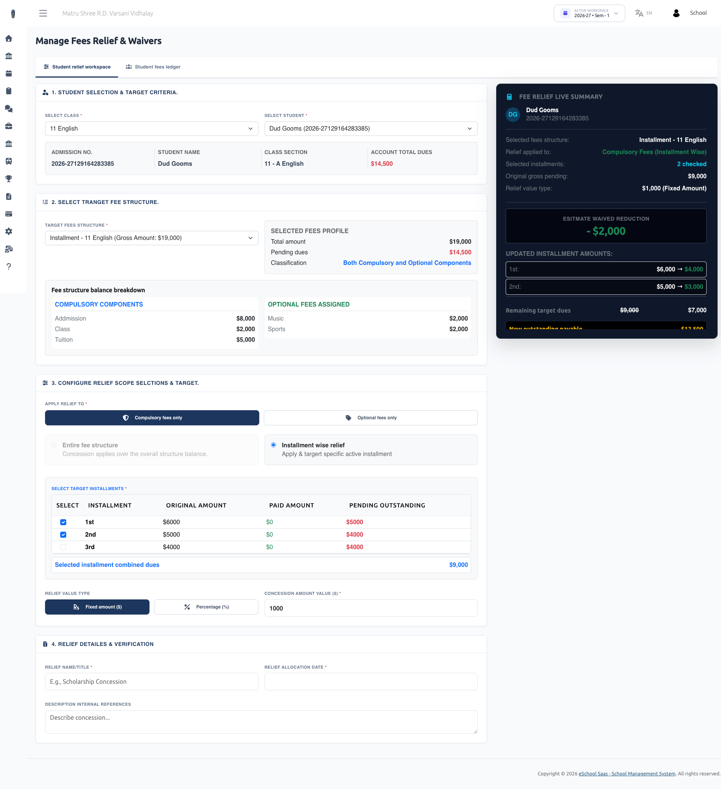
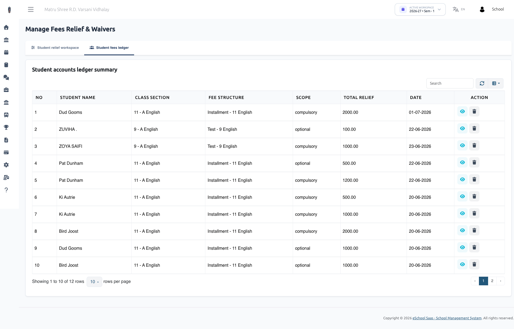

# Student Fees Discount

## 1. Overview & Key Capabilities

The Fee Relief & Concession System allows school management to offer financial assistance, scholarships, sibling concessions, or merit-based waivers to students.

### ✨ What You Can Do:
- **Custom Concessions:** Waive full or partial amounts from a student's fees.
- **Targeted Allocation:** Apply relief across the whole fee structure, specific installments, or individual optional fees (like transport, hostel, or lab fees).
- **Flexible Calculation:** Choose between a **Fixed Amount** (e.g., $500 off) or a **Percentage** (e.g., 20% scholarship).
- **Live Financial Preview:** Instantly see how a concession affects the student’s total dues and upcoming installments before saving.
- **Automatic Expense Tracking:** Every applied fee relief automatically records as a "Fees Relief" expense in the school finance reports for clear bookkeeping.
- **Easy Rollback:** Cancel or remove a concession at any time if applied by mistake.

## 2. Types of Fee Reliefs & Scopes

When creating a fee concession, you can customize how much is waived and where it applies:

### A. Relief Calculation Types

| Type | How It Works | Example |
| :--- | :--- | :--- |
| **Fixed Amount** | Deducts a specific dollar/currency amount from the selected fees. | $1,000 off on Annual Tuition Fee |
| **Percentage** | Deducts a percentage of the total or installment fee. | 25% waiver for Merit Scholarship |

### B. Relief Scopes (Where the Relief Applies)

- **Compulsory Fees (Entire Structure):** Concession is applied over the student’s total compulsory fee balance.
- **Compulsory Fees (Installment-Wise):** Concession is targeted directly at specific active installments (e.g., Quarter 1 or Quarter 2).
- **Optional Fees:** Concession is targeted at specific optional fee heads (e.g., 50% discount on Transport Fee or Library Fee).