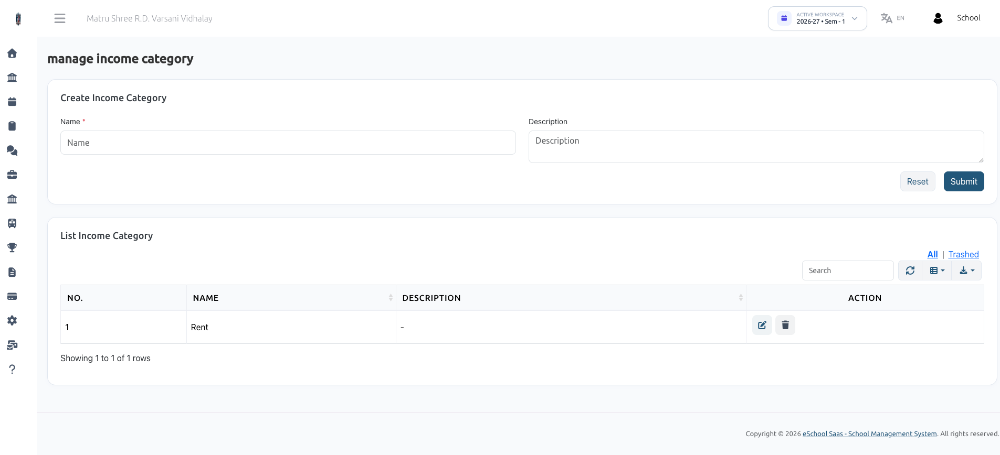

# Manage Income Category

Before recording manual non-fee income, administrators can define custom income categories under **Institutional Finance → Manage Income Category**.

## Overview

Custom income categories allow school administrators to classify non-fee revenue streams for accurate accounting and financial reporting (e.g., Property Rent, Grants, Donations, Canteen Lease, Event Ticket Sales, Uniform Sales).

## How to Create an Income Category

1. Navigate to **Manage Income Category**.
2. Fill out the **Create Income Category** form:
   - **Name** *(Required)*: Name of the income head (e.g., Building Rent, Sponsorships, Cafeteria Lease, Book Sales).
   - **Description**: Brief explanation of the category.
3. Click **Submit**.

## Category Table Actions

- **Search & Filter:** Quickly find category names.
- **Edit (Pencil Icon):** Modify category name or description.
- **Delete (Trash Icon):** Move unused categories to Trash.
- **All / Trashed Filter:** View active or soft-deleted categories with the option to restore.
