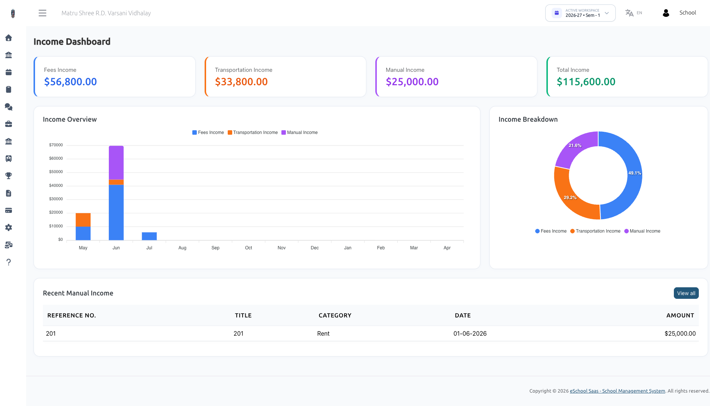

# Manage Income Dashboard

The **Income Dashboard** provides a centralized, visual suite for tracking all revenue sources entering the school—ranging from automated student fee collections to manual operational income.

## Overview & Key Features

- **Multi-Source Revenue Tracking:** Automatically aggregates Fees Income, Transportation Income, and Manual Non-Fee Income.
- **Comprehensive Income Dashboard:** Visual analytics featuring key metric cards, month-by-month stacked bar charts, and revenue distribution donut charts.
- **Granular Search & Filters:** Search income records by session year, category, month, reference number, or title.
- **Audit Transparency:** Tracks which administrator or staff member recorded each manual income entry.

## Dashboard Widgets Explained

### Financial Summary Cards
- **Fees Income:** Total compulsory & optional tuition/academic fees collected.
- **Transportation Income:** Total transportation/bus fees collected from students.
- **Manual Income:** Total non-fee operational income recorded manually.
- **Total Income:** Combined grand total of all revenue sources.

### Income Overview (Monthly Bar Chart)
A month-by-month stacked bar chart illustrating revenue trends across the academic session year.

### Income Breakdown (Distribution Donut Chart)
Visual breakdown showing percentage contributions of each income stream relative to total revenue.

### Recent Manual Income Table
Quick view of the latest manual income transactions with reference numbers, titles, categories, dates, and amounts.
