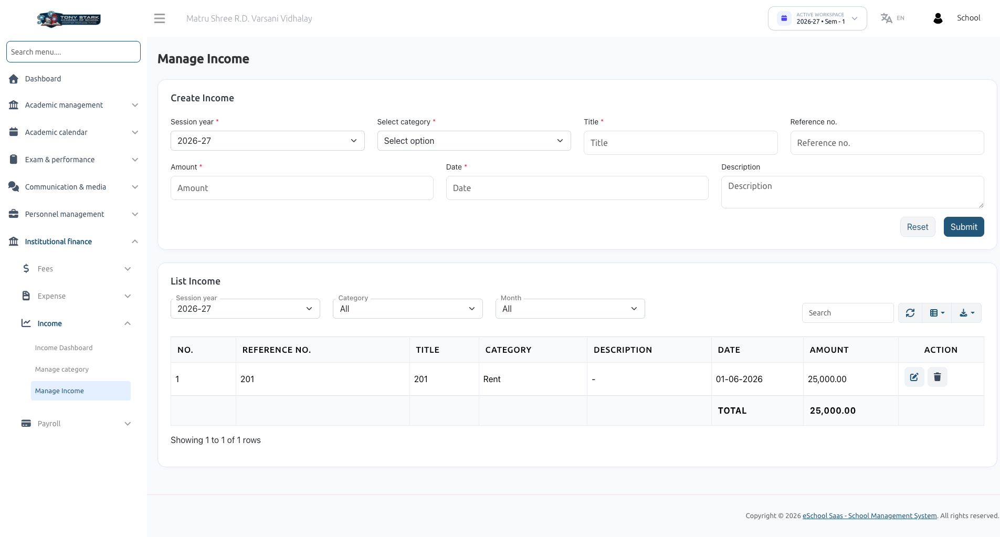

# Manage Income

To record non-fee operational revenue, navigate to **Institutional Finance → Manage Income**.

## Overview

The **Manage Income** section enables school administrators to record, view, and manage all manual non-fee income entries (such as rental income, donations, event sales, and cafeteria lease payments).

## How to Record a New Income Entry

In the **Create Income** form, fill out the following fields:

- **Session Year** *(Required)*: Select the relevant academic session year (e.g., 2026-27).
- **Select Category** *(Required)*: Choose from pre-configured income categories (e.g., Rent).
- **Title** *(Required)*: Short title or receipt name (e.g., Quarterly Hall Rent).
- **Reference No.:** External invoice, receipt, or bank transfer reference number.
- **Amount** *(Required)*: Numerical income value (e.g., 25,000.00).
- **Date** *(Required)*: Transaction date.
- **Description:** Detailed notes regarding the payment.

Click **Submit** to record the transaction.

## Managing & Filtering Income Records

The **List Income** table allows administrators to view and manage recorded transactions:

- **Filter By Session Year:** View income for a specific academic year.
- **Filter By Category:** View income for specific revenue heads (e.g., Rent or Donations).
- **Filter By Month:** Analyze income for specific months (e.g., June).
- **Search Box:** Search across reference numbers, titles, and descriptions.
- **Total Calculation Row:** Displays the calculated sum of filtered amounts at the bottom of the table.
- **Action Column:** Edit or Delete manual income entries.
