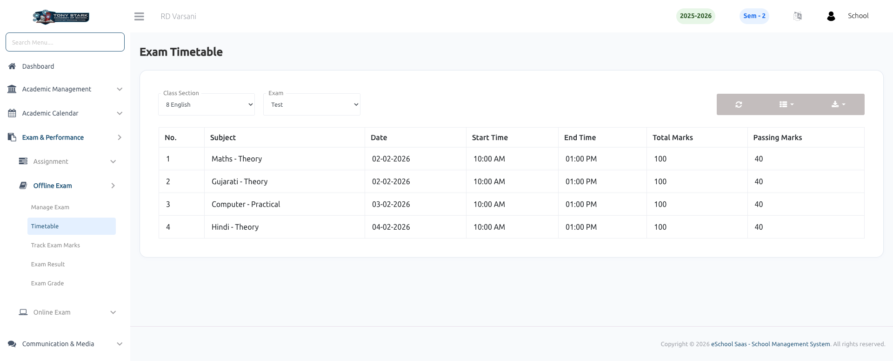

# Exam Timetable

This page allows the School Admin to view exam schedules based on selected class section and exam type.

### Key Features:

- **Class Section Filter**
    - Select **Class Section** to view timetable for a specific class.

- **Exam Filter**
    - Choose **Exam** to display its timetable details.

- **Exam Timetable List**
    - Displays structured exam schedule with the following details:
        - Subject
        - Date
        - Start Time
        - End Time
        - Total Marks
        - Passing Marks

