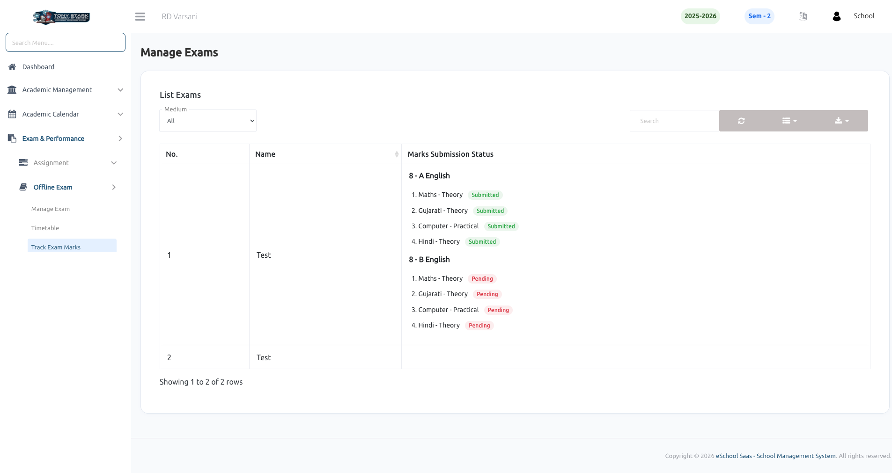

# Track Exam Marks

The **Track Exam Marks** feature allows school administrators to monitor the mark submission status for various offline exams. It provides a detailed view of which subject marks have been submitted by teachers and which are still pending.

### Key Features:

- **Comprehensive Tracking:** Monitor mark uploads across all class sections and subjects for a specific exam.
- **Subject-wise Status:** View the submission status for individual subjects, including different components like Theory and Practical.
- **Filtering Options:** Filter the exam list by medium to narrow down the tracking view.

