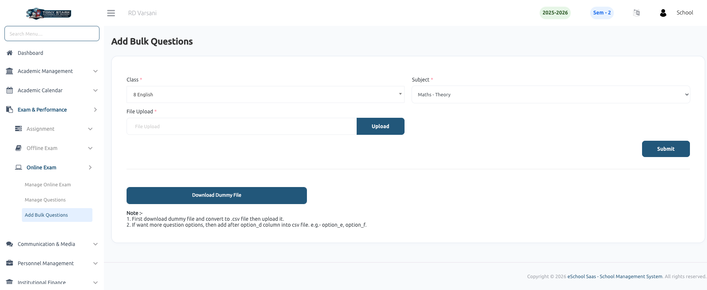

# Add Bulk Questions

The **Add Bulk Questions** feature allows users to upload multiple Multiple Choice Questions (MCQs) for online exams in a single action. This is particularly useful for quickly populating question banks for specific subjects and classes.

### Key Features:

- **Bulk Upload:** Import a large number of questions using a CSV file, saving significant time compared to manual entry.
- **Class & Subject Mapping:** Easily assign uploaded questions to the relevant class section and subject.
- **Sample File Integration:** Provides a **Download Dummy File** option to ensure users have the correct template for data entry.
- **Flexible Options:** Supports standard MCQs and allows for additional answer options (e.g., Option E, Option F) by simply adding extra columns to the CSV template.

### How to Add Bulk Questions:

1. **Download the Template:** Click the **Download Dummy File** button to get the sample CSV.
2. **Prepare Data:** Fill in the question details in the CSV. Ensure the file is saved in `.csv` format before uploading.
3. **Select Details:** Choose the appropriate **Class** and **Subject** from the dropdown menus.
4. **Upload File:** Select your prepared CSV file in the **File Upload** field and click the **Upload** button.
5. **Submit:** Click **Submit** to finalize the bulk import process.

