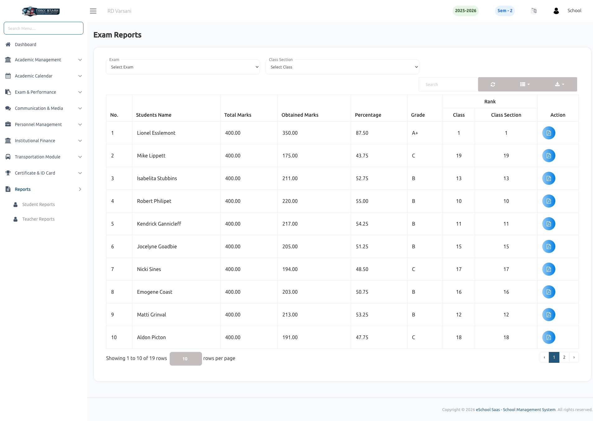
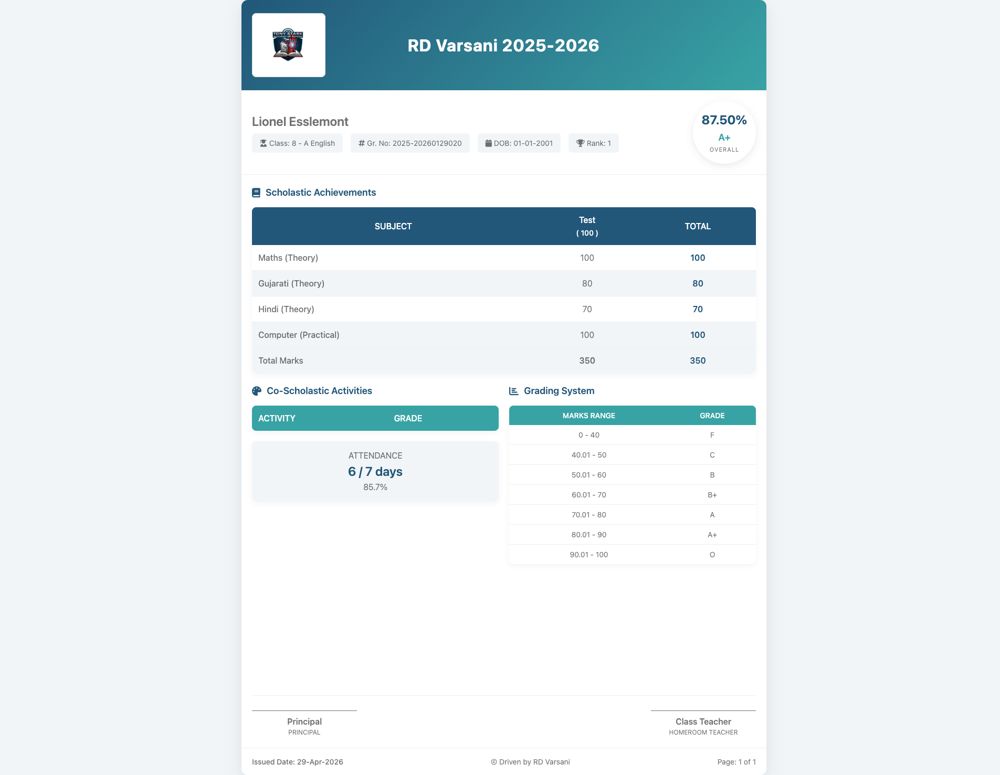

# Exam Reports

The **Exam Reports** module provides a centralized interface for reviewing student academic performance across different offline exams. Administrators can generate detailed performance summaries and individual report cards to track both scholastic and co-scholastic progress.

### 📜 Individual Report Card
Administrators can generate professional, print-ready individual report cards. These comprehensive documents include:
- **Scholastic Achievements:** A detailed subject-wise breakdown of marks for various components (e.g., Theory and Practical).
- **Co-Scholastic Activities:** Evaluation and grading of non-academic activities and overall student participation.
- **Attendance Summary:** A record of the student's attendance percentage during the specific exam term.
- **Grading System:** A clear reference guide explaining the school's marking ranges and their corresponding letter grades.
- **Official Validation:** Dedicated spaces for Principal and Class Teacher signatures to validate the results.

### 📊 Performance Summary
The main exam reports view displays a comprehensive table of student results for a selected exam and class section. This view helps administrators quickly assess the overall performance of a class. Key data points include:
- **Obtained Marks:** The total marks scored by each student in the exam.
- **Academic Standing:** The system automatically calculates and displays the **Percentage**, **Grade**, and **Rank** for each student.
- **Comparative Ranking:** View student rankings within the entire **Class** as well as their specific **Class Section**.
- **Report Generation:** Use the action icons to view or download individual student report cards.

