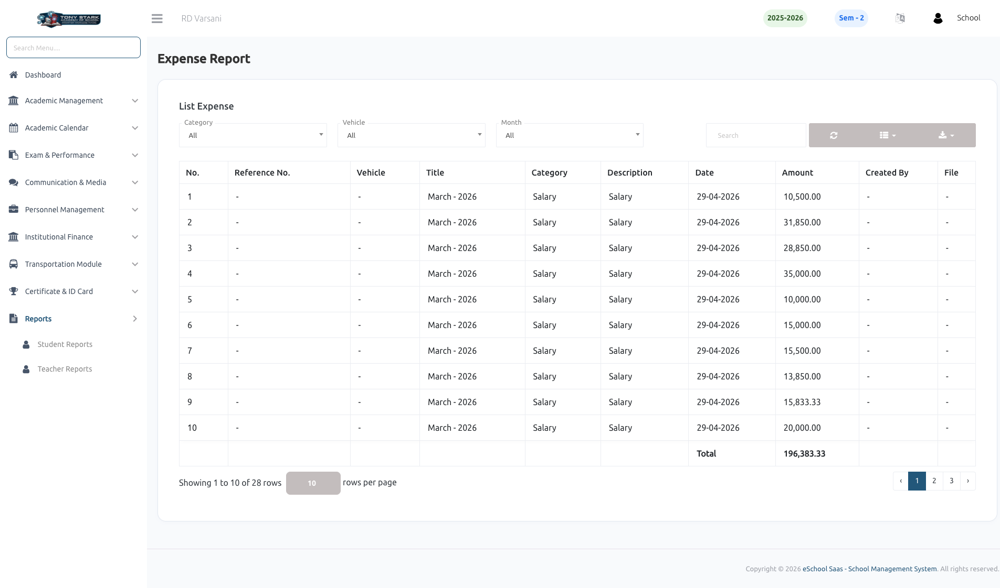

# Expense Report

The **Expense Report** feature provides a comprehensive financial overview of all school expenditures. It allows administrators to track, filter, and analyze spending across various departments and categories effectively.

### 💰 Expense Tracking & Analysis
The expense report displays a structured list of all recorded expenditures, providing transparency into the school's financial activities. Key features include:

- **Multi-level Filtering:** Narrow down the expense list by **Category**, **Vehicle** (for transportation-specific costs), or a specific **Month** to analyze targeted spending patterns.
- **Comprehensive Details:** View essential data for every entry, including Reference Numbers, Vehicle association, Expense Title, Category, and the exact Date of transaction.
- **Automated Totaling:** The system automatically calculates the total expenditure for the current filtered view, displayed at the bottom of the table for immediate financial insights.
- **Document Access:** View or download attached receipts and supporting files directly from the report table.

