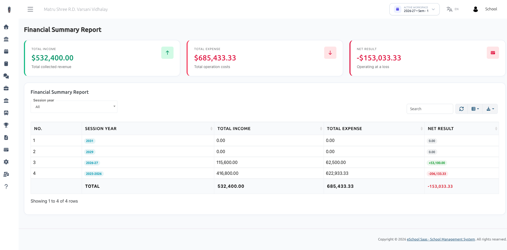

# Financial Summary Report (Profit & Loss)

The **Financial Summary Report** provides school executives and board members with a high-level Profit & Loss Statement by comparing total school revenues against operational expenses.

## Executive Financial Metrics

- **Total Income:** Combined sum of all revenue sources (Fees + Transportation + Manual Non-Fee Income) across all session years or selected filter.
- **Total Expense:** Combined sum of all operating costs (Manual Expenses + Subscription Bills + Fee Relief Concessions).
- **Net Result (Net Profit / Loss):**

  > **Net Result = Total Income - Total Expense**

  - **Green Badge (+ Amount):** Indicates net operating surplus/profit.
  - **Red Badge (- Amount):** Indicates net operating deficit/loss.

## Session-Year Financial Breakdown Table

- Lists financial performance year-by-year across historical academic sessions.
- Enables school boards and management to analyze long-term financial health and performance trends.
- Features search, column visibility toggles, and data export capabilities.
