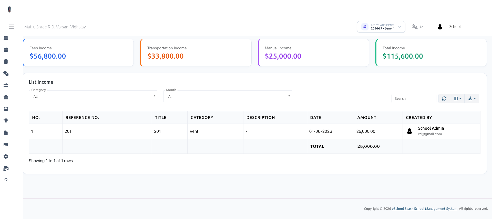

# Income Report

Navigate to **Reports → Income Report** to view structured revenue reports across all school income streams.

## Overview

The **Income Report** provides a comprehensive financial overview of all incoming revenue streams—combining automated fee collections, transportation fees, and manual operational income.

## Key Capabilities of Income Reports

- **Unified Metrics:** Summary cards displaying total Fees Income, Transportation Income, Manual Income, and Grand Total Income.
- **Staff Audit Attribution:** The **Created By** column displays the profile name and email of the staff member who recorded each manual transaction for complete audit transparency.
- **Granular Filtering:** Filter transactions by Session Year, Income Category, and Month.
- **Total Sum Calculation:** Displays total calculated sum for filtered records at the bottom of the table.
- **Export Options:** Export income tables to Excel/CSV or print formatted financial statements directly from the report table.
