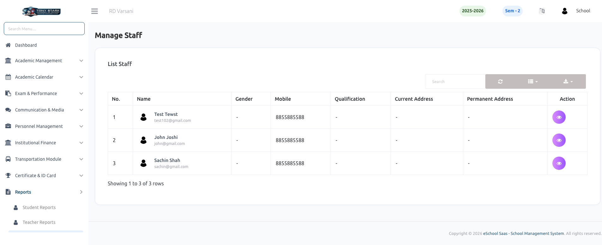
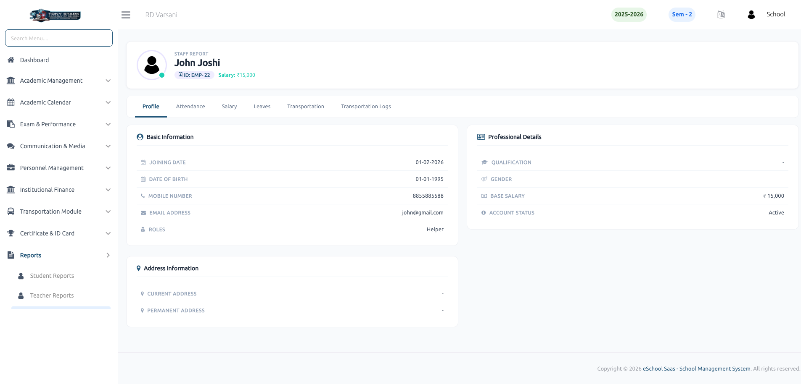
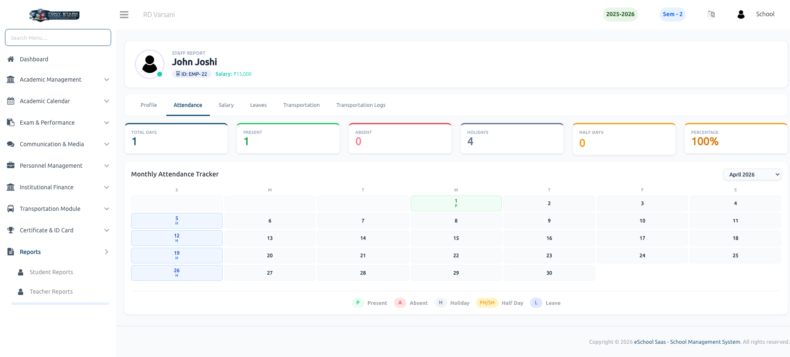
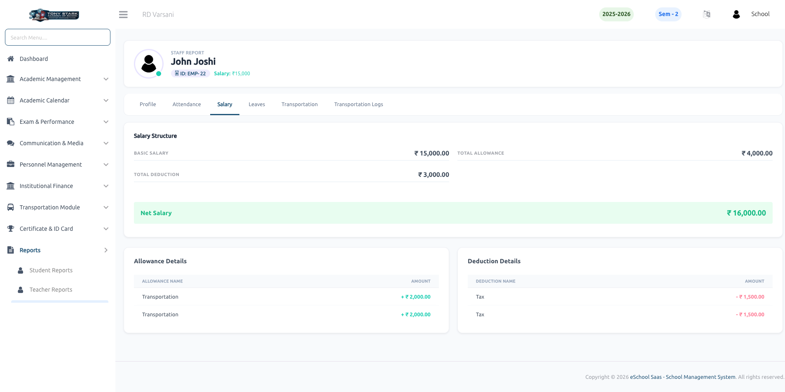
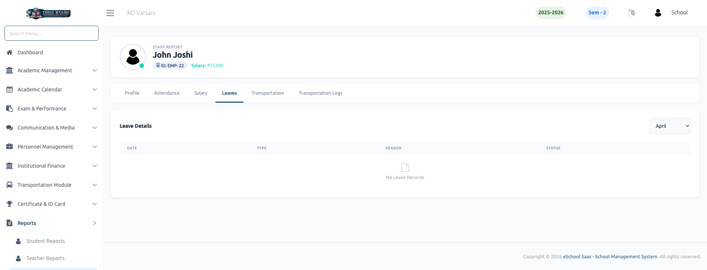
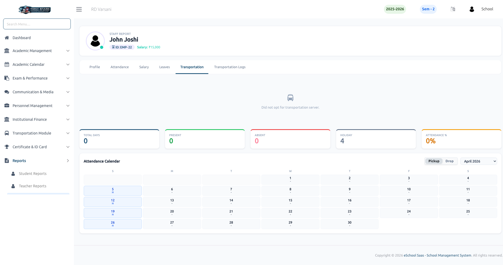
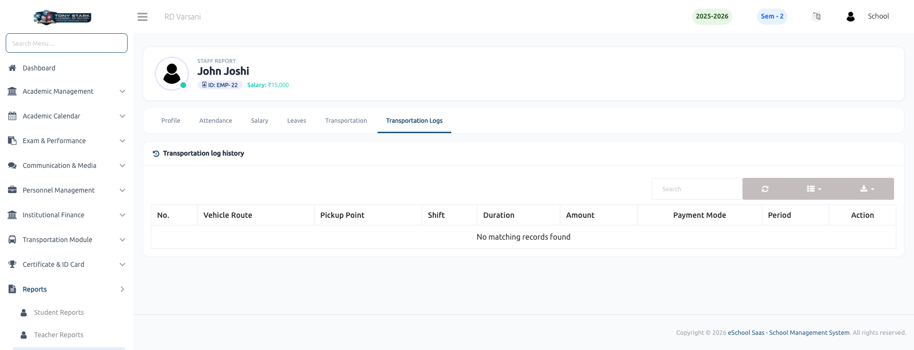

# Staff Reports

The **Staff Reports** section provides a comprehensive overview of non-teaching staff data, including attendance, salary structures, leave history, and transportation details. This module helps administrators manage staff records and track their operational performance effectively.

### 👥 Staff List
The staff list is the central hub for managing non-teaching personnel. It displays a summary of all staff members, including their names, roles, and contact details. Admins can quickly search for specific staff members and access their full individual reports by clicking on the view icon.

### 👤 Staff Profile
This report provides a detailed overview of a staff member's personal and professional data, organized into three key sections:
- **Basic Information:** Joining date, date of birth, contact number, and email address.
- **Professional Details:** Role/Designation, gender, base salary, and account status (Active/Inactive).
- **Address Information:** Current and permanent residential addresses.

### 📅 Staff Attendance
Monitor staff presence and leave history through a structured interface:
- **Attendance Summary:** Visual cards showing total days, present count, absent count, holiday count, and overall attendance percentage.
- **Monthly Tracker:** A color-coded calendar highlighting specific attendance types such as Present, Absent, Holiday, Half Day, or Leave for every day of the month.

### 💵 Salary Structure
This report provides a detailed breakdown of the staff member's compensation:
- **Net Salary:** Calculates the final take-home pay after all adjustments.
- **Allowance Details:** Itemized list of extra benefits such as transportation or mobile recharge allowances.
- **Deduction Details:** Displays itemized subtractions like taxes and other professional deductions.
- **Summary:** Overview of Basic Salary, Total Allowance, and Total Deduction for complete financial transparency.

### 🚪 Leave Details
Track all time-off records for staff members:
- **Leave History:** Detailed list showing leave dates, types (Full Day, First Half, or Second Half), and reasons.
- **Status:** Displays the current approval status (e.g., **Approved**) for each request.

### 🚌 Transportation Details
For staff members utilizing school transport, this report provides comprehensive commute data:
- **Plan Details:** Tracks subscription status, validity dates, and payment history.
- **Route & Vehicle:** Displays the assigned route, pickup point, and specific timings.
- **Staff Info:** Lists the designated Driver and Helper for the assigned route.
- **Commute Tracker:** A specialized attendance calendar to monitor daily transportation usage.

### 📋 Transportation Logs
The **Transportation Log History** maintains a record of all transportation-related transactions and service periods:
- **Transaction History:** Detailed logs of payment amounts, payment modes (e.g., Cash), and subscription durations.
- **Service Period:** Records the specific date ranges covered by each transportation plan.

