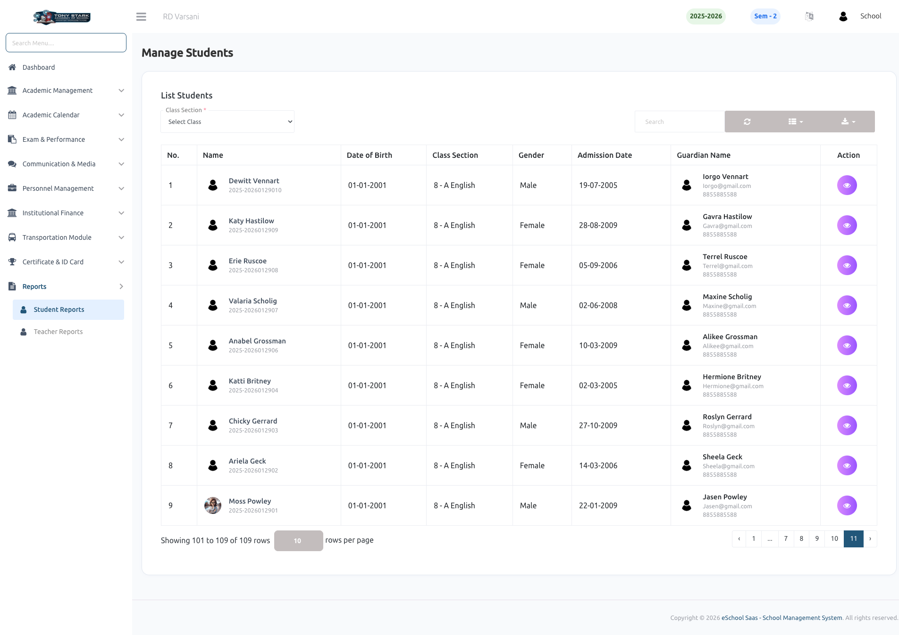
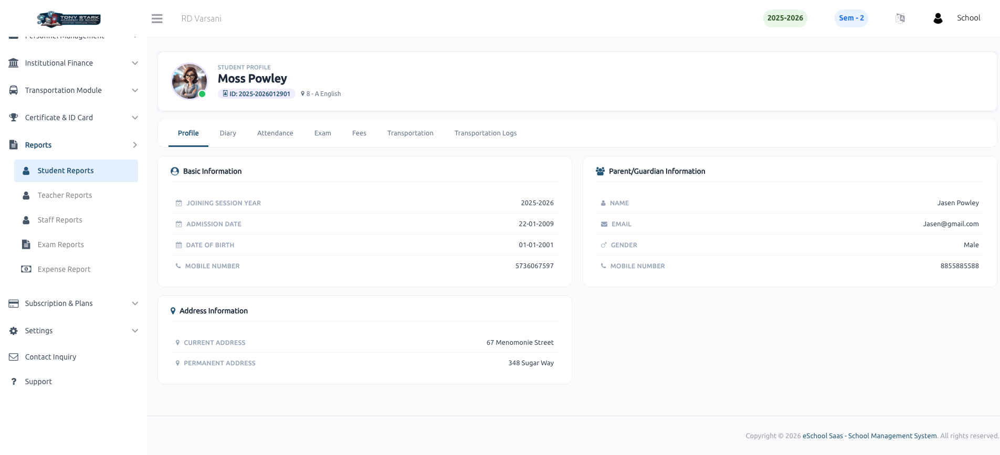
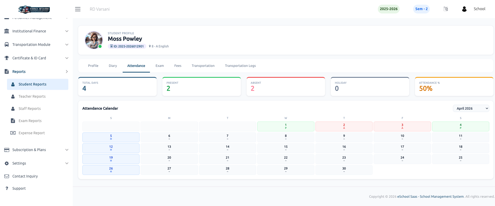
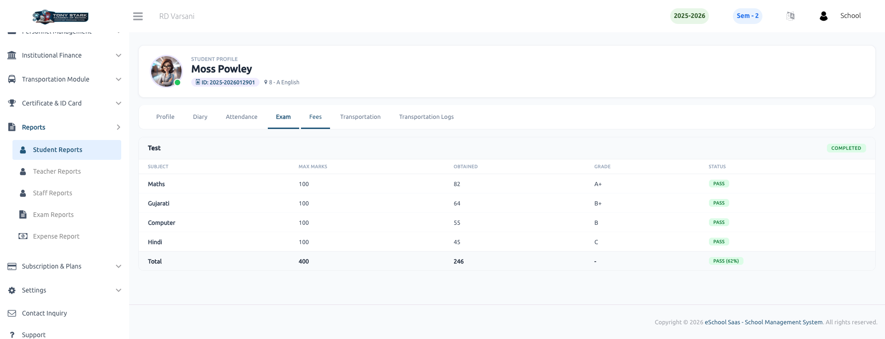
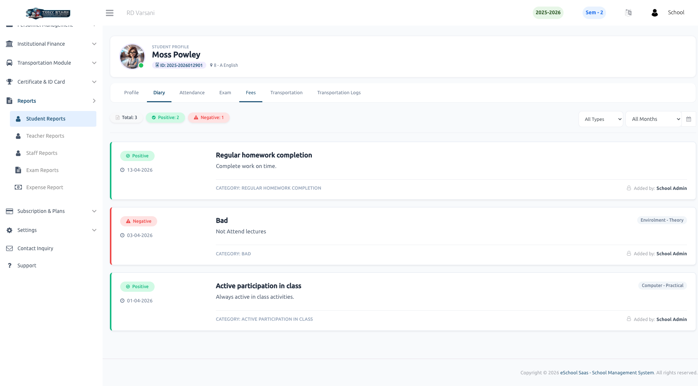
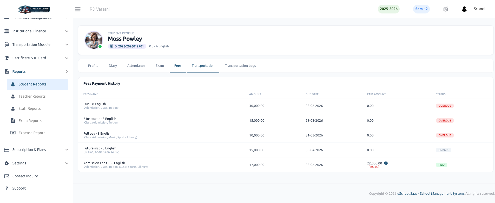
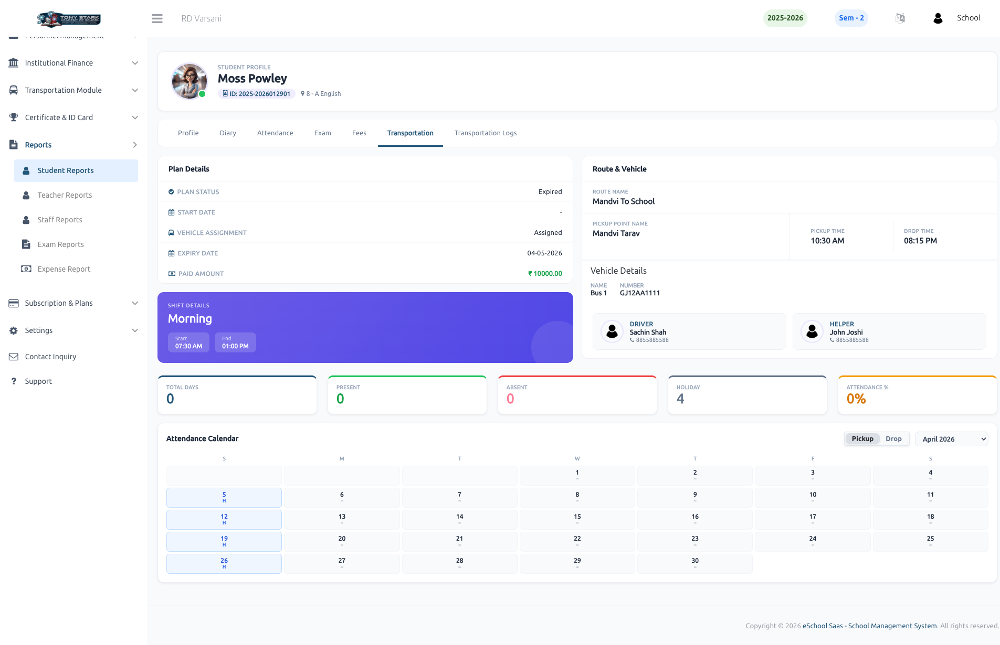
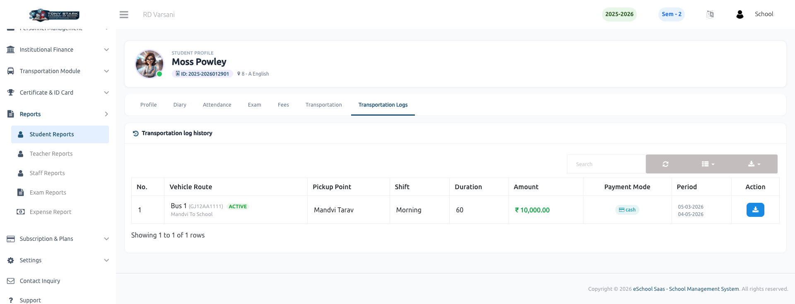

# Student Reports

The **Student Reports** section provides a comprehensive overview of student data, including academic performance, attendance, behavioral history, and personal profiles. This module allows administrators to track individual student progress and generate detailed reports for various school requirements.

### 👥 Student List
The student list serves as the primary entry point for viewing individual student reports. Administrators can filter students by class section and search for specific students to access their detailed information and individual records.

### 👤 Student Profile
This report displays complete personal and academic information for a student, organized into three main sections:
- **Basic Information:** Joining session year, admission date, date of birth, and contact number.
- **Parent/Guardian Information:** Name, email, gender, and mobile number.
- **Address Information:** Current and permanent residential addresses.

### 📅 Student Attendance
The attendance report provides a detailed breakdown of a student's presence. It includes summary cards showing total days, present count, absent count, and holiday count, along with an overall attendance percentage. A visual monthly calendar also displays the specific attendance status for each day.

### 📝 Student Exam Report
This section displays the results for various exams. It provides a subject-wise breakdown of maximum marks, obtained marks, and grades. It also calculates the total marks, obtained marks, and the overall pass/fail status with the final percentage.

### 📔 Student Diary
The diary report tracks behavioral and performance notes assigned to a student. It categorizes entries into **Positive** and **Negative** feedback (e.g., "Regular homework completion" vs "Bad behavior"), allowing administrators to monitor student conduct and class participation effectively.

### 💰 Student Fees
This report provides a comprehensive **Fees Payment History** for the student. It includes:
- **Fees Name:** Details of various fees like Admission, Class, and Tuition fees.
- **Payment Status:** Clearly indicates if a fee is **Paid**, **Overdue**, or **Unpaid**.
- **Financial Breakdown:** Lists the total amount, due date, and the amount paid so far for each fee category.

### 🚌 Transportation Details
The transportation report offers a deep dive into the student's commute details:
- **Plan Details:** Shows plan status (e.g., Active/Expired), start/expiry dates, and paid amount.
- **Route & Vehicle:** Displays the assigned route name, pickup point, and specific pickup/drop times.
- **Staff Information:** Provides details and contact info for the assigned **Driver** and **Helper**.
- **Commute Attendance:** A specialized attendance calendar to track when the student used the transportation service.

### 📋 Transportation Logs
The **Transportation Log History** maintains a record of all transportation-related transactions and subscriptions. It tracks:
- **Route & Vehicle Details:** The specific bus and route used for the period.
- **Subscription Info:** Duration of the plan, amount paid, and the payment mode (e.g., Cash).
- **Service Period:** The specific date range covered by each subscription log.

