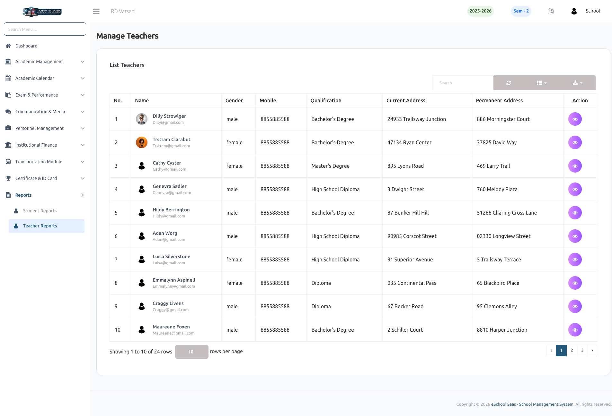
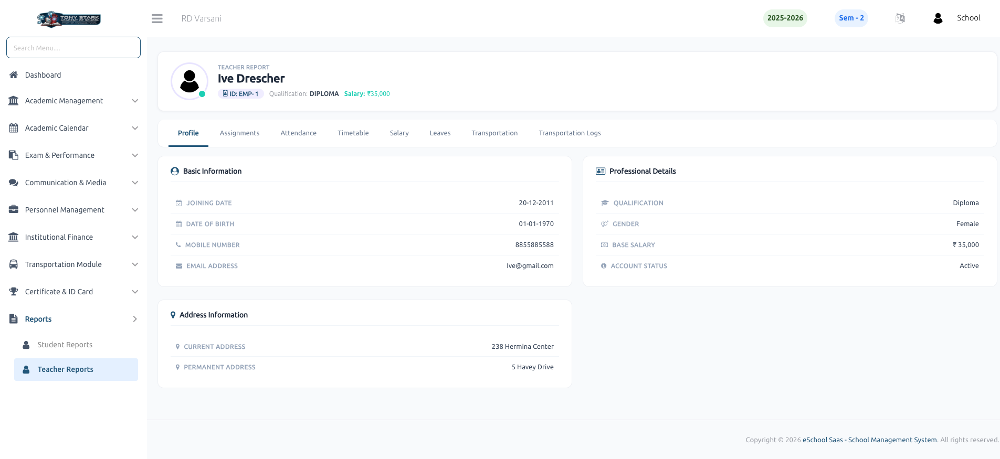
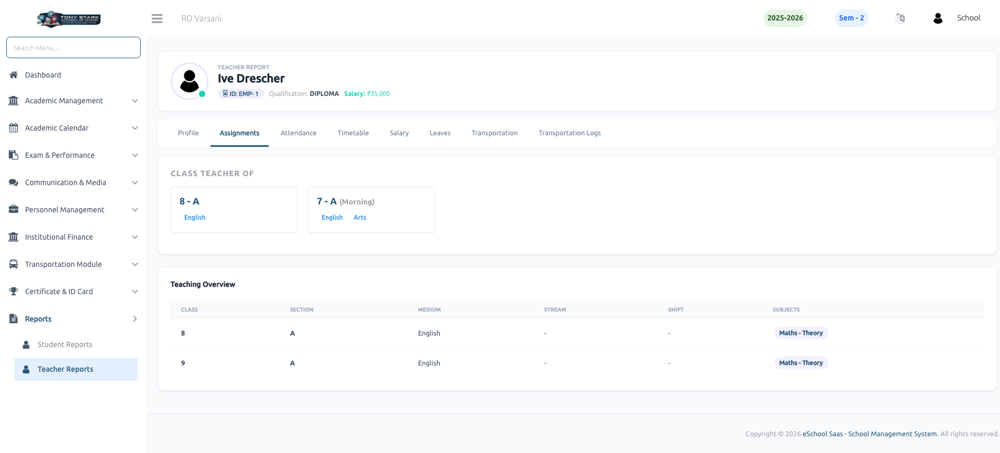
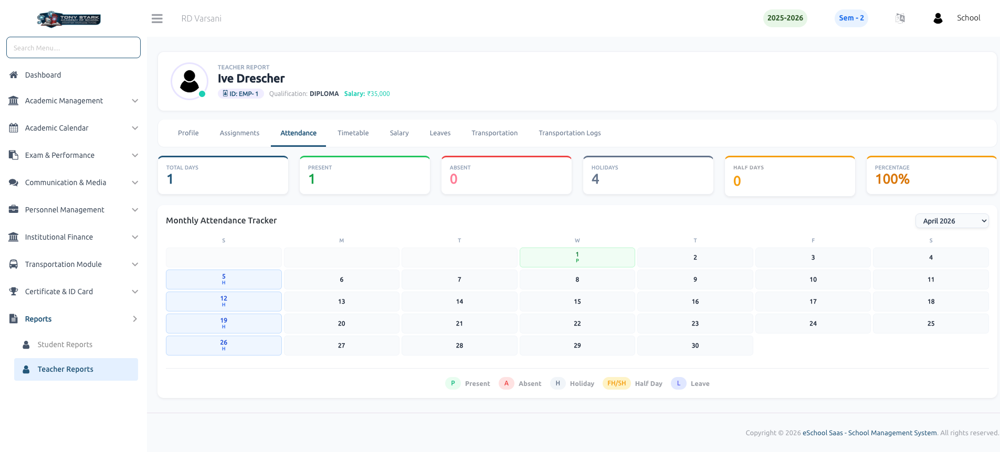
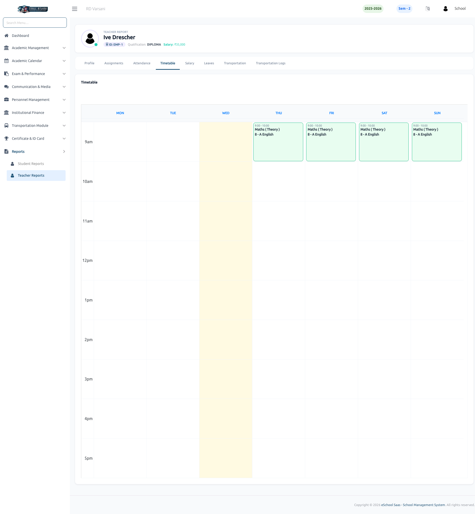
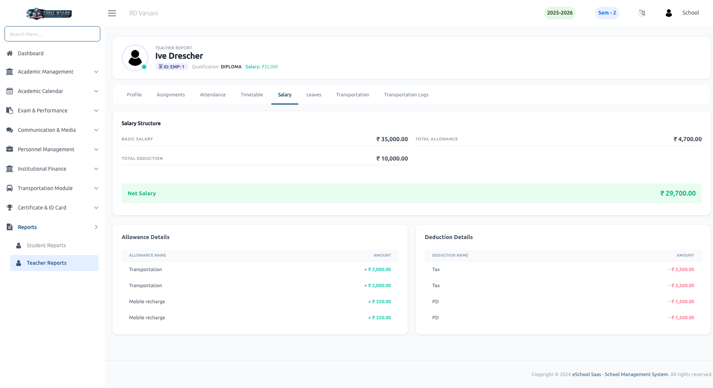
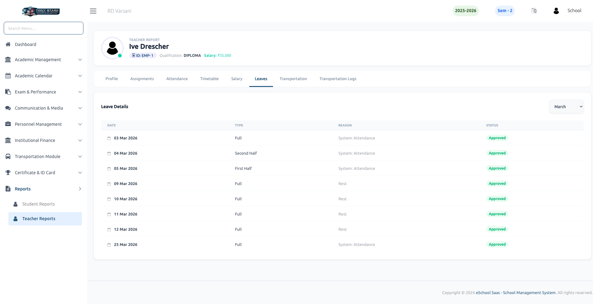
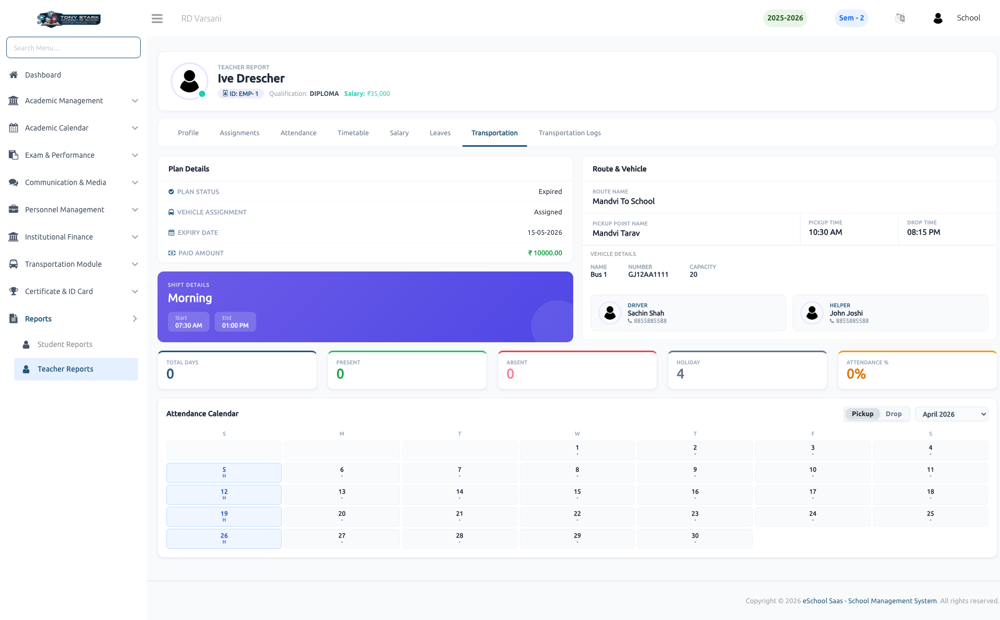
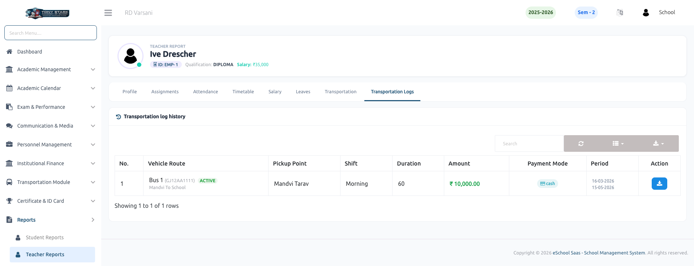

# Teacher Reports

The **Teacher Reports** section provides comprehensive data on faculty performance, schedules, and profiles. This module allows school administrators to monitor teaching loads, attendance records, and professional details for all faculty members.

### 👩‍🏫 Teacher List
The teacher list is the primary view for managing faculty data. It displays a summary of all registered teachers, including their names, qualifications, and contact addresses. Admins can quickly search for specific teachers and access their full report by clicking on individual records.

### 👤 Teacher Profile
This report provides a detailed overview of a teacher's personal and professional data, organized into three key sections:
- **Basic Information:** Joining date, date of birth, contact number, and email address.
- **Professional Details:** Qualification, gender, base salary, and account status (Active/Inactive).
- **Address Information:** Current and permanent residential addresses.

### 📋 Teacher Assignments
The assignments report tracks the specific academic responsibilities assigned to a teacher:
- **Class Teacher of:** Identifies the class sections where the teacher serves as the primary class teacher.
- **Teaching Overview:** Summarizes all classes, sections, and subjects the teacher handles, including medium and shift details.

### 📅 Teacher Attendance
This report monitors staff presence and leave history through a structured interface:
- **Attendance Summary:** Visual cards showing total days, present count, absent count, holiday count, and overall attendance percentage.
- **Monthly Tracker:** A color-coded calendar highlighting specific attendance types such as Present, Absent, Holiday, Half Day, or Leave for every day of the month.

### 🕒 Teacher Timetable
The timetable report displays the teacher's weekly academic schedule. It provides a visual grid showing:
- Specific time slots for each lecture.
- The subject being taught in each session.
- The designated class and section for every period.

### 💵 Salary Structure
This report provides a detailed breakdown of the teacher's compensation:
- **Net Salary:** Calculates the final take-home pay after all adjustments.
- **Allowance Details:** Lists all extra benefits such as Transportation and Mobile recharge allowances.
- **Deduction Details:** Displays subtractions like Taxes and other professional deductions.
- **Summary:** Shows Basic Salary, Total Allowance, and Total Deduction for complete financial transparency.

### 🚪 Leave Details
The leave report tracks all time-off records for the teacher. It includes:
- **Date & Type:** Lists the specific date and the type of leave (Full Day, First Half, or Second Half).
- **Reason:** Provides the context or reason for the leave request.
- **Status:** Displays the current approval status (e.g., **Approved**) for each entry.

### 🚌 Transportation Details
For teachers utilizing school transport, this report provides comprehensive commute data:
- **Plan Details:** Tracks subscription status, validity dates, and payment history.
- **Route & Vehicle:** Displays the assigned route, pickup point, and specific timings.
- **Staff Info:** Lists the designated Driver and Helper for the assigned route.
- **Commute Tracker:** A specialized attendance calendar to monitor daily transportation usage.

### 📋 Transportation Logs
The **Transportation Log History** maintains a record of all transportation-related transactions and service periods:
- **Transaction History:** Detailed logs of payment amounts, payment modes (e.g., Cash), and subscription durations.
- **Service Period:** Records the specific date ranges covered by each transportation plan.

