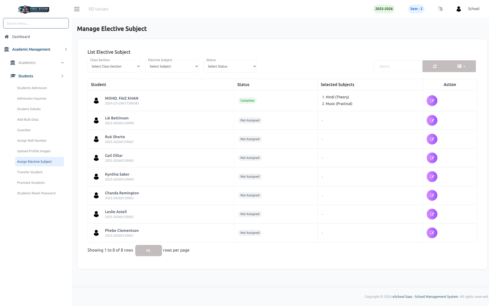

# Manage Elective Subject

This page allows the School Admin to assign and manage elective subjects for students efficiently.

### Key Features:

- **Class & Subject Filters**
    - Select **Class Section** to view students of a specific class.
    - Filter by **Elective Subject** to check assignments.
    - Use **Status** filter (e.g., Complete / Not Assigned) for quick tracking.

- **Student List View**
    - Displays all students in the selected class.
    - Shows:
        - Student Name & ID
        - Assignment Status
        - Selected Elective Subjects

- **Elective Subject Assignment**
    - Admin can assign elective subjects to each student using the **Action** button.
    - Supports assigning multiple subjects (e.g., Theory + Practical).

- **Status Indicators**
    - **Complete** → Elective subjects are assigned.
    - **Not Assigned** → No subjects assigned yet.

- **Search & Pagination**
    - Search students quickly using the search bar.
    - Pagination support for handling large student lists.

- **Quick Actions**
    - Edit/assign subjects directly from the list.
    - Easy access to update or modify existing selections.

