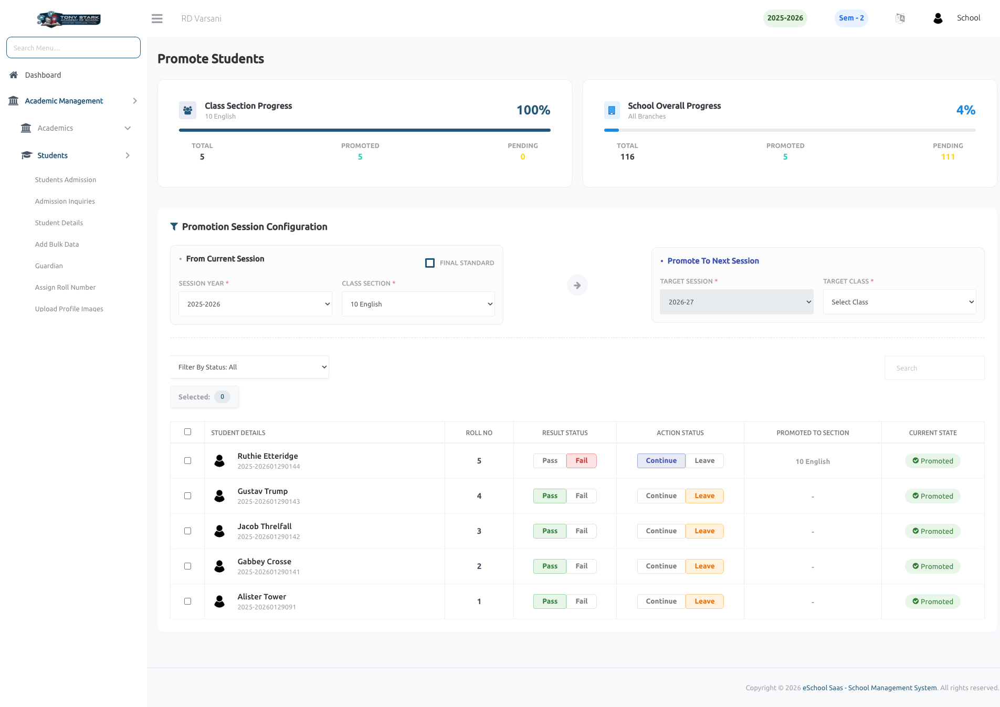

# Promote Students

This page allows the School Admin to promote students from the current academic session to the next session based on their academic performance and promotion status.

### Key Features:

- **Progress Overview**
    - Displays **Class Section Progress** with total students, promoted, and pending counts.
    - Shows **Overall School Progress** for promotion tracking across all classes.

- **Promotion Session Configuration**
    - **From Current Session**:
        - Select **Session Year** and **Class Section** from which students will be promoted.
        - Option to mark as **Final Standard** (for last class students).
    - **Promote To Next Session**:
        - Select **Target Session Year**.
        - Choose **Target Class Section** for promotion.

- **Student List Management**
    - Displays detailed student list including:
        - Student Name & Roll Number
        - Result Status (Pass / Fail)
        - Action Status (Continue / Leave)
        - Promoted Section
        - Current Promotion State (Promoted / Pending)

- **Promotion Decision Controls**
    - Admin can mark each student as:
        - **Continue** → Eligible for promotion
        - **Leave** → Not promoted / discontinued
    - Result status helps determine eligibility.

- **Bulk Selection & Actions**
    - Select multiple students for bulk promotion processing.
    - Efficient handling of large student datasets.

- **Filtering & Search**
    - Filter students based on status.
    - Search functionality for quick access to specific students.

- **Real-Time Status Indicators**
    - Clearly shows which students are:
        - **Already Promoted**
        - **Still Pending** action

- **Data Integrity & Workflow Control**
    - Ensures structured academic year transition.
    - Prevents incorrect promotions with controlled configuration.

