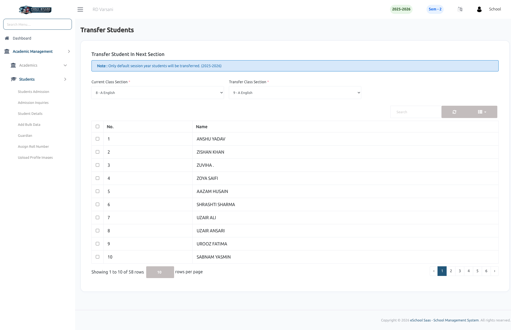

# Transfer Students

This page enables the School Admin to transfer students from one class section to another within the same academic session year.

### Key Features:

- **Session Restriction**
    - Only students from the default session year (e.g., 2025–2026) are eligible for transfer.
    - Prevents accidental transfers across different academic sessions.

- **Class Section Selection**
    - **Current Class Section**: Select the class from which students will be transferred.
    - **Transfer Class Section**: Select the target class where students will be moved.

- **Student List Display**
    - Displays all students from the selected current class.
    - Includes:
        - Serial Number
        - Student Name
        - Selection checkbox for bulk actions

- **Bulk Transfer Facility**
    - Admin can select multiple students using checkboxes.
    - Perform bulk transfer in a single action to save time.

- **Search & Pagination**
    - Search functionality to quickly find specific students.
    - Pagination support for managing large datasets efficiently.

- **Data Accuracy & Control**
    - Ensures structured movement of students between sections.
    - Helps maintain proper class-wise student distribution.

