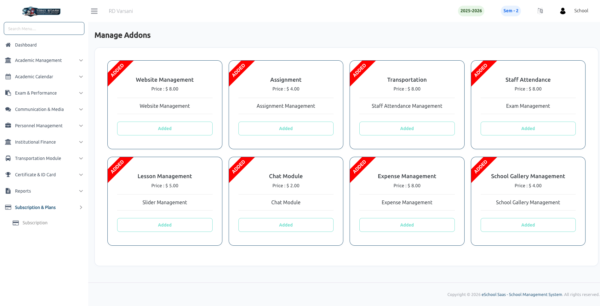

# Addons

**Addons** allow you to extend the functionality of your current subscription plan without upgrading to a higher tier. You can purchase specific modules to customize the platform according to your school's unique needs.

### 🧩 Managing Addons
- **Flexibility:** Purchase only the specific features your school needs (e.g., Website Management, Staff Attendance) as individual modules.
- **Immediate Integration:** Once purchased, addons are immediately added to your active subscription and integrated into your current billing cycle.
- **Easy Tracking:** You can view all your currently active addons on the main **Subscription** dashboard under the **Active Addons** section.

