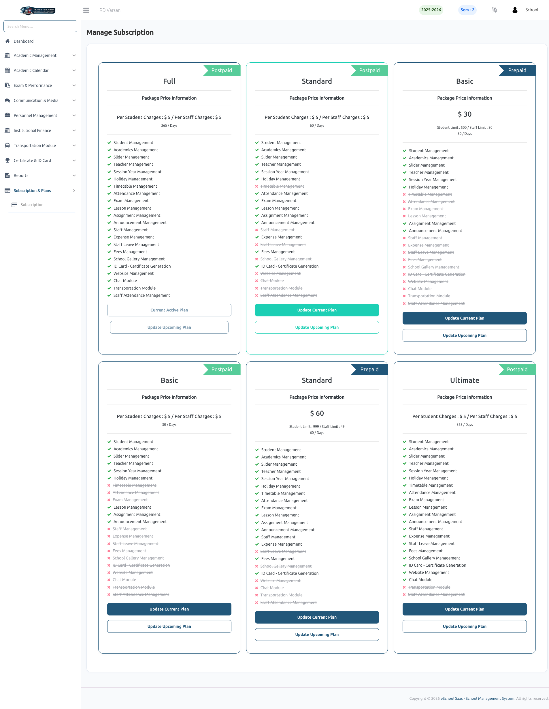

# Subscription Plans

eSchool SaaS offers flexible subscription plans tailored to meet the needs of different schools. You can choose between **Prepaid** and **Postpaid** models with varying sets of features and pricing structures.

### 📦 Choosing a Plan
Each plan comes with a curated set of modules. Administrators can compare plans to find the best fit for their school's requirements:
- **Comprehensive Plans (Full/Ultimate):** Include all available modules for a complete school management experience.
- **Essential Plans (Standard/Basic):** Offer a focused set of modules for smaller schools or specific administrative needs.
- **Pricing Models:** Choose between a fixed price per user or a base plan fee. Plans are clearly labeled as **Prepaid** or **Postpaid**.

### 🔄 Updating Plans
Administrators have the flexibility to manage their subscription lifecycle:
- **Update Current Plan:** Upgrade your current plan to access more features immediately.
- **Update Upcoming Plan:** Set your preferred plan for the next billing cycle to ensure a seamless transition.
