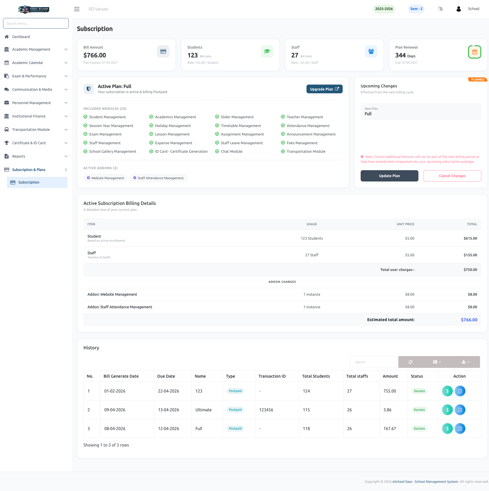

# Subscription

The **Subscription** page provides a comprehensive overview of your school's current active plan, billing details, and transaction history. It serves as the central hub for managing your school's access to the eSchool SaaS platform.

### 💳 Active Plan Overview
Monitor your current subscription status at a glance. This section includes:
- **Billing Summary:** View your total bill amount, number of active students and staff, and plan renewal date.
- **Included Modules:** A complete list of all features currently accessible under your active plan (e.g., Student Management, Exam Management, etc.).
- **Active Addons:** Track any additional features you have purchased on top of your base plan.
- **Billing Details:** An itemized breakdown showing how your total amount is calculated based on user counts and addon charges.

### 📜 Subscription History
Keep track of all your past transactions and billing cycles. The history table provides details on:
- **Billing Dates:** Track when bills were generated and their respective due dates.
- **Transaction Details:** View the plan type (Prepaid/Postpaid), transaction IDs, and the number of users at the time of billing.
- **Payment Status:** Monitor the status of each bill (e.g., Success) and perform actions like paying overdue bills or viewing receipts.

