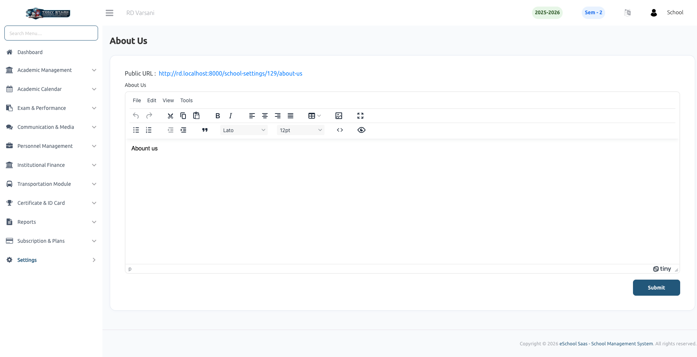

# About Us

The **About Us** settings allow school administrators to define and manage the content that describes the school's mission, history, and values. This information is typically displayed on the public-facing pages of the school application and website.

### 📝 Content Management
- **Rich Text Editor:** Use the built-in editor to format your "About Us" content with ease. You can add headings, bold text, lists, and other formatting to make the description engaging for parents and visitors.
- **Dynamic Updates:** Any changes made here are instantly updated across the platform, ensuring your school's information remains current and accurate.

